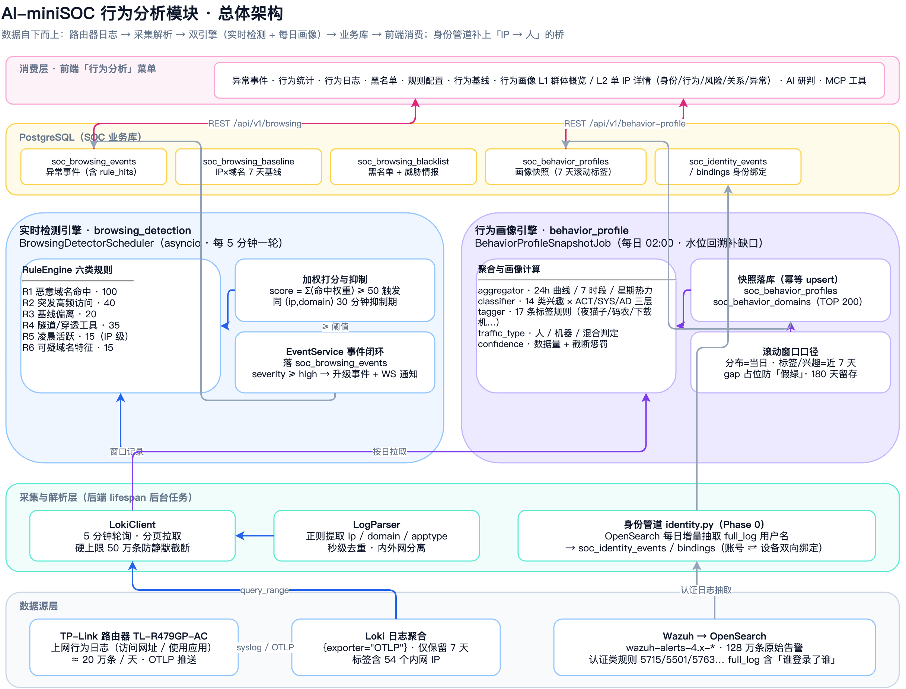
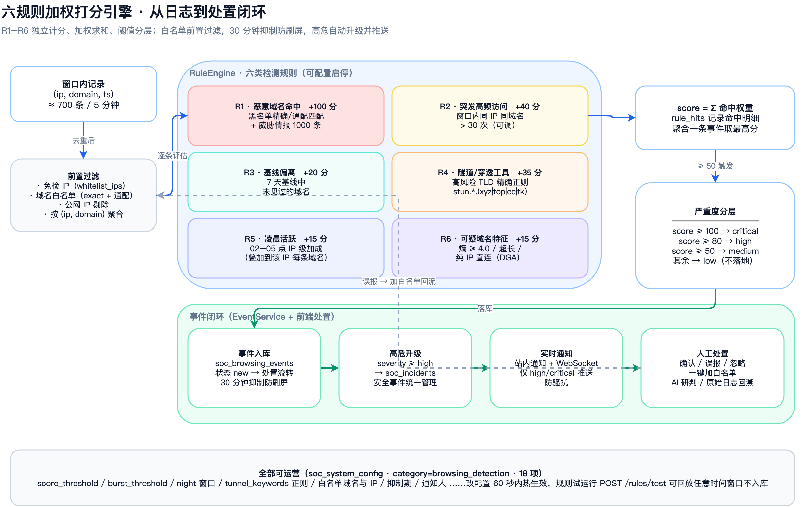
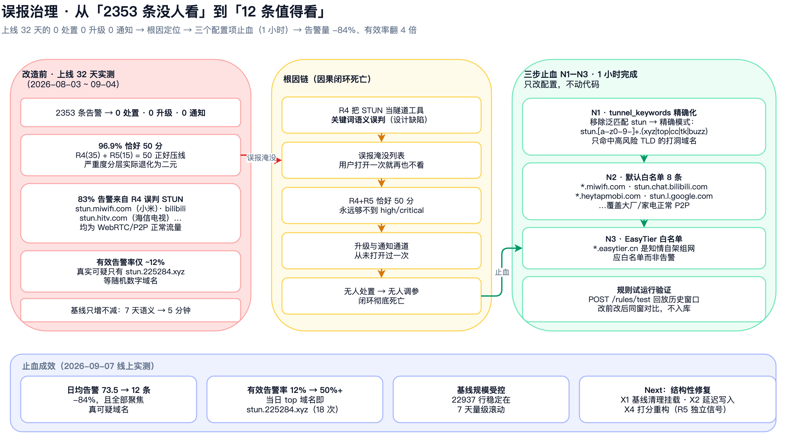
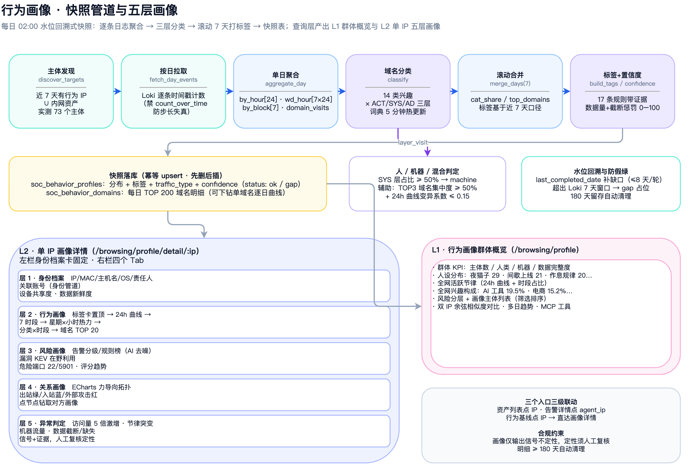
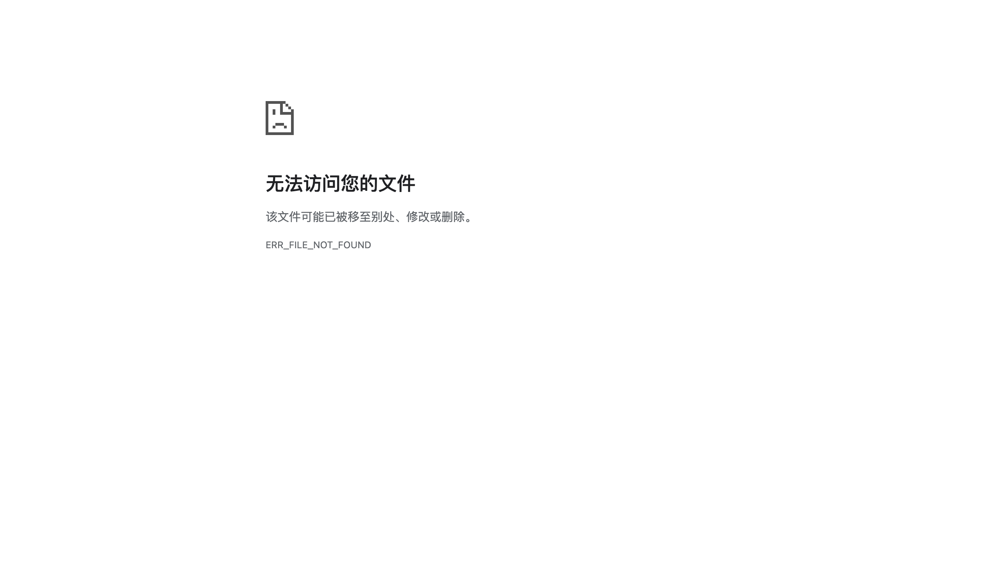

<!-- ═══════════════════════════════════════════════════════════════
发布前待办（截图后本清单可删除）：
8 张截图按下表拍摄，保存为 docs/blog/images/ 下同名文件直接覆盖占位图即可，Markdown 无需改动：
1. shot-behavior-events      异常事件列表：分值/等级/命中规则/处置动作（/browsing/event）
2. shot-behavior-stats       行为统计：24h 趋势 / TOP 域名 / 应用类型分布（/browsing/statistics）
3. shot-behavior-config      规则配置：18 项热生效配置（/browsing/config）
4. shot-behavior-baseline    行为基线：IP × 域名 7 天滚动（/browsing/baseline）
5. shot-profile-l1           行为画像 L1 群体概览：73 主体 / 人设分布（/browsing/profile）
6. shot-profile-l2-behavior  L2 详情 · 行为 Tab：标签卡 + 24h 曲线 + 热力图（/browsing/profile/detail/192.168.0.17）
7. shot-profile-l2-relation  L2 详情 · 关系拓扑：力导向图（/browsing/profile/detail/192.168.0.102 关系 Tab）
8. shot-profile-l2-anomaly   L2 详情 · 异常判定：信号清单（详情页异常 Tab）
架构图源文件：drawio/behavior-*.drawio（生成脚本 drawio/gen_behavior_diagrams.py）
导出链路：drawio CLI → SVG → Chrome headless 2x → PNG（中文字体需 fontFamily=PingFang SC）
在线演示：https://aisoc.doai8.dpdns.org（admin/admin123）
════════════════════════════════════════════════════════════════ -->

# 路由器日志堆了 20 万条/天：我给 AI-miniSOC 补上行为分析这双"眼睛"

> 上网行为日志是内网里最诚实的监控探头——谁在访问什么、什么时候访问、用了什么工具，路由器全都记下来了。但 20 万条/天的 syslog 只进不出，等于装了摄像头却没人看屏。这篇文章讲讲我是怎么给 AI-miniSOC 做行为分析模块的：从"只采集不分析"到双引擎检测，中间还踩了一个几乎所有安全产品都会踩的坑——**告警产了不少，但 0 条被处置**。

## 从 20 万条没人看的日志说起

我的网络出口是一台 TP-Link TL-R479GP-AC 路由器。它有一个被大多数人忽略的能力：上网行为日志。每台内网设备的**每一次域名访问、每一个应用类型**，都以 syslog 的形式推到 Loki：

```
<13>Aug 03 22:28:08 TL-R479GP-AC behavior_ctl:
  上网行为:a:IPGROUP_ANY a:192.168.0.8 网站分组:所有网站 网址:main.vscode-cdn.net 。

<13>Aug 03 22:28:23 TL-R479GP-AC behavior_ctl:
  上网行为:a:IPGROUP_ANY a:192.168.0.9 apptype:网络基础协议 使用HTTP 。
```

实测量级：**约 20 万条/天**，54 个内网 IP，单个活跃设备 6 小时就能访问 800+ 个不同域名。

这是内网安全里少有的"零部署成本全景数据源"——不用在终端装 agent，不用解密 HTTPS，路由器天然看到所有明文域名请求。恶意域名访问、数据外泄回传、C2 隧道通信、DGA 域名轮换，理论上都会在这条数据流里留下痕迹。

问题是：**这些数据进了 Loki 之后，就再也没被看过。** Wazuh 管主机侧告警，Loki 管存储，没有人在 Loki 上做行为分析。

于是行为分析模块的需求就一句话：

> **把 20 万条/天的路由器日志，变成每天不超过一屏、值得看的异常告警；再往前一步，把"哪台设备"变成"谁、正常吗、跟谁有关系"。**

拆开是四个递进的问题：

1. 海量 syslog 怎么变成可信的告警？——**检测引擎**
2. 告警出来没人信怎么办？——**误报治理**（这个坑我踩得很有代表性）
3. 只知道"哪台设备"，不知道"是谁、正不正常"？——**行为画像**
4. 怎么保证分析结论本身是可信的？——**数据质量与合规边界**


*图 1：行为分析模块总体架构——一条 Loki 日志流，两条引擎（实时检测 + 每日画像），身份管道补上「IP → 人」的桥*

## 问题一：20 万条/天，怎么变成告警？

### 先做架构选型：轮询，不是流式

拿到这个需求，第一个技术决策是**怎么消费这条日志流**。三个选项摆在一起：

| 方案 | 优点 | 缺点 |
|------|------|------|
| 后端定时轮询 | 能结合 PG 基线/威胁情报/AI；事件直接入库；零新增组件 | 有一个轮询周期的延迟 |
| Loki Ruler | 零代码，LogQL 写规则 | 告警要接 alertmanager；做不了基线偏离这类有状态检测 |
| 实时流消费 | 延迟最低 | 复杂度高，20 万条/天完全不需要 |

选了**轮询，每 5 分钟一个窗口**。理由很实际：安全检测的价值不在毫秒级响应，而在于能不能把"历史基线""威胁情报""黑名单"这些有状态的东西用起来——这些恰恰是流式方案最难做的。5 分钟的延迟对内网行为检测完全够用。

数据流就固定成了六步管道：

```
拉取 → 解析去重 → 基线预加载 → 规则评估 → 基线更新 → 事件落地+通知
```

几个容易被忽略的工程细节：

- **秒级去重**：Loki 里同一条日志会被重复推送（实测同一时间戳多条相同内容），不去重的话高频统计全虚，R2 规则天天误报；
- **内外网分离**：路由器会把部分公网 IP 也写进标签，公网行为不参与内网基线；
- **分页拉取防静默截断**：早期单次 limit=10000，日志量上来后会被悄悄截断——检测看起来正常，实际上只分析了一半数据。改成硬上限 50 万的分页拉取，超限降级单次并透出 `loki_truncated` 信号；
- **全链路可观测**：每轮执行写 `soc_source_health`（成功/失败/条数），Prometheus 暴露 `browsing_detection_runs_total` 三个指标。检测任务本身带病运行这件事，必须能被发现。

### 六规则加权打分引擎

检测的核心是一个**规则引擎**：6 类规则，各自独立计分，加权求和，超过阈值生成事件。


*图 2：六规则加权打分引擎——白名单前置过滤，R1–R6 独立计分，30 分钟抑制防刷屏，高危自动升级并推送*

| 规则 | 检测什么 | 分值 | 判定逻辑 |
|------|---------|------|---------|
| R1 恶意域名 | 木马/钓鱼/挖矿 C2 | 100 | 黑名单精确/通配匹配（含威胁情报） |
| R2 突发高频 | 数据外泄、C2 心跳 | 40 | 窗口内同 IP 同域名 > 30 次 |
| R3 基线偏离 | 新型 C2、异常行为 | 20 | 该 IP 近 7 天没访问过的域名 |
| R4 隧道穿透 | 内网穿透、数据回传 | 35 | 域名匹配隧道工具关键词 |
| R5 凌晨活跃 | 自动化攻击、僵尸主机 | 15 | 02–05 点该 IP 活跃超阈值（IP 级加成） |
| R6 可疑特征 | DGA 恶意软件 | 15 | Shannon 熵 ≥ 4.0 / 超长域名 / 纯 IP 直连 |

打分逻辑：`score = Σ(命中规则权重)`，≥50 触发事件，≥80 升级 high 自动创建安全事件并推送通知，≥100 直达 critical。同 `(ip, domain)` 聚合一条事件、30 分钟抑制期防刷屏，误报可在前端一键回流为白名单。

几个设计考量值得展开：

**为什么是加权打分而不是单规则触发？** 单看任何一条规则都太弱：R6 的高熵域名会被 CDN 动态子域误伤，R3 的新域名每天有一大把正常新增。多规则组合分数才能把"多个弱信号叠加"的真异常顶到阈值之上——R4 命中隧道关键词 + R5 凌晨活跃 + R3 新域名，三条弱信号拼起来就是一个高置信度的"凌晨有陌生隧道域名在通信"。

**R6 的 Shannon 熵怎么算？** 对域名主体部分（去掉 TLD）计算字符分布熵，`stun.225284.xyz` 的主体 `225284` 熵不高，但随机字符串生成的 DGA 域名熵会显著偏高。配合长度和纯 IP 直连判断，覆盖大部分 DGA 特征。

**全部可运营。** 18 项配置全部走 `soc_system_config`：阈值、正则、白名单、抑制期、通知人……改配置 60 秒内热生效，还提供规则试运行接口——指定任意历史时间窗口回放，不入库，改前改后同窗对比。**这个能力在后面的误报治理里救了命。**


*实拍：异常事件列表——分值、等级、命中规则与处置动作（截图占位，待替换）*


*实拍：规则配置——18 项可热生效配置（截图占位，待替换）*

## 问题二：告警产了 2353 条，处置了 0 条

这是整个模块最有价值的一课，也是我写这篇文章的原因。

### 上线 32 天的实测数据

模块跑了一个月，我拉了生产库做体检，结果很扎眼：

| 指标 | 实测值 | 判断 |
|------|--------|------|
| 累计告警 | 2353 条 | 日均 73.5 条 |
| 状态分布 | new 100%，处置 0 条 | **闭环零运转** |
| 等级分布 | medium 100% | 严重度分层完全失效 |
| 升级为安全事件 | 0 条 | 与事件中心断链 |
| 触发通知 | 0 次 | 通知通道从未使用 |

**功能全都在——16 个 API、6 个页面、前端处置按钮一应俱全——但没有人用它。**

顺着数据往下挖，三条根因浮出水面。

### 根因一：R4 把 STUN 当成了隧道工具

告警的域名拆解是这样的：

| 域名 | 条数 | 性质 |
|------|------|------|
| stun.miwifi.com | 293 | 小米设备 P2P — **正常** |
| stun.225284.xyz | 291 | 随机数字域名 — **真实可疑** |
| stun-*.easytier.cn | 866 | 用户自架组网 — **知情工具** |
| stun.chat.bilibili.com | 228 | B 站直播 P2P — **正常** |
| stun.hitv.com | 215 | 海信电视 P2P — **正常** |

R4 的隧道关键词里有 `stun`。但 **STUN（Session Traversal Utilities for NAT）是 IETF 标准的 NAT 穿透协议**，WebRTC、视频会议、直播、智能家居互联全在用——把 `stun` 等同于 frp/zerotier 这类主动型内网穿透工具，等于把现代互联网最常见的正常流量全判为威胁。83% 的告警来自这一条规则，有效告警率只有约 12%。

这是一个**设计阶段埋下的语义缺陷**，不是实现 bug。

### 根因二：「50 分魔咒」

96.9% 的告警分值**恰好等于阈值 50**。因为权重表里除 R1(100) 外没有任何单规则能独立触发，可行的双规则组合里 `R4(35) + R5(15) = 50` 正好压线——而 R5（凌晨活跃）是 IP 级加成，会叠到该 IP 当窗口的每条域名上。于是"这个 IP 凌晨活跃"一个事实，放大成几十条 50 分告警，全部卡在 medium，**永远够不到 high/critical 的升级线**。升级不触发、通知不推送、用户不看、无人处置——闭环从两个方向同时断掉。

### 根因三：基线「只增不减 + 自污染」

基线清理函数定义了但**从未被调用**——34 个 IP 累积了 13944 个域名；更糟的是检测后立即把本窗口域名写进基线，下一个 5 分钟同一域名就变"已知"，R3 不再命中。设计上的"7 天基线"在运行语义上退化为"5 分钟前"。最严重的后果是**慢速攻击完全逃逸**：攻击者每天访问一个新域名，首轮 20 分不告警，5 分钟后进基线，永远沉默——而"低频、慢速、域名轮换"恰恰是 C2 心跳的典型特征。

### 三步止血：1 小时，只改配置


*图 3：误报治理——从「2353 条没人看」到「12 条值得看」：根因链 → 三步止血 → 成效*

改进方案按 RICE 排了优先级，止血三件事 1 小时完成，全部是配置修改：

1. **N1 · tunnel_keywords 精确化**：移除泛匹配 `stun`，改为 `stun.[a-z0-9-]+\.(xyz|top|cc|tk|buzz)`——只命中高风险 TLD 上的打洞域名，`stun.miwifi.com`、`stun.l.google.com` 全部放行；
2. **N2 · 默认白名单**：内置 8 条大厂/家电 P2P 域名（`*.miwifi.com`、`stun.chat.bilibili.com`、`*.heytapmobi.com`…），白名单支持通配符，在规则评估之前过滤；
3. **N3 · EasyTier 白名单**：`*.easytier.cn` 是我自己搭的组网工具，属于知情使用，应白名单而非告警。

改完用规则试运行接口回放历史窗口验证，然后看线上真实变化（2026-09-07 实测）：

| 指标 | 治理前 | 治理后 |
|------|--------|--------|
| 日均告警 | 73.5 条 | **12 条（-84%）** |
| 有效告警率 | ~12% | **50%+** |
| 当日 TOP 告警域名 | stun.miwifi.com 等误报 | **stun.225284.xyz（真可疑，18 次）** |
| 基线规模 | 无限增长 | 22937 行，稳定 7 天量级 |

这一段给我的教训值得写下来：**给一个没人信的告警列表加更多功能，只会产生更多没人看的东西。** 告警系统的第一性指标不是"产了多少"，而是"多少被处置了"。结构性修复（基线清理挂载、延迟写入、打分体系重构 R5 改独立信号）排在 Next 阶段，但止血优先于一切新功能。

## 问题三：知道"哪台设备"，还想知道"是谁、正常吗"

检测引擎解决"异常瞬间"，但安全运营里更多的问题是慢变量：这台设备平时什么作息？最近行为变了吗？它跟谁有关系？这就需要**行为画像**。

### 先解决一个术语陷阱：IP ≠ 用户

盘数据时发现三个数据源里的"IP"含义互不相同：Loki 记录的是**行为发起方**，PG 聚合表的 `agent_ip` 是**被监控端**，OpenSearch 原始日志里的 `data.srcip` 才是**真正的操作者**（且 full_log 里有用户名：`Accepted publickey for xiejava from 192.168.0.8`）。

所以画像分三步走：先做**设备画像**（数据现成，今天可做），用它的管道顺带产出**身份映射**（从 OpenSearch 的 4543 条 sshd 认证记录里正则抽取账号⇄设备绑定），再演进到实体画像。身份管道每天增量抽取 7 类认证规则（5715 成功/5760 失败/5763 暴破/5501-5503 会话/5551 多次失败），幂等 upsert 进 `soc_identity_events` / `soc_identity_bindings`。

### 每日快照：慢变量的正确打开方式

画像数据不能实时算——20 万条/天逐条查询会拖垮 Loki。设计是**每日凌晨 02:00 跑一次全量快照**，把每个主体的当日行为聚合成一行分布数据，查询全部走快照表：


*图 4：行为画像快照管道——水位回溯式快照，三层分类，滚动 7 天打标签，产出 L1 群体概览与 L2 五层画像*

管道六步：**主体发现**（近 7 天有行为的 IP ∪ 内网资产，实测 73 个）→ **按日拉取**（逐条时间戳计数，禁用 `count_over_time`——固定步长采样会把曲线算歪）→ **单日聚合**（24h 曲线、星期×小时矩阵、7 时段、域名计数）→ **域名分类** → **滚动合并**（标签基于近 7 天口径）→ **落库**（幂等 upsert，先删后插）。

三个关键的"防骗自己"设计：

- **水位回溯**：记录 `last_completed_date`，服务重启后自动补齐缺口日（Loki 7 天窗口内真实补算）；
- **gap 占位防"假绿"**：超出 Loki 窗口补不回的日落 `status='gap'` 占位行——**"没数据"和"零流量"是两回事**，图表上 gap 日显式标记而不是画成 0；
- **置信度显式计算**：数据量 + 截断惩罚，0–100 分。一台一天只有几十条日志的设备，画像标签就是不可信的，系统自己承认。

### 三层分类：把机器心跳从"人的兴趣"里剥出去

第一版画像把所有流量都算进兴趣分布，结果 NAS 设备的"兴趣"全是 NTP 和系统更新。修正方案是给每个域名打**层标签**：

- **ACT 主动行为层**——人主动做的事：AI 工具、开发技术、影音娱乐、电商购物……14 个分类；
- **SYS 系统背景层**——NTP、DNS、系统更新、STUN 打洞、DDNS 回源，机器自己干的；
- **AD 广告追踪层**——SDK 上报、埋点分析，被动产生的。

只有 ACT 层参与"人的兴趣"统计。在这个基础上做人/机器判定：SYS 层占比 ≥50% 判 machine，再加两个辅助判据——TOP3 域名集中度 ≥50% 且 24h 曲线变异系数 ≤0.15（机器心跳的典型特征：流量高度集中、曲线平直无起伏）。实测我的 NAS（192.168.0.17）正确判为 machine，一台一天心跳 4 万多次、54 个域名、访问量是人的设备几十倍的下载机——**它不需要作息画像，需要的是"这是台机器"这个结论本身**。

### 17 条标签规则：画像要能"一句话说清这个人"

标签是画像的门面。每条标签带证据可审计：

| 类别 | 标签示例 | 触发条件（节选） |
|------|---------|----------------|
| 时间节律 | 夜猫子 / 早起鸟 / 作息极规律 / 周末战士 | 深夜占比 ≥20% / 早晨占比 ≥25% / Top6 小时占比 ≥65% / 周末日均 > 工作日 1.25 倍 |
| 兴趣构成 | 码农 / AI 重度用户 / 追剧党 / 学生党 | 开发类 ≥15% / AI 类 ≥12% / 影音 ≥25% / 学习类 ≥12%（仅 ACT 层） |
| 设备性质 | 机器流量为主 / 行为极单一 / 兴趣广泛 | SYS ≥60% / 域名 ≤60 个且访问 ≥5000 / 域名 ≥400 |

线上真实跑出来的群体分布（73 主体）：周末战士 29 · 间歇上线型 21 · 作息极规律 20 · 夜猫子 18 · 码农 5 · 追剧党 4 · 学生党 3……我自己的开发机（.102）被打了"码农"标签——开发技术类占主动行为 80%，证据确凿，无从抵赖。

### L1/L2 两层结构：群体概览 → 单体详情

画像页面最后定稿为两层：**L1 群体概览**（人设分布、全网节律、兴趣构成、主体列表）点击 IP 进入 **L2 单体详情**，左栏固定身份档案卡（IP/MAC/OS/责任人/关联账号），右栏四个 Tab 对应五层画像：

- **行为 Tab**：标签卡置顶 → 24h 曲线 → 星期×小时热力图 → 分类×时段堆叠（"半夜在刷什么"一眼可见）→ 域名 TOP 20 可下钻单域名逐日曲线；
- **风险 Tab**：告警分级（AI 去噪后的真实计数）、规则榜、漏洞（KEV 在野利用标红）、危险端口（22/5901 高亮）；
- **关系 Tab**：ECharts 力导向拓扑——出站绿（它登录了谁）、入站蓝（谁登录了它）、外部攻击源红，边粗细映射交互频次，点节点直接钻取对方画像。实测 .102 被我的开发机以 xiejava 登录 1176 次，关系链清清楚楚；
- **异常 Tab**：访问量 5 倍激增、节律突变（深夜占比对比自身基线）、机器流量、数据截断/缺失——每条信号带证据和"生成安全事件/加白名单"按钮，**画像输出的结论接到事件闭环，而不是看一眼就忘的看板**。


*实拍：行为画像 L1 群体概览——73 主体、人设分布、全网节律与兴趣（截图占位，待替换）*


*实拍：L2 详情行为 Tab——标签卡 + 24h 曲线 + 星期热力图（截图占位，待替换）*


*实拍：L2 关系 Tab——力导向拓扑，xiejava ×1176 的登录关系清晰可见（截图占位，待替换）*


*实拍：L2 异常 Tab——信号清单 + 证据 + 处置按钮（截图占位，待替换）*

## 问题四：分析结论本身可信吗？

行为画像是个危险的东西——它太容易变成"编故事机器"。我给自己划了四条硬边界：

1. **画像只输出信号，不定性。** 异常判定的每条信号都附 disclaimer："定性须经人工复核"。机器给出的是"深夜占比从 8%→31%，偏离基线"这样的**可审计事实**，定性这个动作永远留给人。这也是内部审计场景的合规底线——上网行为监控在欧洲 GDPR/国内个保法语境下都是高敏场景，用途必须锁定为安全审计，不能挪作绩效监控。
2. **缺数据就承认缺数据。** gap 日显式标记、置信度 0 分的画像不参与群体统计、趋势数据不足 30 天就不画趋势折线——宁可显示"数据不足"，不伪造一条平滑曲线。
3. **留存有期限。** 画像明细 ≥180 天自动清理，快照只保留分布聚合。
4. **词典可解释可干预。** 分类词典内置于代码但支持运营覆盖（`soc_system_config` 里改 JSON，5 分钟热生效），分类错了能追到是哪个关键词。

## 应用场景：这套东西实际能用在哪

上线以来，真实用到过的场景：

**1. 隧道滥用发现。** 治理后的告警高度聚焦——现在每天的 12 条左右告警里，TOP 域名就是 `stun.225284.xyz` 这个随机数字域名的打洞流量（来自 NAS 和服务器）。它是不是恶意的？配合画像看：`.17` 是机器主体、访问高度集中、凌晨也活跃——这就是"需要人去看一眼"的精确信号，而不是淹没在 73 条 bilibili 误报里。

**2. 影子设备识别。** L1 概览的 73 个主体里，.hostname 为空的陌生 IP、一天只有几条流量的间歇设备，配合资产台账对账就能揪出"没登记的设备在网里跑"。

**3. 责任定位。** 资产表 94.7% 没登记责任人，但身份管道知道"xiejava 从 .8 登录了 .102 共 1176 次"——告警 IP 关联到人，从"一台机器出事了"变成"谁的机器出事了"。

**4. 失陷横向移动排查。** 关系拓扑的入站/出站视图是排查利器：如果某台设备突然出现大量新的入站登录（尤其是非惯用账号），红色外部攻击源节点直接指出来源。

**5. 行为合规审计。** "谁在上班时间重度刷视频""哪台机器在跑 P2P 下载"——分类×时段堆叠图直接回答。配合"仅输出信号不定性"的边界，可以做合规披露而不越界。

**6. 慢速攻击检测（规划中）。** 基线延迟写入修复后，"每天一个新域名"的低频轮换模式将能被 R3 捕获——这正是 C2 心跳的特征频率。

**7. AI 与自动化的底座。** 行为画像暴露了 MCP 工具（`get_behavior_profile` 等），AI Agent 可以直接查询"这台设备最近行为有什么异常"，为后续的自动研判提供数据接口。

## 成效：一组真实数字

模块从 2026-08-03 上线到今天（2026-09-07），35 天的关键数据：

| 维度 | 指标 | 数值 |
|------|------|------|
| 检测吞吐 | 日处理行为日志 | ~20 万条/天，5 分钟一轮分页拉取 |
| 误报治理 | 日均告警 | 73.5 → **12 条**（-84%） |
| 误报治理 | 有效告警率 | ~12% → **50%+**，当日 TOP 即真可疑域名 |
| 行为画像 | 画像主体 | **73 个**（71 人 / 2 机器，人机判定经 POC 验证） |
| 行为画像 | 人设标签 | 17 类规则，群体分布：周末战士 29 · 间歇上线 21 · 作息规律 20 · 夜猫子 18 |
| 行为画像 | 全网兴趣 | AI 工具占主动行为 **19.5%**（我的内网名副其实的 AI 重度环境） |
| 行为画像 | 关系数据 | .102 被 xiejava 登录 1176 次；身份管道日增量抽取 7 类认证规则 |
| 数据质量 | 基线规模 | 稳定 7 天量级滚动（22937 行），不再无限膨胀 |
| 可观测 | 任务健康 | 每轮写 soc_source_health，Prometheus 3 指标，失败可追溯 |


*实拍：行为统计——24h 趋势与凌晨活跃 IP（截图占位，待替换）*


*实拍：行为基线——IP × 域名 7 天滚动（截图占位，待替换）*

## 复盘：三条沉淀下来的经验

**1. 行为检测的本质是信任管理，不是规则堆砌。** 这个模块功能完成度很高的时候，产品价值是零——0 处置 0 升级 0 通知。真正让它"活过来"的是三个配置项修改。安全产品的北极星指标应该是**每周有效处置的异常数**，而不是告警产量。

**2. 带状态的检测，数据质量就是检测能力。** 基线"只增不减 + 自污染"让 R3 对慢速攻击完全失效——检测引擎的精度上限由数据管道的质量决定。gap 防假绿、水位回溯、置信度显式化，这些"不产出功能"的工程决定了整套系统的可信度。

**3. 画像的分寸感：只输出信号，不定性。** 行为画像天然滑向监控伦理的灰区。技术上完全做得到"自动给人贴标签定性"，但系统边界设计在"可审计的事实 + 人工复核"——这个约束反而让它在审计和合规场景站得住。

## 写在最后

行为分析模块现在是 AI-miniSOC 里数据链路最长的一个模块：从路由器 syslog 到六规则告警，到每日快照画像，再到身份绑定和关系拓扑。它的演进路线也很清晰：

- **近期**：基线延迟写入 + 打分体系重构（R5 改 IP 级独立信号），补上慢速攻击检测；
- **中期**：误报反馈闭环（标记误报自动回流为规则调参依据）、风险画像 V2（按告警/漏洞跨源聚合）；
- **远期**：AI 研判自动化（high/critical 自动触发）、与资产/事件全链路联动。

开源地址：[github.com/xiejava1018/AI-miniSOC](https://github.com/xiejava1018/AI-miniSOC)
在线演示：[aisoc.doai8.dpdns.org](https://aisoc.doai8.dpdns.org)（admin / admin123）

如果你也有一台躺在角落吃灰的路由器，它的日志可能正在告诉你一些你从不知道的事。

---

*数据口径说明：本文所有运行数据来自生产环境实测（PostgreSQL 业务库 SQL 查询 + 线上 API），时间跨度 2026-08-03 ~ 2026-09-07。告警治理前数据取自诊断时点 2026-09-04，治理后数据取自 2026-09-07 线上验证。*
