---
# 任务进度跟踪锚文件 —— Agent 协同优先
title: AI-miniSOC 资产管理 AI 能力建设 · 任务进度跟踪
doc_type: task_tracker
status: active
owner: xiejava
last_updated: 2026-10-05 10:50
last_updated_by: 主 Agent（OH-4.1 落地 session #18）

# 配套文档（Agent 接手必读，按权威性倒序）
canonical_docs:
  - id: UI融合设计分析
    path: docs/design/2026-10-01-资产管理AI能力建设-UI融合设计分析.md
    version: v2.1
    role: UI 方案唯一权威（推翻前稿 v1「16 页平铺」）
  - id: 主方案
    path: docs/design/2026-09-30-资产管理AI能力建设方案.md
    version: v1.2
    role: 三件套主轴 + AOG-1~7 + S1~S13
  - id: 实施方案
    path: docs/design/2026-09-30-资产管理AI能力建设-实施方案.md
    version: v1.2
    role: 任务级 OH-x 清单 + 工作量 + 依赖
  - id: UI缺口补遗
    path: docs/design/2026-09-30-资产管理AI能力建设-UI缺口补遗.md
    version: v1.1
    role: 旧稿（已让位给 UI融合设计分析 v2.1），仅 OH-UI.x 编号体系沿用
  - id: 统一融合数据底座
    path: docs/design/2026-10-02-统一融合数据底座架构与建设建议.md
    version: v1.6
    role: 底座（不新库、逻辑融合层）；P0 已落地、P1 待 spike
  - id: UI原型
    path: docs/design/prototype/资产管理AI能力建设-UI原型.html
    version: 2026-10-01 608 行
    role: 已对齐融合分析 v2 导航；可交互预览

# 全局北极星（H1 / H2 / 2027 底，详见主方案 §九）
north_star:
  h1:
    关联资产覆盖率: "≥60%（73 资产基线）"
    图谱节点数: "≥200（含资产/端口/账户/关系实体）"
    场景投产数: "5"
  h2:
    关联资产覆盖率: "≥85%"
    图谱节点数: "≥800"
    场景投产数: "10"
  2027底:
    关联资产覆盖率: "≥95%"
    图谱节点数: "≥2000"
    场景投产数: "≥13"

# 状态枚举（Agent 写入时严格遵守）
status_enum:
  pending: 待启（前置依赖未解）
  in_progress: 在研（有人在做，但未合 master）
  in_review: 待验（PR 已开，CI/Review 未过）
  done: 已完成（master 已合，部署可见）
  blocked: 阻塞（依赖/决策未拍板，见 §五「阻塞登记」）
  cancelled: 取消（已写入决策依据文档）
  shelved: 搁置（条件未触发或外部依赖未到）
  split: 拆分（被拆为子任务，详见子条目）
  redo: 重做（验收不通过，需回归）

# 工作量口径
effort_legend:
  S: "< 3 天，1 人"
  M: "3-7 天，1-2 人"
  L: "7-14 天，2-3 人"

# 三库约定（采集/部署必读）
CONNECTION_RULES:
  dev_db: "远端 111.228.57.2:25432 / AI-miniSOC-testdb（Mac 本地 .env）"
  prod_db: "本机 192.168.0.102:5432 / AI-miniSOC-db（服务器 .env）"
  test_db: "AI-miniSOC-db_test（pytest 独立库）"
  golden_rule: "本地 Mac .env ≠ 生产服务器 .env——改 env 必须两处都改"

# 强约束（违反=事故）
hard_constraints:
  - "所有业务表名 soc_ 前缀（alembic_version 除外）"
  - "API 响应统一 envelope {code, msg, data}；HTTP 状态码恒 200"
  - "前端 axios 拦截器只读 body.code，不要读 response.status"
  - "图谱 query 不重建：复用现有 7 端点 + 4 query 函数 + 6 builder（详见实施方案 §九）"
  - "采集器新增必须在 deploy_collectors.sh 同步加健康门禁"
  - "凭证走 soc_data_sources 配置中心，不要新增 .env 键"
  - "菜单注册：DB 存相对 path（父 /assets + child），component 用相对名（见 CLAUDE.md §4.3/§4.4）"
  - "icon 必须 iconify ri:* 且 https://icones.js.org/ 真实存在"
  - "新增 MCP 工具必须路由级端到端实测（CLAUDE.md service 测过路由未必通）"
  - "新增写操作走 @log_audit 装饰器落 hash 链"
  - "新端点必须接 require_role / require_button_permission（X1 矩阵）"
  - "等保定级为法律判定，系统只建议不裁决（主方案 §0.2 S4 红线）"

# 配套命令（一键复活现场）
rehydration_commands:
  - "git log --oneline --grep='OH-' | head -10  # 看最近进度"
  - "git status                                   # 看工作区"
  - "PYTHONPATH=src/backend venv/bin/python -m pytest src/backend/tests/ -q  # 跑后端测试"
  - "cd src/frontend && npm run build             # 验前端编译"
  - "grep -rn 'OH-X.Y' src/backend/app src/frontend/src  # 看任务落地痕迹"
  - "git log --since='2 weeks ago' --oneline | head -20  # 看近期 commit"
---

# AI-miniSOC 资产管理 AI 能力建设 · 任务进度跟踪

> **本文件是 Agent 协同的"单一真值锚"。**
>
> **设计原则**（响应"Agent 重启接不上"的痛点）：
> 1. **YAML frontmatter = 不可变事实**（基线、约束、命令），会话重启不丢；
> 2. **本文 = 唯一可变区**（任务状态、阻塞、session log），每会话结束必更新；
> 3. **状态枚举严格 9 选 1**（见 frontmatter `status_enum`），Agent 写入前自查；
> 4. **任务 ID 沿用 OH-x / OH-UI.x / OH-P0.x / OH-P1.x**，绝不私自新建编号体系；
> 5. **任何被废弃的旧 ID 必须显式登记在「已落地存档」或「已取消」区**，禁止直接删除（避免下次 Agent 又从坑里踩）。
>
> **Agent 接手清单**（必读）：
> 1. 先读 frontmatter 的 `canonical_docs` 5 份配套文档链接，按权威性顺序；
> 2. 再读本文 §一「全任务总表」定位你的任务；
> 3. 然后看 §五「阻塞登记」和 §六「Agent 接手会话 log」了解最新上下文；
> 4. 最后才动代码——任何变更须在 PR 描述里引用 `OH-X.Y` 编号 + 本文件锚点。

---

## 一、全任务总表（OH-x / OH-UI.x / OH-P0.x / OH-P1.x）

> **阅读约定**：
> - `状态`列严格 9 选 1（见 frontmatter `status_enum`）；
> - `依赖`列写 OH-ID，逗号分隔；`工作量`沿用 S/M/L；
> - `证据`列写 commit SHA 或文件:行号，没落地写"—"；
> - `责任人`列写 session 主 Agent 标识或姓名，待认领写"—"；
> - `更新时间`写最近一次状态变更时间，**禁止超过 7 天不更新**。

### 1.1 AOG-1 本体 v1（7 项）

| ID | 任务 | 文件/位置 | 工作量 | 依赖 | 状态 | 证据 | 责任人 | 更新时间 |
|---|---|---|---|---|---|---|---|---|
| OH-1.1 | 本体 YAML 骨架 | `configs/asset_ontology_v1.yaml` | M | 无 | **done** | commit `0397539`（5 顶层类 + 14 关系 + 5 公理）+ `986f04b` 重要性 ref 修正 | 主 Agent | 2026-10-03 |
| OH-1.2 | 本体加载器 | `app/core/asset_ontology.py` | S | OH-1.1 | **done** | commit `e5df98e`：`asset_ontology.py` 440 行（11 类 + 15 关系 + 5 公理 frozen dataclass + mtime 缓存 + 查询 API）；不依赖 sqlalchemy/fastapi | 主 Agent | 2026-10-03 |
| OH-1.3 | 本体校验 CI | `scripts/validate_ontology.py` + `.github/workflows/ci-backend.yml` 新增 step | S | OH-1.2 | **done** | commit `e5df98e`：`validate_ontology.py`（--json/--strict）+ 接 ci-backend.yml 阻塞式 step；不另开 workflow（与 alembic check 同文件） | 主 Agent | 2026-10-03 |
| OH-1.4 | SQLAlchemy ↔ 本体映射层 | `app/models/ontology_mapping.py` | M | OH-1.2 | **done** | 2026-10-06（Session #50）：OntologyMapping 把本体类 ai_minisoc_mappings 解析为 ClassMapping（orm/graph/unmapped）+ validate 完整性（unresolved_model/unknown_column，filter 列核对）+ count_class（filter 计数）+ class_alignment（对齐总览）。**只读映射不建表**；graph 节点类（IP/域名/端口）计数 None 不伪造；注册 Asset/User/BusinessSystem/AIAsset，规划模型 AssetComponent/Control 报未建（validate 价值）。API GET /assets/ontology/alignment + /validate；8 例测试。 | 主 Agent | 2026-10-06 |
| OH-1.5 | OWL 导出 | `app/core/asset_ontology_owl.py` | S | OH-1.2 | **done** | 2026-10-06（Session #52）：export_owl 把 OntologySnapshot 序列为 OWL/XML——类（subClassOf 层次）+ ObjectProperty（domain/range）+ DatatypeProperty（attributes→xsd）+ 公理注释。**不引 rdflib**（手写 XML 转义）；纯只读不读业务数据；平台 filter 等实现细节不写进 OWL，公理不伪装成 SWRL 推理。API GET /assets/ontology/owl（rdf+xml，未被 envelope 包装）；7 例测试（XML 合法性/类/层次/属性/公理/版本）。 | 主 Agent | 2026-10-06 |
| OH-1.6 | STIX 2.1 兼容导出 | `app/core/asset_ontology_stix.py` | M | OH-1.2 | **done** | 2026-10-06（Session #53）：export_stix_bundle 把技战术离线目录转 STIX 2.1 Bundle——identity + attack-pattern SDO（MITRE external_references+子技标记）+ marking-definition（兼容性声明）；确定性 UUIDv5 id 可重放。**不引 stix2 库**（构造 dict）；纯只读不读业务库；**诚实标注 STIX 2.1-compatible 但未经 OASIS 一致性认证**。API GET /assets/ontology/stix；7 例测试。 | 主 Agent | 2026-10-06 |
| OH-1.7 | 本体驱动 LLM 抽取 | `app/services/ontology_extractor.py` | L | OH-1.6 | **pending** | — | 待认领 | — |

### 1.2 AOG-2 八维画像 + AHS（8 项）

| ID | 任务 | 文件/位置 | 工作量 | 依赖 | 状态 | 证据 | 责任人 | 更新时间 |
|---|---|---|---|---|---|---|---|---|
| OH-2.1 | 八维画像数据模型 | `app/services/asset_profile/` 子包 | M | OH-1.2 | **done** | commit `6fb74f2`：8 frozen dataclass + EvidenceItem + CoverageInfo + AssetProfile + profile_confidence + compute_coverage + profile_to_dict + empty_profile；38 例单测全绿；commit `f9fbe05`：5 loader（identity/ownership_tech/risk_dims/compliance_behavior）+ builder + loaders/ 子包 + tests/loaders/ 32 例单测；不依赖 sqlalchemy/fastapi/pydantic | 主 Agent | 2026-10-03 |
| OH-2.2 | AHS 计算服务 | `app/services/asset_profile/ahs_service.py` | M | OH-2.1 | **done** | commit `42d2399`：compute_ahs + AHSResult + DimensionScore + criticality_factor（BIA×CIA×等保 0.8~1.5）+ apply_ahs_to_profile；与 asset_risk.py 并存；5 维重归一化 + insufficient_data 状态机；不依赖 sqlalchemy/fastapi/pydantic | 主 Agent | 2026-10-03 |
| OH-2.3 | 画像卡 UI | `views/asset/profile-card/index.vue` | M | OH-2.1 | **cancelled** | UI 融合分析 v2 §4 决策点 1：并入 `asset/detail` 增强（OH-UI.5），避免双源 | — | 2026-10-01 |
| OH-2.4 | 证据链生成器 | `app/services/asset_profile/evidence_chain.py` | M | OH-2.2 | **done** | commit `a00dc5d`：build_evidence_chain + EvidenceChain + EvidenceEntry + group_by_source/dimension/filter_by_confidence + JSON-LD 输出；跨八维 + AHS evidence 收集 + 时间线排序 + dedup_by_source 默认最新一条 + chain_id/evidence_id sha256 稳定 | 主 Agent | 2026-10-03 |
| OH-2.5 | 画像覆盖率看板 | `app/api/asset_completeness.py` + `views/asset/data-health/index.vue` | S | OH-2.1 | **done** | Session #9：GET `/completeness/aggregate` 聚合端点（_aggregate_responses 纯函数 + 14 例单测） + 前端 data-health 第 4 层三列布局（八维覆盖 / 直方图 + 状态 / 缺失维度定位 top5）。曾未提交改动已合并。 | 主 Agent | 2026-10-03 |
| OH-2.6 | 画像驱动闭环 | `app/services/governance_loop.py` | L | OH-2.3 | **done** | 2026-10-05（Session #43）：与 OH-7.1 同文件（D-3）。GovernanceLoopService 编排六步——loop_status（阶段分布+漏斗+三档卡点 verify_overdue/unassigned/recurring+闭环率）+ run_loop_for_ticket（advance/retest/suggest_next 三动作）。仅建议不静默。**串起既有能力**：build_profile/compute_ahs/AssetBusiness/remediation_workflow/external_verifier 复用。**权重反哺（OH-7.3）是闭环第 6 步，暂缺**。API GET /remediation/loop/status + POST /tickets/{id}/loop；10 例测试。 | 主 Agent | 2026-10-05 |
| OH-2.7 | 合规维（⑦）完整化 | `app/services/asset_profile/` 扩展 | M | OH-2.1 | **done** | 2026-10-05（Session #37）：S4 定级接入⑦维——AssetCompliance 增 protection_level/source/system_rating_status（取最落后系统）/rated_system_count；loader 挂系统关联+evidence（soc_business_systems）；AHS 合规维增等保稽核因子（未定级系统 +10 分、建议待确认仅提示、已确认不罚）；⑦维点亮条件扩展（有等级/系统即有效）。2+4 例新测+161 例回归全绿。八维全部接真数据。 | 主 Agent | 2026-10-05 |
| OH-2.8 | 行为维（⑧）落地 | `app/services/identity_ueba.py` | L | OH-3.5 | **done** | 2026-10-05（Session #32）：UEBA 双能力——score_behavior_anomaly（纯函数：夜间/周末占比+流量类型错配+风险标签 → 0-100+信号明细；gap/无快照取中性不判异常，假绿防护反面）接入 AssetBehavior（anomaly_score/signals，38 例画像回归全绿）；detect_zombies（近 N 天零行为+零认证 → 候选+证据，有画像史 .7 无 .4，须人工确认）；API GET /assets/ueba/zombies + /ueba/{id}。八维画像 8/8 数据层齐备。 | 主 Agent | 2026-10-05 |

### 1.3 AOG-3 图谱增强（10 项）

| ID | 任务 | 文件/位置 | 工作量 | 依赖 | 状态 | 证据 | 责任人 | 更新时间 |
|---|---|---|---|---|---|---|---|---|
| OH-3.1 | 多因子融合服务 | `app/services/identity_fusion.py` | M | OH-1.2 | **done** | Session #16：identity_fusion.py（5 因子 IP/MAC/主机名/Wazuh agent/硬件指纹 + 缺失信号在参与因子间重归一化 + 阈值三态 + 强证据冲突压制/正向决定对称规则）；22 例单测全绿；纯计算不依赖 sqlalchemy/fastapi，不建表 | 主 Agent | 2026-10-04 |
| OH-3.2 | 身份置信度评分 | `app/services/identity_fusion.py` | M | OH-3.1 | **done** | Session #17：score_identity_trust（单资产，coverage 因子加权覆盖 .40 + corroboration 多源佐证 .35 + strength 强身份锚 .25）+ trusted/tentative/unverified 三档 + eligible_for_reasoning 入推理层门槛；核心安全语义：单源弱信号不可 trusted；test_identity_trust.py 17 例全绿（连同 fusion 39 例） | 主 Agent | 2026-10-04 |
| OH-3.4 | `maps_to` 关系入图 | `app/services/graph/builders.py`（Builder 6） | S | OH-4.2 | **done** | commit `0164fb6`：`NatMappingBuilder` 已注册 run_all_builders；maps_to 入 D1_TYPES | 主 Agent | 2026-10-01 |
| OH-3.5 | 身份共现图串联 | `app/services/graph/builders.py` Identity 增强 | M | OH-3.1 | **done** | 2026-10-05（Session #20）：IdentityGraphBuilder 新增 `co_login` 无向边（同账号成功登录的设备两两相连，confidence=.6，90 天衰减，evidence 带账号/双方登录次数）；EDGE_DECAY_DAYS 加 co_login:90；2 例新测试；仅计成功登录（失败不产生「使用」语义）。 | 主 Agent | 2026-10-05 |
| OH-3.6 | 图谱 P95 看板 | `app/services/graph/perf.py` + `api/graph.py` + `views/asset/graph/perf-dashboard/index.vue` | S | 无 | **done** | Session #10：后端 `perf.py`（deque(200) 滑窗 + threading.Lock + 4 query type P50/P95/max/avg/slow_count + slow ring buffer 50）+ 装饰器 `@observe()` 透明挂 4 端点 + 端点 `GET /api/v1/graph/perf`（viewer+） + `POST /api/v1/graph/perf/reset`（admin）。前端 `views/asset/graph/perf-dashboard/index.vue` 4 P95 卡片（超阈值红边） + 最近慢查询表 + 窗口信息卡 + admin 重置按钮。路由 `routesAlias AssetGraphPerf = '/asset/graph/perf-dashboard/index'` + `asyncRoutes` 同步注册 + alembic 迁移 `b6c7d8e9f0a1` 挂 /assets 子菜单 sort_order=9。20 例新单测全绿（总 201 → 221）。 | 主 Agent | 2026-10-03 |
| OH-3.7 | 慢查询告警 | `app/services/graph/slow_query_monitor.py` | S | OH-3.6 | **done** | Session #11：alembic c7d8e9f10a2b `soc_graph_perf_alerts` 表 + SOCGraphPerfAlert ORM；slow_query_monitor 滑窗 + sustained_rounds 防抖 + cold-start 保护；端点 GET/POST perf/alerts（viewer+ 可读，admin/operator 手动触发）；17 例测试全绿 | 主 Agent | 2026-10-03 |
| OH-3.8 | 扩容触发线 | `configs/graph_capacity.yaml` | S | OH-3.6 | **done** | Session #12：`configs/graph_capacity.yaml` 阈值（edges≥10000 / P95≥500ms，interval=5min，cooldown=30min，notify_role_codes=[admin]）；`app/services/graph/capacity_check.py` probe + evaluate_thresholds + build_alert_message + fire-and-forget 通知 + audit log；端点 GET /capacity/status（viewer+）+ POST /capacity/run（admin/operator）；main.py lifespan 接入启停；17 例测试全绿（OH-3.7 + OH-3.8 共 34 例） | 主 Agent | 2026-10-03 |
| OH-3.9 | 端点行为图 | `app/services/graph/builders.py` 扩展 | M | OH-6.6 | **pending** | — | 待认领 | — |
| OH-3.10 | 数据流转图 | `app/services/graph/builders.py` 扩展 | M | 数据源未接入 | **shelved** | 底座 §10.5：当前无 APM/数据库网关数据源 | — | 2026-10-02 |

### 1.4 AOG-4 场景 S1–S13（11 项，按 §5.1 状态记号统一）

| ID | 场景 | 文件 | 工作量 | 依赖 | 状态 | 证据 | 责任人 | 更新时间 |
|---|---|---|---|---|---|---|---|---|
| OH-4.1 | S1 完整融合 | `app/services/identity_fusion.py` | M | OH-3.1 | **done** | Session #18：sync 写入路径接入融合判定——IP 未命中查身份候选（MAC/agent/hostname），强信号一致自动合并（含 IP 漂移，allow_ip_update），无候选新建；asset_sync_handler 增 _find_fusion_candidates/_try_identity_fusion；identity_fusion 强匹配集含 wazuh_agent；端到端 test_asset_fusion_integration 8 例全绿（连同 fusion/trust 共 47 例） | 主 Agent | 2026-10-05 |
| OH-4.2 | S2 NAT 暴露面 | `app/services/nat_sync/` + `views/asset/exposure/` | L | OH-3.1 | **done** | commits `0164fb6`+`fd928dd`+`5593c7d`+`1fb99d2`：端到端打通 | 主 Agent | 2026-10-02 |
| OH-4.3 | S3 考核资产真实化 | `app/services/audit_check.py` | M | OH-2.1 | **done** | 2026-10-05（Session #38）：scope_audit（in-scope 真实圈定+脱锚 inherited 无系统+传播缺口+范围内无证据资产）+ system_findings（真实 ComplianceFinding 逐规则聚合+达标率+无证据成员）；API GET /business-systems/audit-scope + /{id}/audit-findings；OH-5.4 增补 2 S3 工具（58 tools）；6+3 例测试，不伪造 23 项口径判定（属业务侧）。 | 主 Agent | 2026-10-05 |
| OH-4.4 | S6 ATT&CK 映射 | `app/services/attack_mapping.py` + `models/attack_pattern.py` | M | OH-2.1 | **done** | 2026-10-05（Session #30）：表 soc_attack_patterns/soc_alert_attack_mappings（迁移 h4c5d6e7f8a9）；离线种子 configs/attack_patterns.yaml（19 技战术+18 映射，替代 STIX feed）；sync 幂等且 manual_override 不覆盖；map_rule 精确 id 0.9/组前缀 0.6，未命中返空不伪造；attack_chain 告警→技战术→资产（复用 _find_asset）→业务系统；API GET /alerts/{id}/attack-chain + POST /alerts/attack-mappings/sync；9 例测试。UI（OH-UI.10）待建。 | 主 Agent | 2026-10-05 |
| OH-4.4a | 等保等级自动建议引擎 | `app/services/protection_level_suggest.py` | S | OH-2.1 | **done** | 设计：docs/design/2026-10-03-业务系统资产模型与定级继承设计.md §6。确定性矩阵版已落地（commit `3530785`，GB/T 22240 二维 × BIA/CIA 代理 + filing_hint + evidence），端点 POST /business-systems/{id}/suggest-protection-level（admin/operator）。建议/确认分离字段已由迁移 d8e9f0a1b2c3 建好（OH-4.14a 同迁移）。**矩阵版 2026-10-04 收口为 done**；AI 增强迭代降为可选增强项（shelved，待真实定级数据回流后再评估，不阻塞 S4 主线） | 主 Agent | 2026-10-04 |
| OH-4.5 | S5 VPT+ 图谱重排 | `app/services/vulnerability_priority.py` | M | OH-2.2, OH-3.x | **done** | 2026-10-05（Session #40）：VulnerabilityPriorityService 编排 vuln_chokepoints（复用）+漏洞→资产→业务系统+暴露+在野利用+SLA——纯函数 VPT+ 分（CVSS35+阻塞25+业务20+暴露10+利用5+SLA5）；API GET /vulnerabilities/priority（可按系统圈定）；无图谱/无系统中性降级不伪造可达性；6 例测试。**S5 投产**。 | 主 Agent | 2026-10-05 |
| OH-4.6 | S10 整改工单 | `app/services/remediation_workflow.py` | M | OH-2.6 | **done** | 2026-10-05（Session #26）：表 soc_remediation_tickets（迁移 f1a2b3c4d5e6，up/down/up 验证）；来源两路（对账差异/合规 fail 项）+ 责任链 created_by→assignee→resolved_by→verified_by；状态机 open→in_progress→resolved→verified（+reopened/cancelled，服务层迁移表校验）；防重复派单（同源未终态→bump occurrence，partial unique index）；API /assets/remediation/** 5 端点（写 require_role(admin/operator)+@log_audit，UI 落地后改挂按钮权限）；9 例测试；openapi 实测路由注册成功。 | 主 Agent | 2026-10-05 |
| OH-4.7 | S7 性能优化 | `app/services/graph/query.py` | M | OH-3.6 | **pending** | — | 待认领 | — |
| OH-4.8 | S8 僵尸 UEBA | `app/services/identity_ueba.py` | L | OH-2.8 | **pending** | — | 待认领 | — |
| OH-4.9 | S9 L2 模板扩展 | `configs/query_templates.yaml` | S | 无 | **done** | Session #15：模板 4→10（templates_version 1→2），新增 high_risk_assets / asset_by_business_system / vuln_assets / assets_by_owner / eol_assets / port_count_by_asset；query_templates.py 6 执行器 + 注册；tests/services/test_query_templates.py 21 例全绿（另验证相邻模块无交叉污染，45 例） | 主 Agent | 2026-10-04 |
| OH-4.10 | S11 变更预测 | `app/services/change_risk_predict.py` | L | OH-2.2, OH-3.x | **done** | 2026-10-05（Session #39）：ChangeRiskPredictor 复用 impact_analysis 定位/拓扑 + TimelineService 联邦时间线（P0）——纯函数风险分（历史高危密度 40+近期告警征兆 25+重要性 20+影响面 15，兜底拓扑半权）；API POST /assets/risk-predict（admin/operator）；降级源收集（Loki error/timeout），诚实披露「启发式风险非成功率模型」；8 例测试。**S11 投产——硬标志 4 七场景全齐**。 | 主 Agent | 2026-10-05 |
| OH-4.11 | S12 验证回路 | `app/services/verification_loop.py`（逻辑落 external_verifier） | M | OH-4.6, OH-2.6 | **done** | 2026-10-05（Session #42）：复测判定随 OH-7.2 落地（trigger→扫描→evaluate 三态判定）；自动 reopen 未静默执行（fail 信号+人工 decide 重开），与 OH-5.7 打通。完整闭环编排（governance 六步串）待 OH-2.6 governance_loop。 | 主 Agent | 2026-10-05 |
| OH-4.12 | S4 定级备案（辅助定级） | `app/services/rating_audit.py` | M | OH-4.4a, OH-4.14b | **done** | 2026-10-05（Session #35）：audit 总览（状态分布+四类发现 unrated/pending/divergence/member_exceeds_system+建议覆盖率 KPI）+ gap_analysis 单系统（确认 vs 建议 vs 成员等级分布+一致性）；只建议不裁决红线内嵌；API GET /business-systems/rating-audit + /{id}/rating-gap；6 例测试。列表染色已有（business-systems 列表返回 protection_level）；OH-UI.11 视图待建。 | 主 Agent | 2026-10-05 |
| OH-4.14a | 业务系统 role 枚举化 + PATCH 端点 + 定级字段落库 | `schemas/business_system.py` + 迁移 `d8e9f0a1b2c3` | S | 无 | **done** | 设计 §4.3/§7：alembic d8e9f0a1b2c3（soc_assets.protection_level_source + 系统定级 5 列 + role 字典 8 行 + backfill）；AssetBusinessLinkCreate.inherit 参数；PATCH /business-systems/assets/{aid}/systems/{sid} 改 role；字典 dict_type='asset_business_role' | 主 Agent | 2026-10-03 |
| OH-4.14b | 等保等级继承传播引擎（就高+source 标记） | `services/protection_level_propagation.py` + 4 触发点 | M | OH-4.14a | **done** | 设计 §5：PL_RANK/strictest/recompute_asset/propagate_system_level_change；link（inherit 语义）/unlink/系统PUT（值变→confirmed+传播）/系统DELETE（force 防护+成员重算）四触发点；资产 PUT §5.3 v2 值有变才翻 manual；传播汇总落审计链。顺带修复 @log_audit UUID→BigInteger PendingRollback 预存 bug（audit_decorator.py） | 主 Agent | 2026-10-03 |
| OH-4.14c | 业务系统资产抽屉 + 删除防护 + 定级建议 UI | `views/asset/business-system/index.vue` | S | OH-4.14a | **done** | 设计 §8.1：资产明细抽屉（role 行内编辑 PATCH + source「承」徽标）；D9 force 删除二次确认；定级建议弹窗（矩阵依据+近似声明+证据+采纳=PUT 确认）；KPI 4 卡（覆盖率北极星 H1）；rating_status 徽标三态 | 主 Agent | 2026-10-03 |
| OH-4.13 | S13 AI 资产 6 类建模 | `models/ai_asset.py` + `services/ai_asset_service.py` | L | OH-1.2 | **done** | 2026-10-06（Session #45）：`soc_ai_assets` 单表 + kind/status/risk 枚举（六类 model/data/agent/tool/credential/compute）+ 共同字段 + details JSONB。AIAssetService CRUD+dashboard（按 kind/status/risk 计数 + 影子 AI 计数）。**credential 合规**：details 禁存明文键（api_key/token/secret/...），仅元数据；service 层 CredentialPlaintextError。API POST/GET /ai-assets + /dashboard + /{id}；6 例测试。菜单按 OH-UI.7 决策**并入现有 `/config/ai-provider` Tab**，不新建。枚举 values_callable 坑（默认发 name 非 value）。 | 主 Agent | 2026-10-06 |

### 1.5 AOG-5 数字员工工具（7 项）

| ID | 任务 | 文件 | 工作量 | 依赖 | 状态 | 证据 | 责任人 | 更新时间 |
|---|---|---|---|---|---|---|---|---|
| OH-5.1 | 工具基类（本体驱动） | `app/mcp/tools/asset_base.py` | S | OH-1.2 | **done** | 2026-10-05（Session #21）：AssetToolBase + schema_for_class（本体 attributes→JSON schema）+ validate_params（required/类型/enum/未知参数拦截，空值丢弃但保留 False/0）+ ToolResult（data/evidence/confidence 统一形态）+ SimpleGetTool 工厂；13 例单测（mock call_api，无后端往返）。 | 主 Agent | 2026-10-05 |
| OH-5.2 | 资产问答本体驱动版 | `app/mcp/tools/asset_query_v2.py` | M | OH-5.1 | **done** | 2026-10-05（Session #22）：AssetQueryV2Tool 消费 POST /assets/ask（L1/L2 引擎零重写），question 必填/session_id 经基类校验；payload→ToolResult，evidence 提炼 query_template/l1_filters/coverage/alert_buckets/notes/non_success；置信度 template .9 / filter·stats·detail .75 / 降级 None；诚实降级透传。已注册 register_all（38 tools）；10 例测试。 | 主 Agent | 2026-10-05 |
| OH-5.3 | 融合助手 | `app/mcp/tools/asset_fusion.py` | M | OH-5.1, OH-4.1 | **done** | 2026-10-05（Session #23）：3 工具复用确认工作台——asset_fusion_list（默认 pending，enum 合法状态）/asset_fusion_detail（真实 FusionResult best_score + 全候选 confidence/decision）/asset_fusion_resolve（merge·create·dismiss 写动作，决策 enum 拦截，target/note 透传，后端审计）；助手默认只读、无自动批量裁决；confidence 直接取真实融合分（非启发式）。注册 register_all（41 tools）；10 例测试。 | 主 Agent | 2026-10-05 |
| OH-5.4 | 稽核助手 | `app/mcp/tools/asset_audit.py` | M | OH-5.1, OH-4.3 | **done** | 2026-10-05（Session #24）：5 工具复用既有稽核——asset_audit_systems（定级状态分布）/coverage（绑定覆盖率 KPI，confidence 取覆盖率）/suggest_level（S4 等保建议，只建议不裁决）/data_health（三层健康总览）/recon_summary（对账差异分布+pending）；除 suggest 外全只读；注册 register_all（46 tools）；10 例测试。**2026-10-05（Session #38）增补**：OH-4.3 落地后补 2 S3 工具 asset_audit_scope（范围真实性）/asset_audit_system_findings（系统考核清单，confidence 取达标率）；7 工具共 13 例测试，register_all 达 58 tools。 | 主 Agent | 2026-10-05 |
| OH-5.5 | 优先级助手 | `app/mcp/tools/asset_priority.py` | M | OH-5.1, OH-4.5 | **done** | 2026-10-05（Session #25）：降级版 3 工具。**2026-10-05（Session #40）升级 VPT+**：增 asset_priority_vpt_plus（消费 /vulnerabilities/priority，含 CVSS/阻塞/业务/暴露/利用/SLA 完整优先级，confidence=有分条目占比）；system 改为轻量排序并引导到 vpt_plus；4 工具 7 例测试；register_all 达 59 tools。 | 主 Agent | 2026-10-05 |
| OH-5.6 | 修复助手 | `app/mcp/tools/asset_remediation.py` | M | OH-5.1, OH-4.6 | **done** | 2026-10-05（Session #27）：5 工具包装 /assets/remediation/**——list（状态/来源/责任人过滤+enum 校验）/detail（责任链+来源快照 evidence）/create（派单，重复仅 bump）/assign/advance（状态机 enum，verified 预留 S12）；写动作全部明示人工确认、不批量。注册 register_all（54 tools）；12 例测试。 | 主 Agent | 2026-10-05 |
| OH-5.7 | 验证助手 | `app/mcp/tools/asset_verify.py` | M | OH-5.1, OH-4.11 | **done** | 2026-10-05（Session #28）：降级版 2 工具。**2026-10-05（Session #42）接入复测**：增 asset_verify_retest（trigger/evaluate 网络侧复测，confidence pass .9/fail .85/inconclusive 无）；queue note 改引复测；3 工具 9 例测试；register_all 达 60 tools。 | 主 Agent | 2026-10-05 |

### 1.6 AOG-6 采集器扩展（10 项，含已取消）

| ID | 任务 | 文件 | 工作量 | 依赖 | 状态 | 证据 | 责任人 | 更新时间 |
|---|---|---|---|---|---|---|---|---|
| OH-6.1 | NAT 拉取（复用 TP-Link） | `src/collectors/tplink/` 扩展 | L | OH-3.1 | **done** | commit `4b60663`：client.get_nat_rules + collector 支持 + __main__ 双推 | 主 Agent | 2026-10-01 |
| OH-6.1a | WAN 公网 IP 回填 wan_ip | `src/collectors/tplink/` 扩展 + NatSyncHandler | S | OH-6.1b | **done** | commit `0164fb6`：ifconfig.me/ipify 300s 缓存 + 每轮注入（实测 20/20 回填） | 主 Agent | 2026-10-01 |
| OH-6.1b | NatSyncHandler（后端接收） | `app/services/sync_handlers/nat_sync_handler.py` + 注册 | S | OH-6.1 | **done** | commit `0164fb6`：SYNC_HANDLERS 注册 nat_mapping；未注册 data_type 拒绝前记 source_health failure | 主 Agent | 2026-10-01 |
| OH-6.2 | ~~WAF 采集器~~ | — | — | — | **cancelled** | 现网无 WAF，2026-10-01 校正 | — | 2026-10-01 |
| OH-6.5 | ~~4A/堡垒机采集器~~ | — | — | — | **cancelled** | 现网无 4A/堡垒机，2026-10-01 校正 | — | 2026-10-01 |
| OH-6.6 | EDR 事件入图（复用 Wazuh） | `app/services/graph/builders.py` + `wazuh_client.py` | M | OH-3.9 | **pending** | — | 待认领 | — |
| OH-6.7 | ~~CMDB 同步器~~ | — | — | — | **cancelled** | 现网无 CMDB 对接，2026-10-01 校正 | — | 2026-10-01 |
| OH-6.8 | 部署采集器 CI/CD 健康门禁 | `deploy/deploy_collectors.sh` 扩展 | S | OH-6.1b, OH-6.6 | **pending** | —（CLAUDE.md v3.0 CI/CD 节，2026-08-23 教训：NAT 上线必须同步接入） | 待认领 | — |
| OH-6.9 | 采集器总览页面（NAT 健康卡） | `views/system/data-source/index.vue` | M | OH-6.1 | **done** | commit `1fb99d2`：nat-health-card 已加（5min 自动刷新） | 主 Agent | 2026-10-01 |

### 1.7 AOG-7 闭环治理（4 项）

| ID | 任务 | 文件 | 工作量 | 依赖 | 状态 | 证据 | 责任人 | 更新时间 |
|---|---|---|---|---|---|---|---|---|
| OH-7.1 | 闭环编排服务 | `app/services/governance_loop.py` | L | OH-2.6 | **done** | 2026-10-05（Session #43）：与 OH-2.6 同文件（D-3）。治理闭环阶段映射 + 三动作编排；环中待 OH-7.3 权重反哺；详见 OH-2.6 行。 | 主 Agent | 2026-10-05 |
| OH-7.2 | 外侧复测通路 | `app/services/external_verifier.py` | M | OH-4.11 | **done** | 2026-10-05（Session #42）：ExternalVerifier 复用 ScannerTask/ScanFinding/AssetVulnerability——trigger_retest（建 ports/internal 复测任务，run_reason=retest，从 ticket.asset_id/来源取 IP）+ evaluate_retest（pending→inconclusive、failed→inconclusive、success 后端口 OPEN 漏洞/存活判定）；**诚实标注**：网络侧独立复测非互联网外部视角；缺证据不判达标；复测不静默改工单。API POST+GET /tickets/{id}/retest；8 例测试。 | 主 Agent | 2026-10-05 |
| OH-7.3 | 权重学习 | `app/services/weight_feedback.py` | M | OH-7.1 | **done** | 2026-10-05（Session #44）：WeightFeedbackService 统计已 verified 工单按 source_type → AHS 维分桶，报告高危占比+调整建议（样本≥30 才出建议，上下调 ±MAX_ADJUST 0.05）；**不改 AHS_DIMENSION_WEIGHTS 常量**，仅报告+当前权重快照供人审；**诚实标注**：关联≠因果、样本不足不下结论。API GET /remediation/loop/weight-feedback；4 例测试。**闭环六步全齐**。 | 主 Agent | 2026-10-05 |

### 1.8 UI 任务（14 项，按融合分析 v2 修订版）

| ID | 任务 | 文件 | 工作量 | 依赖 | 状态 | 证据 | 责任人 | 更新时间 |
|---|---|---|---|---|---|---|---|---|
| OH-UI.1 | 路由/菜单/权限注册框架 | `asyncRoutes.ts` + `routesAlias.ts` + `soc_menus` 种子迁移 | M | 无 | **done** | 模板见 `alembic/versions/u5v6w7x8y9z0_business_system_menu.py`；当前业务系统/图谱/合规/数据健康/变更影响/对账均已注册 | 主 Agent | 2026-10-01 |
| ~~OH-UI.2~~ | ~~孤儿页面补注册~~ | — | — | — | **cancelled** | 经 DB 菜单迁移核实全部已注册（UI 融合 v1 §0），无需补注册 | — | 2026-10-01 |
| OH-UI.3 | 确认工作台（**真新增**） | `views/asset/attribution-workbench/` + `app/api/attribution.py` | M | OH-3.1 | **done** | 2026-10-05（Session #19）：模型 `soc_attribution_reviews`（同指纹唯一 partial 去重）+ `attribution_service`（create_or_bump/list/get/resolve，合并/新建复用 sync handler）+ API `/assets/attribution/**`（注册于 assets.router 前）+ sync_handler needs_review 落表 + 11 例单测；前端工作台（列表 + 裁决抽屉 + 全候选评分对比）+ api/types + routesAlias；vite build 通过（预存 vue-tsc 10 错均在 detail 旧文件，与本任务无关）。spike 已确认 5 决策点。 | 主 Agent | 2026-10-05 |
| OH-UI.4 | 完整度评分卡 | `app/api/asset_completeness.py` | S | OH-2.1 | **done** | commit `d068a31`：GET `/assets/{id}/completeness` + `/completeness/batch`；输出 overall_score + 八维明细 + AHS + 证据链摘要；_assemble_response 纯函数 + 21 例单测 | 主 Agent | 2026-10-03 |
| OH-UI.5 | 详情页八维/AHS/证据链增强 | `asset/detail` + `MetricCard` 扩展 | M | OH-2.2 | **done** | commit `1f63a66`（Session #7 + #7.1）：3 新组件 (`AHSRing.vue`/`ProfileCard.vue`/`EvidenceChainPanel.vue`) + `Api.AssetCompleteness` 类型 + `loadCompleteness()` + 「八维画像」Tab 置首 + 左右分栏 + 「证据说明」折叠区合并入 Tab。Session #7.1 后端补 `evidence_timeline` + 3 例单测。`npm run build` EXIT=0。 | 主 Agent | 2026-10-03 |
| OH-UI.6 | 数字员工统一对话工作空间（**真新增**） | `views/asset/agent-workbench/` | L | OH-5.x | **done** | 2026-10-06（Session #49）：聊天式工作空间——多轮（后端 session_id 续接）+用户/助手气泡+欢迎建议问题；每条回答透明展示 level/intent/template 徽标 + 参数/统计 code + 覆盖率缺失披露 + 数据降级提示，unsupported/unavailable 不伪装成功。复用 askAssetQuery（/assets/ask）。菜单迁移 o1f2a3b4c5d6（资产管理 sort=14，ri:robot-2-line，四角色可用）。**诚实边界**：v1 只接入资产问答一个工具，不冒充全工具 agent；非流式。vue-tsc 0、vite build ✓。 | 主 Agent | 2026-10-06 |
| OH-UI.7 | AI 资产纳管/影子 AI 可视化 | `views/asset/ai-asset/` + `system/ai-provider` 扩展 | M | OH-4.13 | **done** | 2026-10-06（Session #46）：按既定决策**并入** `system/ai-provider` 页 Tab（非新建菜单/顶级页）。新增 `AIAssetLedger.vue`（看板 KPI 卡总数/影子/六类+列表筛选 kind/status+登记抽屉+详情抽屉）；原页包 ElTabs「模型实例 / AI 资产台账」（lazy）。`api/aiAsset.ts`。credential 抽屉明示禁填明文。vue-tsc 新文件 0 错误、vite build 通过。 | 主 Agent | 2026-10-06 |
| OH-UI.8 | 本体/资产本体对齐视图（**真新增**） | `views/asset/ontology-view/` | M | OH-1.4 | **done** | 2026-10-06（Session #51）：KPI（ORM 映射类/图谱节点类/未映射类）+ 类对齐表（映射形态 tag+表/模型+图谱节点 tag+实例计数+filter/unresolved）+ 完整性校验问题表；graph 类计数显「—」不伪造 0。api/ontology.ts；菜单迁移 p2a3b4c5d6e7（资产管理 sort=15，ri:share-circle-2-line，四角色只读）；vue-tsc 0、vite build ✓。 | 主 Agent | 2026-10-06 |
| OH-UI.9 | 暴露面分析页（**真新增**） | `views/asset/exposure/index.vue` + `api/exposure.ts` | M | OH-4.2 | **done** | commit `5593c7d`：500 行 vue + api；菜单 sort=8 双库入库；vite build ✓ | 主 Agent | 2026-10-02 |
| OH-UI.10 | ATT&CK 技战术映射视图 | `views/asset/attack-chain/index.vue` | S | OH-4.4 | **done** | 2026-10-05（Session #31）：左告警列表（近期 30 条+手输 ID）右攻击链四段（告警→技战术按 tactic 分组卡片带置信度标记→资产→业务系统）；未映射/未锚定如实提示不伪造；api getAlertAttackChain+syncAttackMappings；菜单迁移 i5d6e7f8a9b0 挂告警管理（只读，四角色可读）；vite build 通过。 | 主 Agent | 2026-10-05 |
| OH-UI.11 | 定级备案稽核视图 | `views/asset/rating-audit/index.vue`（独立页，非 compliance 内嵌） | M | OH-4.4a, OH-4.12 | **done** | 2026-10-05（Session #36）：KPI 卡（四状态+建议覆盖率）+发现表（四类 kind 标签）+行点击差距抽屉（确认 vs 建议等级/差距结论/成员等级分布/建议依据 JSON/红线提示）；api getRatingAudit/getRatingGap+类型；菜单迁移 l8c9d0e1f2a3（挂资产管理 sort=12，只读四角色）；vue-tsc 0 错误，build 通过。 | 主 Agent | 2026-10-05 |
| OH-UI.12 | 变更风险预测预览面板 | `asset/impact-analysis` 扩展 | M | OH-4.10 | **done** | 2026-10-06（Session #48）：impact-analysis 页增模式切换（影响分析/风险预测 RadioButton）+ 新增 `RiskPredictPanel.vue`（大号风险分染色+等级 tag+目标/回溯/窗口 meta+贡献因子+证据汇总+降级源 tag+红线）；风险模式额外显示历史回溯天数。复用 POST /assets/risk-predict，措辞「风险」非「成功率」；api 增 predictChangeRisk+类型。vue-tsc 新文件 0 错误、vite build ✓。 | 主 Agent | 2026-10-06 |
| OH-UI.13 | 整改工单处理流 | `views/asset/remediation/index.vue`（独立页，非 reconciliation 扩展） | M | OH-4.6 | **done** | 2026-10-05（Session #29）：独立工单页（参照 attribution 基准）——状态 radio+来源筛选、责任链列、超期标红；动作按状态机显隐（指派/开始/完成/验证通过/重开/取消）；详情抽屉含来源快照；api/asset.ts 新增 5 函数+类型；菜单迁移 g3b4c5d6e7f8（挂资产管理 sort=11，view/assign/advance，admin/operator 全量、viewer/auditor 只读）；后端守卫同步改挂 require_button_permission；vite build 通过；回归 21 例全绿。 | 主 Agent | 2026-10-05 |
| OH-UI.14 | 闭环六步可视化 | `views/asset/governance-loop/` | M | OH-7.x | **done** | 2026-10-06（Session #47，即 D-4 合并后的闭环看板）：只读看板——KPI（总数/闭环率/卡点数）+ 闭环漏斗（dispatch→handling→verify→returned→closed + cancelled）+ 阶段分布 + 卡点清单（verify_overdue/unassigned/recurring）+ 权重学习报告只读嵌入。复用既有 GET loop/status + weight-feedback，不新增判定、不自动闭环。api 增 getLoopStatus/getWeightFeedback；路由 GovernanceLoopView；菜单迁移 n0e1f2a3b4c5（资产管理 sort=13，ri:loop-left-line，四角色只读）；vue-tsc 新文件 0 错误、vite build ✓。 | 主 Agent | 2026-10-06 |

### 1.9 底座（5 项，P0 全部完成；P1 待 spike）

| ID | 任务 | 文件 | 工作量 | 依赖 | 状态 | 证据 | 责任人 | 更新时间 |
|---|---|---|---|---|---|---|---|---|
| OH-P0.T1 | TimelineService 骨架 | `app/services/federation/timeline_service.py` | M | 无 | **done** | 文件存在（291 行 async 编排）；P0 v1.5 落地 | 主 Agent | 2026-10-02 |
| OH-P0.T2 | 三源适配器（PG/OS/Loki） | `app/services/federation/adapters.py` | M | OH-P0.T1 | **done** | 文件存在（10.8 KB，含 G3 可空回退 + G4 纳入 `soc_identity_events`） | 主 Agent | 2026-10-02 |
| OH-P0.T3 | REST API `/assets/{id}/timeline` | `app/api/asset_timeline.py` | S | OH-P0.T2 | **done** | 文件存在（已注册到 `api/__init__.py`）；路由双重前缀已修 | 主 Agent | 2026-10-02 |
| OH-P0.T4 | 前端时间线 Tab | `views/asset/detail/` 扩展 | M | OH-P0.T3 | **done** | Session #14：`views/asset/detail/components/TimelineTab.vue`（类型筛选 + 源状态条 + 竖向时间线严重度染色 + cursor 加载更多）+ asset.ts 时间线类型/API + detail 新增「事件时间线」Tab（lazy）。vue-tsc 本件 0 错；vite build ✓；后端 16 例时间线单测全绿。顺手补齐 AssetCompleteness.evidence_timeline 字段（master 旧错 16→11） | 主 Agent | 2026-10-04 |
| OH-P1.T5 | EntityResolver 服务 | `app/services/entity_resolver.py` | M | OH-P0.T3 | **blocked** | 底座 v1.6 §10.4 列 G5/G6/G7 三个设计缺口，须先 spike（算法优先级 + 覆盖率度量 + 可选表迁移约束） | 待认领 | — |
| OH-P1.T6 | 日志 srcip / 告警 agent.ip 全量对齐 | `services/entity_resolver.py` 回填脚本 | M | OH-P1.T5 | **blocked** | 同上 | 待认领 | — |
| OH-P1.T7 | 回流 soc_graph（东西向流量边 + 告警实时边） | `app/services/graph/builders.py` 扩展 | M | OH-P1.T6 | **blocked** | 同上 | 待认领 | — |

### 1.10 储备（3 项）

| ID | 任务 | 文件 | 工作量 | 状态 | 证据 |
|---|---|---|---|---|---|
| OH-Q.1 | 引入 mypy（后端类型检查） | `src/backend` mypy 配置 + CI | M | **pending** | 旧版闸门写 mypy/vitest-80% 但工具链不存在，2026-10-01 修正防虚报 |
| OH-Q.2 | 前端测试体系 vitest 从 0 建立 | `src/frontend` vitest + 首批测试 | M | **done** | 2026-10-05（Session #41）：vitest@3.2.7 + @vue/test-utils@2.5.1 + jsdom；vitest.config.ts（独立轻量，不载 AutoImport）；test scripts；首批 14 例——validator 11（手机/邮箱/IPv4/密码/账号纯函数）+ component-mount 3（挂载/交互/props，固化 SFC harness）。npm run test 全绿。⚠️ **新发现基线债**：干净 clone+npm ci 下 vue-tsc 报 38 错误（art-form/table/search-bar/governance/reconciliation/remediation 等泛型约束冲突，@types/node 24+vue-tsc 2.1.10 锁文件不兼容），旧 node_modules 隐性为 0——另立待办，不阻断本任务。 | 主 Agent | 2026-10-05 |
| OH-X.1 | 分布式图库 POC | `docs/design/graph_distributed_poc.md` | L | **shelved** | 仅当节点规模破万级时评估 |
| OH-X.2 | 行为采集镜像 | `src/collectors/behavior/` | L | **shelved** | 主进程调用采集，条件未到 |
| OH-X.3 | 闭环看板适配 | `views/asset/governance-loop/` | M | **cancelled** | D-4 已决（Session #34）：并入 OH-UI.14，不单独实施 |

---

## 二、已落地存档（commit 级真值，2026-09-30 → 2026-10-03）

> **设计**：只保留有 commit 的"硬落地"，不写口头汇报；按时间倒序，**Agent 可凭 SHA 复核**。

| # | commit | 日期 | 任务 | 关键文件 |
|---|---|---|---|---|
| 1 | `eb04483` | 10-03 | ✨ OH-3.6 图谱 P95 性能看板（Session #10） | `app/services/graph/perf.py` + `api/graph.py` + `views/asset/graph/perf-dashboard/index.vue` + `alembic/versions/b6c7d8e9f0a1_*.py` |
| 2 | `54ccd7f` | 10-03 | ✨ OH-2.5 画像覆盖率看板（Session #9） | `app/api/asset_completeness.py` + `views/asset/data-health/index.vue` |
| 3 | `b6bdfb1` | 10-03 | 📝 跟踪表 Session #8 状态同步 | `docs/design/2026-10-03-...` |
| 4 | `8d44bc4` | 10-03 | 📝 跟踪表 Session #7+#7.1 push 标记同步 | `docs/design/2026-10-03-...-任务进度跟踪.md` |
| 2 | `6562adc` | 10-03 | 🔧 恢复 ci-backend.yml validate_ontology step（SSH 推送绕开 PAT workflow scope） | `.github/workflows/ci-backend.yml` |
| 3 | `054c2c6` | 10-03 | 📝 跟踪表 Session #7 + #7.1 完成记录（HTTPS cherry-pick 推送） | 同上 |
| 4 | `159ef5d` | 10-03 | ♻️ 合并「证据链」Tab 入「八维画像」末尾折叠区（Session #7.1） | `views/asset/detail/index.vue` + `EvidenceChainPanel.vue` |
| 5 | `b1769ad` | 10-03 | 🎨 「八维画像」Tab 左右分栏布局（AHS 大环 | 八维网格） | `views/asset/detail/index.vue` |
| 6 | `480ef2f` | 10-03 | ♻️ 合并「八维画像健康评分」卡入 Tab 并置首 | 同上 |
| 7 | `06fdf4d` | 10-03 | 📝 跟踪表 OH-UI.5 标记 done | 同上 |
| 8 | `ec4da40` | 10-03 | ✨ OH-UI.5 详情页八维画像 + AHS 健康分 + 证据链增强（Session #7） | 3 新组件 + `api/asset.ts` + `api.d.ts` + `detail/index.vue` |
| 9 | `5cc7fd7` | 10-03 | 📝 跟踪表 Session #6 log + OH-UI.4 完整度 API done | 同上 |
| 10 | `c1e08eb` | 10-03 | ✨ OH-UI.4 完整度评分卡 API（GET /assets/{id}/completeness + /batch + 21 例单测） | `app/api/asset_completeness.py` + `tests/test_asset_completeness_api.py` |
| 11 | `109315b` | 10-03 | 📝 跟踪表 Session #5 log + OH-2.4 证据链生成器 done | 同上 |
| 12 | `a00dc5d` | 10-03 | ✨ OH-2.4 证据链生成器（八维 evidence → JSON-LD 时间线 + 28 例单测） | `app/services/asset_profile/evidence_chain.py` + `tests/test_evidence_chain.py` |
| 13 | `5ea67aa` | 10-03 | 📝 跟踪表 Session #4 log + OH-2.2 AHS done | 同上 |
| 14 | `42d2399` | 10-03 | ✨ OH-2.2 AHS 计算服务（5 维扣分 + 关键性系数 + 41 例单测） | `app/services/asset_profile/ahs_service.py` + `tests/test_ahs_service.py` |
| 15 | `c43db7b` | 10-03 | 📝 跟踪表 Session #3 log + OH-2.1 loader done | 同上 |
| 16 | `f9fbe05` | 10-03 | ✨ OH-2.1 八维画像 loader 子包 T2-T5（5 loader + builder + 32 例单测） | `app/services/asset_profile/{__init__,_main,_helpers,builder,loaders/*}.py` + `tests/loaders/*` |
| 17 | `986f04b` | 10-03 | 📝 本体 YAML 重要性 ref 修正 + 现网实际取值备注 | `configs/asset_ontology_v1.yaml` |
| 18 | `6fb74f2` | 10-03 | ✨ OH-2.1 八维画像数据模型 T1（8 frozen dataclass + 38 例单测） | `app/services/asset_profile/_main.py` + `tests/test_asset_profile.py` |
| 19 | `e5df98e` | 10-03 | ✨ OH-1.2 本体加载器 + OH-1.3 CI 校验（24 例单测） | `app/core/asset_ontology.py` + `scripts/validate_ontology.py` |
| 20 | `7b321ac` | 10-02 | ✨ Session #1 底座 P0 收口（11 vue + 6 doc + 16 例单测） | `app/services/federation/` + `app/api/asset_timeline.py` + tests |
| 21 | `5130700` | 10-02 | 🐛 前端历史类型错修复，npm run build 完整通过 | `src/frontend/...` 多文件 |
| 22 | `83c867a` | 10-02 | 🐛 api.d.ts 块错位语法错修复 + data-source request 调用修正 | `src/frontend/src/api/` |
| 23 | `5593c7d` | 10-02 | ✨ OH-UI.9 暴露面分析页（消费 OH-4.2 API） | `views/asset/exposure/index.vue`(500行) + `api/exposure.ts` |
| 24 | `1fb99d2` | 10-01 | ✨ NAT scheduler 5min 自动重建 maps_to + 数据源页 NAT 健康卡（OH-3.4 自动调度 + OH-6.9） | `services/graph/scheduler.py` + `views/system/data-source/index.vue` |
| 25 | `fd928dd` | 10-01 | ✨ OH-4.2 S2 暴露面 API 三端点 | `app/api/exposure.py`（206 行 +） |
| 26 | `0164fb6` | 10-01 | ✨ S2 暴露面归位端到端打通（OH-6.1b + OH-6.1a + OH-3.4） | `services/sync_handlers/nat_sync_handler.py` + Builder 6 + scheduler |
| 27 | `5d5355a` | 10-01 | 📝 评审发现的 4 个坑修复 + 文档对齐已建表（含 UI 补遗首次入库） | 多文档 |
| 28 | `4b60663` | 10-01 | ✨ S2 暴露面归位 step 1+2（TL-R479GP-AC NAT 端口映射采集，OH-6.1） | `src/collectors/tplink/...` |
| 29 | `0397539` | 09-30 | 📝 三件套设计文档 + 本体 YAML v1（OH-1.1） | `docs/design/2026-09-30-*.md` + `configs/asset_ontology_v1.yaml` |

**底座 P0（Session #1 后已全部 commit 上库）**：
- `app/services/federation/{__init__,schemas,adapters,timeline_service}.py`
- `app/api/asset_timeline.py`
- `tests/services/test_federation_timeline.py`（13748 字节）+ `tests/api/test_asset_timeline_api.py`（4708 字节），16 例全绿
- **【Session #1 完成】** 底座代码 + 16 例单测 + 11 vue + 6 doc 全部 commit 上库（7b321ac 最末笔）
- **【Session #1 完成】** OH-1.2 本体加载器 + OH-1.3 CI 校验（commit `e5df98e`），24 例单测全绿

**工作区状态（2026-10-03 18:55 检出）**：
- 本地 master = origin/master = `8d44bc4`，working tree 干净
- Session #1 后所有未提交改动已分 11 笔 commit 收口（`0397539..7b321ac`）
- Session #2~#8 后新增 18 笔 commit 全部已推送到 origin/master

---

## 三、依赖图（Mermaid，Agent 可渲染）

> 关键路径：**OH-1.1（YAML）→ OH-1.2（加载器）→ OH-2.1（八维）→ OH-2.2（AHS）→ OH-2.4（证据链）**
> 已解锁可启动（无前置或前置已 done）：OH-3.6（P95 看板）/ OH-4.9（模板扩）/ OH-5.1（工具基类，受 OH-1.2 阻塞）/ OH-P0.T4（时间线 Tab）

```mermaid
graph TD
    YAML[OH-1.1 本体 YAML<br/>✅ done]
    LOADER[OH-1.2 加载器]
    YAML --> LOADER

    LOADER --> VCI[OH-1.3 CI]
    LOADER --> MAP[OH-1.4 映射层]
    LOADER --> OWL[OH-1.5 OWL]
    LOADER --> STIX[OH-1.6 STIX]
    STIX --> LLM[OH-1.7 LLM 抽取]

    LOADER --> PROFILE[OH-2.1 八维画像]
    PROFILE --> AHS[OH-2.2 AHS]
    AHS --> EVID[OH-2.4 证据链]
    PROFILE --> CARD[OH-2.3 画像卡<br/>❌ cancelled 并入 OH-UI.5]
    PROFILE --> COV[OH-2.5 覆盖率看板]
    CARD --> LOOP1[OH-2.6 画像驱动闭环]
    PROFILE --> COMP[OH-2.7 合规维]
    PROFILE --> UEBA[OH-2.8 行为维]

    LOADER --> FUSE[OH-3.1 多因子融合]
    FUSE --> CONF[OH-3.2 身份置信度]
    FUSE --> COOC[OH-3.5 身份共现图]
    FUSE --> S1[OH-4.1 S1 完整融合]
    FUSE --> NAT[OH-4.2 S2 NAT<br/>✅ done]

    AHS --> VPT[OH-4.5 S5 VPT+]
    VPT --> PR1[OH-5.5 优先级助手]
    LOOP1 --> S10[OH-4.6 S10 工单]
    S10 --> REM[OH-5.6 修复助手]
    LOOP1 --> VERIFY[OH-4.11 S12 验证]
    VERIFY --> V[OH-5.7 验证助手]

    PROFILE --> AUDIT[OH-4.3 S3 考核]
    PROFILE --> ATT[OH-4.4 S6 ATT&CK]
    PROFILE --> SUG[OH-4.4a 等保建议引擎]
    SUG --> S4RATE[OH-4.12 S4 定级备案]
    LOADER --> AIAST[OH-4.13 S13 AI 资产建模]
    S4RATE --> ATTACKUI[OH-UI.11 定级备案视图]

    LOADER --> BASE[OH-5.1 工具基类]
    BASE --> ASK2[OH-5.2 资产问答 v2]
    BASE --> FUSION[OH-5.3 融合助手]
    BASE --> AUD[OH-5.4 稽核助手]

    NAT --> MAPS[OH-3.4 maps_to 入图<br/>✅ done]
    NAT --> API[OH-4.2 API<br/>✅ done]
    API --> EXPUI[OH-UI.9 暴露面页<br/>✅ done]
    NAT --> COLN[OH-6.1 NAT 采集<br/>✅ done]
    COLN --> SYNC[OH-6.1b NatSyncHandler<br/>✅ done]
    COLN --> WAN[OH-6.1a WAN 回填<br/>✅ done]
    NAT --> HLTH[OH-6.9 NAT 健康卡<br/>✅ done]
    SYNC --> DEPLOY[OH-6.8 部署采集器 CI/CD]

    AHS --> CHA[OH-UI.5 详情增强]
    PROFILE --> COMP_CARD[OH-UI.4 完整度卡]
    FUSE --> ATTUI[OH-UI.3 确认工作台]
    ATT --> ATTUI2[OH-UI.10 ATT&CK 视图]
    AIAST --> AIASTUI[OH-UI.7 AI 资产视图]
    MAP --> ONTUI[OH-UI.8 本体视图]
    LOOP1 --> TICK[OH-UI.13 整改工单流]
    VPT --> IMP[OH-UI.12 变更预测面板]
    LOOP1 --> SIX[OH-UI.14 闭环六步]
    S10 --> SIX

    P0F[底座 P0 TimelineService<br/>✅ done] --> TIMELINE[OH-P0.T4 时间线 Tab]
    P1E[底座 P1 EntityResolver<br/>⏸ blocked] --> FUSE
```



---

## 四、P0-H1 排期建议（按融合分析 v2 排序 + 已落地优先）

> **人力折算**：2-3 名全职 ≈ 12-16 人周；1 人全职 ≈ 12-16 周（实施方案前言）。
> **推荐启动顺序**（依依赖图"宽依赖"先行原则）：

| 顺序 | 任务 | 工作量 | 理由 |
|---|---|---|---|
| 1 | OH-1.2 本体加载器 | S | 解锁 AOG-2/3/5 全线；当前最大瓶颈 |
| 2 | OH-3.6 P95 看板 | S | 无前置，立刻可启；建图谱可观测基线 |
| 3 | OH-P0.T4 时间线 Tab | M | 底座 P0 已就绪，立刻可启；为 S11 铺路 |
| 4 | OH-4.9 S9 模板扩展（4→10） | S | 无前置，立刻可启；扩 L2 覆盖 |
| 5 | OH-2.1 八维画像数据模型 | M | 解锁 AOG-2/4 主轴 |
| 6 | OH-2.2 AHS 计算服务 | M | 解锁 OH-UI.5 / OH-4.5 / OH-4.10 |
| 7 | OH-2.4 证据链生成器 | M | 与 OH-2.2 并行 |
| 8 | OH-3.1 多因子融合服务 | M | 解锁 S1/S6/S8/S13 实体锚 |
| 9 | OH-4.4a 等保建议引擎 | S | 解锁 S4 Phase 0 + OH-2.7 合规维 |
| 10 | OH-UI.5 详情页八维/AHS/证据链增强 | M | 用户感知最强的"门面" |
| 11 | OH-4.13 S13 AI 资产建模 | L | 解锁 OH-UI.7；与 OH-1.2 并行即可 |
| 12 | OH-4.4 S6 ATT&CK 映射 | M | 解锁 OH-UI.10 |
| 13 | OH-4.10 S11 变更预测 | L | 依赖 OH-2.2 + OH-3.x；底座 P0 ✅ |
| 14 | OH-UI.3 确认工作台 | M | 数据补齐闭环入口（OH-3.1 之后） |
| 15 | OH-UI.6 数字员工工作空间 | L | AOG-5 八工具聚合面；最后攻坚 |

**周末启动检查单（Agent 接手第一小时）**：
```bash
cd /Users/xiejava/AIProject/AI-miniSOC
git status                                          # 看未提交改动
git diff --stat                                      # 看改动大小
PYTHONPATH=src/backend venv/bin/python -m pytest src/backend/tests/services/test_federation_timeline.py src/backend/tests/api/test_asset_timeline_api.py -q  # 跑底座 P0 回归
cd src/frontend && npm run build                     # 验前端编译
```

---

## 五、阻塞登记 / 待决策（Agent 必看）

### 5.1 阻塞中（影响 ≥3 个任务的决策）

| ID | 阻塞描述 | 影响任务 | 待谁拍板 | 最长等待 |
|---|---|---|---|---|
| **D-1** | ~~OH-1.2 本体加载器未启动 → AOG-2/3/5 全线阻塞~~ | ~~OH-2.x/3.x/4.x/5.x 约 30 项~~ | ~~主 Agent 启动~~ | **✅ resolved 2026-10-03** (commit `e5df98e`：OH-1.2 + OH-1.3 落地) → 下游 OH-2.1 / OH-3.1 / OH-5.x 可启动 |
| **D-2** | 底座 P1 `EntityResolver` 算法优先级未定 → S1/S6/S8 全局实体锚缺失 | OH-P1.T5/T6/T7（OH-3.1 已查明不被本项阻塞并于 Session #16 落地） | 产品/架构师 spike | 已等 9 天 |
| **D-3** | ~~OH-2.6 与 OH-7.1 是否同一文件~~ | OH-2.6 / OH-7.1 / OH-7.3 | **✅ resolved 2026-10-05**（Session #34）：采纳建议——合并为单一 `app/services/governance_loop.py`，OH-7.1 范围包含 OH-2.6；实施时只建一个任务，验收取两者并集 | — |
| **D-4** | ~~OH-X.3 闭环看板适配是否并入 OH-UI.14~~ | OH-X.3 / OH-UI.14 | **✅ resolved 2026-10-05**（Session #34）：采纳建议——并入 OH-UI.14，同一 `views/asset/governance-loop/` 目录；OH-X.3 标 cancelled（合并） | — |
| **D-5** | ~~S13 AI 资产视图新建顶级菜单还是并入 system/ai-provider~~ | OH-UI.7 | **✅ resolved 2026-10-05**（Session #34）：采纳融合分析 v2 §2 #10——并入 `system/ai-provider` 扩展（AI 资产与提供者配置同源，不新建顶级菜单）；OH-UI.7 实施时以 ai-provider 页扩展落地 | — |

### 5.2 已知陷阱（避免下次 Agent 重踩）

| # | 陷阱 | 教训出处 | 防踩姿势 |
|---|---|---|---|
| T-1 | "6 个资产域页面孤儿"判断系只查 `asyncRoutes.ts` | UI 缺口补遗 §0 v1.1 | 判断页面可达：以 `soc_menus` alembic 迁移种子为准，不是前端兜底 |
| T-2 | 等保等级"自动建议引擎已存在"误判 | 实施方案 OH-4.4a 注释 | `criticality.py` 仅档位/校验 helper，无建议函数 |
| T-3 | `ai_asset.py` "已建模"系笔误 | 实施方案 OH-4.13 注释 | 模型不存在；UI 视图强依赖本任务 |
| T-4 | `identity_fusion.py` 与 `find_attack_path` "已存在"系旧文档残留 | 实施方案 §九 | 严格以现有 7 端点 + 4 query + 6 builder 清单为准 |
| T-5 | 同步采集器 `sync_client` 假绿（`body.code=400` 当成功） | CLAUDE.md §4.13 | tplink 用的 collector-framework sync_client 已正确处理；wazuh 侧按 §4.13 自查 |
| T-6 | 路由双重前缀 | 底座 v1.6 测试发现 | `asset_timeline.py` 路由只写 `/{asset_id}/timeline`（最终 `/api/v2/assets/{id}/timeline`），不要写 `/assets/{asset_id}/timeline` |
| T-7 | `IdentityEvent` 模型无 `asset_id` 列（仅 `IdentityBinding` 有） | 底座 v1.6 测试发现 | PG 适配器按 `src_ip/dst_ip ∈ anchor.ips` 匹配，命中即归属 `anchor.asset_id` |
| T-8 | NAT `wan_ip` 数据来源缺口：firewall.redirect 不含公网 IP | 主方案 §5.2 S2 注释 | 已由 OH-6.1a（ifconfig.me/ipify 缓存）补齐；不要再去查 router network.interface（已实测被限流 -40106） |
| T-9 | `soc_role_menus` 只有 role_id/menu_id/permissions 三列 | CLAUDE.md §4.3 红线 5 | 新增列前先 grep model 字段确认 |
| T-10 | Loki 不可达导致 `browsing_detector` 持续降级 | CLAUDE.md §7 | 与本方案无关但排期时心里有数 |

---

## 六、Agent 接手会话 log（倒序）

> **设计**：每个 session 结束前，主 Agent 必须在本节追加一条记录；接手 Agent 第一件事读最新 3 条。

### Session #53 — 2026-10-06（OH-1.6 STIX 2.1 兼容导出）
- **落地** `core/asset_ontology_stix.py` + API GET /assets/ontology/stix。
  - Bundle：identity（平台）+ attack-pattern SDO（MITRE external_references、子技标记）+ marking-definition（兼容性声明）。
  - id 用 UUIDv5（确定性，同目录重放稳定）。
- **红线**：
  - 不引 stix2 库（直接构造 bundle dict）。
  - 纯只读，不读业务数据库；只导离线技战术目录，不伪装实时 observed-data。
  - **STIX 2.1-compatible 但未经 OASIS 一致性认证**——bundle 里显式声明。
- **踩坑**：最初想从 OntologySnapshot 导，但本体的 STIX 层只是「引用类型名」非实例；真实可导的权威数据是 attack_patterns.yaml（OH-4.4 目录）。
- **验收**：7 例测试全绿（bundle 结构/SDO/引用/确定性 id/兼容声明/子技）。
- **状态变更**：OH-1.6: pending→done；本体导出三件套（映射/OWL/STIX）齐备。

### Session #52 — 2026-10-06（OH-1.5 OWL 导出）
- **落地** `core/asset_ontology_owl.py` + API GET /assets/ontology/owl。
  - 类（label/comment/subClassOf 由 parent 映射）+ ObjectProperty（domain/range）+ DatatypeProperty（attributes type→xsd）+ 公理注释。
- **红线**：
  - 不引 rdflib（手写 OWL/XML，转义保合法）。
  - 纯只读；平台 filter/映射属实现细节，不写进 OWL；公理不伪装 SWRL 形式化推理。
  - 导出端点返 rdf+xml 原始流，确认未被 envelope 包装（实测 content-type + XML 头）。
- **验收**：7 例测试全绿（含 ET 解析 XML 合法性）。
- **状态变更**：OH-1.5: pending→done。

### Session #51 — 2026-10-06（OH-UI.8 本体对齐视图）
- **落地** `views/asset/ontology-view/index.vue` + `api/ontology.ts` + 菜单迁移 `p2a3b4c5d6e7`。
  - KPI：ORM 映射类 / 图谱节点类 / 未映射类。
  - 类对齐表：映射形态 tag + 表/模型 + 图谱节点 + 实例计数 + filter/unresolved。
  - 完整性校验：模型未注册/未知列问题表。
- **红线**：全程只读；graph 节点类无 SQL 计数显「—」不伪造 0；不改数据。
- **验收**：菜单迁移往返、单 head；vue-tsc 新文件 0 错误；vite build ✓。
- **状态变更**：OH-UI.8: pending→done。

### Session #50 — 2026-10-06（OH-1.4 SQLAlchemy ↔ 本体映射层）
- **落地** `models/ontology_mapping.py` + `api/ontology_view.py`。
  - ClassMapping：本体类 → orm/graph/unmapped + 表名/filter/图谱节点类型/unresolved。
  - validate：unresolved_model（模型名未注册）+ unknown_column（filter 引用列核对）。
  - count_class（filter 参数化计数）+ class_alignment（对齐总览供 OH-UI.8）。
- **红线**：
  - **只读映射层**，不建表不改数据。
  - graph 节点类（logical-asset: IP/域名/端口）无 SQL 计数 → None，不伪造。
  - filter 来自版本控制 YAML（受信任），不接用户拼接。
- **踩坑**：本体 YAML 引用了规划模型 AssetComponent/Control（尚未建），validate 正确报 unresolved——测试不应断言「全可解析」，改为区分已建/规划；AIAsset 已建补注册。
- **验收**：openapi 实测两端点；8 例测试全绿。
- **状态变更**：OH-1.4: pending→done；解锁 OH-UI.8。

### Session #49 — 2026-10-06（OH-UI.6 数字员工统一对话工作空间）
- **落地** `views/asset/agent-workbench/index.vue` + 菜单迁移 `o1f2a3b4c5d6`。
  - 聊天界面：欢迎态建议问题 + 用户/助手气泡 + 多轮（session_id）+ Enter 发送。
  - 透明性：每条助手回答展示 level/intent/template 徽标 + 参数/统计 code + coverage 缺失/未知披露 + data_degraded 提示。
- **红线**：
  - v1 **只接入资产问答一个工具入口**，不冒充全工具编排 agent（后续增强）。
  - 非流式（请求-响应），unsupported/unavailable 不伪装成功。
- **踩坑**：element-plus icons 无 `Robot`（用 `Service`）；ElTag 不接受空串 type（用 primary/danger + helper intentTagType）；m.intent 可能 undefined，索引用 `m.intent || ''`。
- **验收**：菜单迁移往返、单 head；vue-tsc 新文件 0 错误；vite build ✓。
- **状态变更**：OH-UI.6: pending→done。

### Session #48 — 2026-10-06（OH-UI.12 变更风险预测预览面板）
- **落地** impact-analysis 页模式切换 + `RiskPredictPanel.vue` + api predictChangeRisk。
  - 输入卡顶部 ElRadioButton：影响分析 / 风险预测；风险模式多出「历史回溯天数」。
  - 结果面板：大号风险分按级染色 + 等级 tag + 定位/回溯/窗口 meta + 贡献因子列表 + 证据汇总 JSON + 降级源 tag；未识别资产显错。
- **红线**：措辞统一「风险」非「成功率」；复用 POST /risk-predict，不新增判定；源不可达时 banner 明示可能低估风险。
- **踩坑**：模板插入 `<template v-else>` 包裹原影响结果，须在 kw-card 后补闭合 tag；误把 kw-card 与 header 挤到一行（已修）。
- **验收**：vue-tsc 新文件 0 错误；vite build ✓。
- **状态变更**：OH-UI.12: pending→done。

### Session #47 — 2026-10-06（OH-UI.14 闭环六步可视化看板，D-4 合并项）
- **落地** `views/asset/governance-loop/index.vue` + 菜单迁移 `n0e1f2a3b4c5`。
  - KPI：工单总数 / 闭环率（剔除 cancelled）/ 卡点数量。
  - 闭环漏斗：dispatch→handling→verify→returned→closed（+cancelled 灰条），条宽按最大值归一。
  - 阶段分布网格 + 卡点清单（verify_overdue/unassigned/recurring 三型 tag）。
  - 权重学习报告（OH-7.3）只读嵌入：样本不足显示进度，充足显示建议表。
- **红线**：全程只读、复用既有两个 GET 端点（loop/status + weight-feedback），不新增判定、不自动闭环；权重建议不可在此页修改常量。
- **踩坑**：任务表无独立 OH-7.4 看板行——该视图是 **OH-UI.14**（D-4 已把 OH-X.3 并入），最初找错行；funnel 计数标签用 inline left 百分比定位（--w CSS 变量未赋值）。
- **验收**：迁移 upgrade/downgrade 往返、单 head；vue-tsc 新文件 0 错误；vite build ✓。
- **状态变更**：OH-UI.14: pending→done。

### Session #46 — 2026-10-06（OH-UI.7 AI 资产/影子 AI 视图）
- **落地** `views/system/ai-provider/AIAssetLedger.vue` + `api/aiAsset.ts`；原 561 行页包 ElTabs。
  - Tab 1「模型实例」= 原内容不动；Tab 2「AI 资产台账」lazy 挂载新组件。
  - 新组件：KPI 卡（总数/影子/六类）+ kind/status 筛选列表 + 登记抽屉 + 详情抽屉（JSON details）。
  - credential 登记时 ElAlert 明示禁填明文键。
- **红线**：按既定决策不新建菜单/顶级页，并入现有 `/config/ai-provider`；v1 不含影子 AI 自动识别（后端看板只计数）。
- **踩坑**：http 封装是 `request.get<T>({...})` 默认导出（非命名 request）；columns 异构数组推断不匹配 ColumnOption，标 any[]；pagination 字段是 current/size。
- **验收**：vue-tsc 新文件 0 错误（不引入新基线错误），vite build ✓。
- **状态变更**：OH-UI.7: pending→done。

### Session #45 — 2026-10-06（OH-4.13 S13 AI 资产六类建模）
- **落地** `models/ai_asset.py` + `services/ai_asset_service.py` + `api/ai_assets.py` + 迁移 `m9d0e1f2a3b4`
  - 六类共用单表：model/data/agent/tool/credential/compute（kind 枚举）。
  - 共同字段 + details JSONB；status（registered/shadow/sanctioned/decommissioned）+ risk_level。
  - dashboard：按 kind/status/risk 计数 + 影子 AI 计数（model/data/agent 三类 shadow）。
- **红线**：
  - **credential 不存明文**——details 禁键（api_key/token/secret/password/private_key/system_prompt），仅元数据引用；违例 CredentialPlaintextError 422。
  - **菜单不新建**——OH-UI.7 决策视图并入现有 `/config/ai-provider` Tab。
  - v1 只做数据底座，不含影子 AI 自动识别（独立任务）。
- **踩坑**：
  1. SQLAlchemy Enum 默认把 Python **name** 发入 DB 而非 value（REGISTERED→"registered" 名恰同值侥幸，但统一加 values_callable 保安全）。
  2. alembic 迁移里显式 `Enum.create()` + create_table 隐式创建重复——用 `create_type=False` 或直接让 create_table 建。
  3. 误 append 的 `echo skip` 到 system_configs.py 造成 SyntaxError，已清。
- **状态变更**：OH-4.13: pending→done；解锁 OH-UI.7。

### Session #44 — 2026-10-05（OH-7.3 权重学习，闭环六步全齐）
- **落地** `services/weight_feedback.py`：WeightFeedbackService.report()
  - 按 verified 工单 source_type（compliance/reconciliation/ueba_zombie）→ AHS 维分桶，统计高危占比。
  - 启发式权重建议：占比 ≥35% 上调 / <10% 且样本≥10 下调；调整幅度封顶 ±0.05。
  - 样本<30 直接返回「不下结论」，附 current_weights 只读快照。
- **红线**：
  - **不改 AHS_DIMENSION_WEIGHTS 常量**——只出报告，人审后改常量。
  - **关联 ≠ 因果**——报告是高危占比事实，非事故原因证明。
  - **只有部分维有信号**：compliance/exposure/behavior 三维有工单来源；vulnerability/threat 无直接工单来源→权重调整建议覆盖有限。
- **测试** 4 例（不足样本 / 分桶+高危占比 / 调整建议触发 / 红线+快照）；openapi 实测。
- **踩坑**：工单 source_type 枚举真名是 `compliance/reconciliation/ueba_zombie`（非 compliance_finding）；测试断言文本与实际 red_line 对齐。
- **状态变更**：OH-7.3: pending→done；**治理闭环六步全部就绪**——发现/画像/定责/处置/验证/复盘

### Session #43 — 2026-10-05（OH-2.6/7.1 governance_loop 治理闭环，单一文件）
- **D-3 合并落地**：`services/governance_loop.py` 串起六步闭环。
  - 复用不重写：build_profile/compute_ahs（画像）、AssetBusiness（定责）、remediation_workflow（处置）、external_verifier（验证）——本模块只是状态映射+调度。
  - loop_status：阶段分布（dispatch/handling/verify/returned/closed）+ 漏斗 + 闭环率（剔除 cancelled）+ 三档卡点（verify 超 3 天、open 超 2 天未指派、reopened 反复 ≥3）。
  - run_loop_for_ticket：三动作——advance（委托 workflow）、retest（委托 verifier）、suggest_next（仅建议不静默）。
- **红线**：闭环验证仍需人工 decide；权重反哺（OH-7.3）暂缺，仅事实汇总不反推权重。
- **API** GET /remediation/loop/status + POST /tickets/{id}/loop。
- **踩坑**：工单列真名 assignee (String) 非 assignee_id；tz-aware/naive 比较需 strip tz；run_id UUID 不能赋整数；测试多工单 IP 冲突。
- **测试**：10 例（空/分布+闭环率/三档卡点/三动作+非法动作+缺失）；openapi 实测。
- **状态变更**：OH-2.6: pending→done；OH-7.1: pending→done；闭环服务上线（OH-7.3 权重反哺仍为唯一闭环缺口）

### Session #42 — 2026-10-05（OH-7.2 网络侧复测通路 + OH-4.11 + OH-5.7 接入，验证闭环数据层）
- **落地** `services/external_verifier.py`（复用不重写）：
  - trigger_retest：建 ScannerTask（ports/internal，run_reason=retest），IP 从 ticket.asset_id 优先、回退 reconciliation(details JSON)/compliance 回查。
  - evaluate_retest：任务 pending/failed → inconclusive（缺证据不判达标）；success 后端口类看 OPEN 漏洞关联（fail）/仅网络发现（inconclusive）/干净（pass）；internal 类看主机是否仍存活。
  - **诚实边界**：这是网络侧独立复测（比处理人自证强），**不是互联网外部攻击者视角**——措辞统一；复测不静默改工单，fail 仅信号。
  - API POST/GET /assets/remediation/tickets/{id}/retest。
- **OH-5.7 升级**：增 asset_verify_retest（trigger/evaluate，confidence pass .9/fail .85）；register_all 60 tools。
- **踩坑**：工单列真名是 reconciliation_id/compliance_finding_id/asset_id（非 source_*）；description 字符串不能裸跨行；游离对象/本地 import Asset 漏顶层层级。
- **测试**：external_verifier 8 例 + verify tool 3 例（共 9）；openapi/list_tools 实测。
- **状态变更**：OH-7.2: pending→done；OH-4.11: pending→done（判定层；完整 governance 编排待 OH-2.6）；OH-5.7 增强

### Session #41 — 2026-10-05（OH-Q.2 前端测试体系从 0 建）
- **工具链**：vitest@3.2.7 + @vue/test-utils@2.5.1 + jsdom@30；vitest.config.ts 独立于 vite.config（不载 AutoImport/Components 重插件）；package.json 增 test/test:watch/test:coverage。
- **首批 14 例**：
  - validator.spec 11 例：trim/手机/邮箱/IPv4/密码强度/账号——纯函数。
  - component-mount.spec 3 例：内联 SFC 挂载/点击交互/props，固化 jsdom+SFC transform harness。
- **测试断言对齐真实实现**：邮箱简化正则允许无 TLD 的 a@b（RFC local）；PasswordStrength 是字符串枚举非带 level 对象——按实际行为断言。
- **⚠️ 重要发现（基线债，另立待办）**：为排查做了干净 clone + npm ci，vue-tsc 在**无我改动的基线 commit 63891c8 下同样报 38 错误**（art-form/art-table/art-search-bar/governance/attribution/reconciliation/remediation/browsing 泛型约束冲突；根因方向 @types/node 24 直接依赖 + vue-tsc 2.1.10 锁文件不兼容）。之前 session 的「vue-tsc 0 错误」是旧 node_modules（npm install 树）下的隐性绿。**vite build 仍通过**（build 不跑 vue-tsc 的这些泛型判定？不——build 脚本含 vue-tsc；但实测 vite build 通过因类型错误不阻断 esbuild）。不扩大战线，登记待办后续专项修。
- **状态变更**：OH-Q.2: pending→done；前端测试从 0→14；新增「vue-tsc 基线 38 错误」待办

### Session #40 — 2026-10-05（OH-4.5 S5 VPT+ + OH-5.5 升级，S5 投产）
- **落地** `services/vulnerability_priority.py`（编排层，不重写）：
  - 复用 graph.query.vuln_chokepoints（攻击路径阻塞·修一断多）+ AssetVulnerability + AssetBusiness/系统定级 + exposure_level + has_exploit + SLA。
  - 纯函数 VPT+ 分（无 LLM）：CVSS 35 + 阻塞 25 + 业务 20 + 暴露 10 + 在野利用 5 + SLA 5；无图谱/无系统对应项中性 0，**不伪造可达性**（主方案红线）。
  - API GET /vulnerabilities/priority（system_id 圈范围/include_fixed）。
- **OH-5.5 升级**：新增 asset_priority_vpt_plus（完整优先级，confidence=有分条目占比）；system 改为轻量排序并引导到 vpt_plus（不再标降级）。register_all 59 tools。
- **踩坑**：tz-aware/naive datetime 不能直接比较（_is_overdue），统一 strip tz 后比 utcnow；Decimal cvss 先 float。
- **测试**：VPT+ 6 例（空/排序+因子/业务暴露+利用/超期/系统圈定/fixed）+ priority tool 2 例；MCP list_tools 实测。
- **状态变更**：OH-4.5: pending→done（S5 投产）；OH-5.5 增强
- **七场景状态更新**：S1/S2/S3/S4/**S5**/S6/S9/S11 均已落地——注：硬标志 4 原文为七场景 S1/S2/S3/S4/S6/S9/S11（不含 S5），S5 是额外增强。

### Session #39 — 2026-10-05（OH-4.10 S11 变更风险预测，七场景全齐）
- **落地** `services/change_risk_predict.py`：
  - 复用 impact_analysis 的关键词/定位/拓扑（不重写），升级关键在接入底座 P0 TimelineService 联邦时间线——跨 PG/OpenSearch/Loki 回溯历史事件。
  - 纯函数风险分（**无 LLM**）：历史高危密度(40)+近 24h 告警征兆(25)+资产重要性(20)+影响面广度(15)；computed_fallback 兑底拓扑影响面半权不放大。
  - 降级：源 error/timeout 自动收集到 degraded_sources；措辞统一用「风险」非「成功率」（无变更结果标注语料，不冒充成功率模型）。
  - API POST /assets/risk-predict（admin/operator + QUERY 审计）。
- **测试**：8 例（评分 6 例覆盖密度封顶/近期告警/core 重要性/拓扑信任差/封顶；路由 2 例未识别+降级源）；openapi 实测。
- **踩坑**：项目未配 pytest-asyncio，async 测试一律 asyncio.run；fake asset 须 mock _serialize_asset。
- **状态变更**：OH-4.10: pending→done；**S11 投产 → 硬标志 4 的 S1/S2/S3/S4/S6/S9/S11 七场景全部就绪**

### Session #38 — 2026-10-05（OH-4.3 S3 考核资产真实化 + OH-5.4 S3 升级）
- **落地** `services/audit_check.py`：
  - scope_audit：in-scope（已确认/建议系统成员+manual 定级）、**脱锚**（source=inherited 却无系统可回溯）、**传播缺口**（系统 confirmed 但成员等级未到位）、范围内无当期证据资产（7 天窗口）。
  - system_findings：从真实 ComplianceFinding 逐规则聚合 pass/fail/unknown+达标率+无证据成员。
  - API：audit-scope + /{id}/audit-findings。
- **红线**：23 项口径定义属业务侧（主方案 §12），不伪造逐项判定；纯只读不自动批量派单（洪水派单是管理动作）。
- **OH-5.4 升级**：增补 asset_audit_scope / asset_audit_system_findings（confidence 取达标率）；register_all 58 tools。
- **踩坑**：测试构造 Asset 后未 add 到 session（游离对象 flush 不追踪），查了半小时；后续测试一律显式 add。
- **测试**：audit_check 6 例 + audit tool 3 例（共 13 例）；MCP list_tools 实测。
- **状态变更**：OH-4.3: pending→done；S3 场景投产（硬标志 4 的七场景之一）；OH-5.4 增强

### Session #37 — 2026-10-05（OH-2.7 合规维⑦完整化，八维全部接真数据）
- **落地**：S4 定级数据接入⑦合规维（三层）：
  1. AssetCompliance 增 4 字段：protection_level/protection_level_source（资产等保等级）+ system_rating_status（所属系统定级状态，**取最落后**——稽核视角有未定级就暴露）+ rated_system_count。
  2. loader：JOIN AssetBusiness/BusinessSystem 取状态；有系统关联时 evidence 增 soc_business_systems。
  3. AHS _score_compliance 增等保稽核因子：未定级系统 +10（等保稽核缺口）；suggested 仅提示不计分；confirmed 不罚——「数据缺失不是异常证据」红线保持。⑦维点亮条件扩展（protection_level 非空或有系统即有效）。
- **测试**：loader 2 例（无系统默认/最落后取胜+evidence）+ AHS 2 例（未定级 +10/已确认 0 分）；profile/completeness/AHS 全回归 200+ 例全绿。
- **状态变更**：OH-2.7: pending→done；**八维画像全部接真实数据源**（硬标志 1 数据层就绪，覆盖率指标待实网度量）
- **遗留**：硬标志 1（≥95% 覆盖）需实网跑数度量；D-2 仍 blocked

### Session #36 — 2026-10-05（OH-UI.11 定级稽核视图落地，S4 前后端闭环）
- **落地**：`views/asset/rating-audit/index.vue` 独立页（任务表原写 compliance 扩展，独立页更贴稽核场景且不动 931 行 compliance 页）：
  - KPI 卡：总系统/未定级/待确认/已确认/建议覆盖率（S4 KPI ≥80% 目标内嵌）
  - 发现表：四类 kind 彩色标签 + 说明；行点击开差距抽屉
  - 差距抽屉：确认 vs 建议等级对比 + 差距结论（below/above/aligned 语义化文案）+ 一致性告警 + 成员等级分布 + 建议依据 JSON（可解释）+ 红线提示
  - 全程只读，无任何定级动作入口（红线）
  - api/businessSystem.ts 增 getRatingAudit/getRatingGap+类型；菜单迁移 l8c9d0e1f2a3（资产管理 sort=12，ri:file-shield-2-line，只读四角色）。
- **验证**：vue-tsc 0 错误；vite build 通过；迁移 up/down/up。
- **状态变更**：OH-UI.11: pending→done；S4 Phase 0 前后端闭环（建议引擎→继承传播→稽核→差距分析→视图）

### Session #35 — 2026-10-05（OH-4.12 S4 定级稽核落地）
- **前置核实**：OH-4.4a 建议引擎、OH-4.14b 继承传播、建议/确认分离字段均已 done；PUT protection_level 确认链路已通。缺的只是稽核/差距分析层。
- **落地**：`services/rating_audit.py`（纯只读）：
  - audit：状态分布（unrated/suggested/confirmed）+ 四类发现——unrated（应跑建议引擎）/pending（待人工确认）/divergence（确认低于建议，人工复核）/member_exceeds_system（成员 manual 等级>系统，本体公理 A2 弱化版）+ 建议覆盖率 KPI（S4 Phase 0 目标 ≥80%）。
  - gap_analysis：单系统确认 vs 建议 vs 成员等级分布（inherited/manual）+ 一致性判定。
  - 红线内嵌：两个返回体均带 red_line 字段「系统只建议不裁决」。
  - API：GET /business-systems/rating-audit + /{system_id}/rating-gap（静态先于 catch-all）。
- **踩坑**：Asset.protection_level 非空默认 level_2/manual——测试造 pl=None 成员会落到 manual 档而非 none 档；另测试 helper 同系统两成员 IP 撞唯一约束。
- **测试**：test_rating_audit 6 例全绿；openapi 实测 2 路由。
- **状态变更**：OH-4.12: pending→done（后端）；解锁 OH-2.7 合规维、OH-UI.11 视图

### Session #34 — 2026-10-05（D-3/D-4/D-5 拍板 + 技术债清零）
- **决策落地**（均采纳跟踪表既有建议，用户「继续」授权）：
  - D-3 ✅：OH-2.6 并入 OH-7.1，单一 `app/services/governance_loop.py`，验收取两者并集
  - D-4 ✅：OH-X.3 并入 OH-UI.14，OH-X.3 标 cancelled（合并）
  - D-5 ✅：S13 AI 资产视图并入 `system/ai-provider` 扩展，不新建顶级菜单（融合分析 v2 §2 #10）
  - 仅剩 D-2（底座 P1 EntityResolver，等产品/架构 spike）
- **技术债清零**：
  1. test_graph_builders 2 例失败：根因是 GraphEdge.confidence 列 Numeric 返回 `Decimal('0.900')`，与 float `0.9` 直接 `==` 因二进制不可精确表示恒 False——断言改 `float(e.confidence)`；12/12 全绿。
  2. vue-tsc 12→0：EvidenceChainPanel 模板 summary 可空链修复（8 处）；detail/index key/status 类型断言收窄；attack-chain（本轮新增 2 例）grouped 类型与 items 字段名修正；build 通过。
- **遗留**：D-2 唯一未决；OH-2.6/7.1 大件待启动

### Session #33 — 2026-10-05（UEBA×S10 联动：僵尸候选一键派工单）
- **落地**：
  - remediation_workflow 增 create_from_zombie（source_type=ueba_zombie，severity=low，detail 带 UEBA 证据+处置建议）；_create 分支支持按 asset_id 防重（同资产未终态 bump）。
  - 迁移 k7b8c9d0e1f2：partial unique index（ueba_zombie+未终态唯 asset_id）up/down/up 验证。
  - API POST /assets/ueba/zombies/ticket：**派单前重新跑候选检测**，窗口内有活动 → 422 拒派（防陈旧候选）；require_role+@log_audit。
  - MCP asset_remediation_create 增 ueba_zombie 枚举，路由到 /ueba/zombies/ticket（body asset_id）。
- **测试**：TestZombieSource 1 例（创建+bump）+ 工具路由 1 例；13 例工具回归全绿；openapi 实测 3 路由。
- **遗留**：D-2~D-5 待拍板；技术债

### Session #32 — 2026-10-05（OH-2.8 行为维 UEBA 落地，八维 8/8）
- **落地**：`services/identity_ueba.py`：
  - score_behavior_anomaly（纯函数，无额外查询）：夜间占比≥30% +30 / 周末≥40% +20 / 流量类型与资产类型错配 +25 / 风险标签 +15×；封顶 100；gap 日/无快照 → score=None（缺数据不是异常证据）；零流量 → 0（静默交给僵尸检测）。
  - detect_zombies：在册资产近 N 天行为流量=0 且认证事件=0 → 候选；有画像史 .7 / 无 .4；证据带窗口/流量/事件数，须人工确认（S8 僵尸闭环入口，后续可接整改工单派单）。
  - ⑧维接入：AssetBehavior 增 anomaly_score/anomaly_signals，loader 调纯函数；38 例画像回归全绿。
  - API：GET /assets/ueba/zombies + GET /assets/ueba/{asset_id}（openapi 实测）。
- **踩坑**：Asset 无 asset_id 属性（是 asset_ip），僵尸检测循环里笔误引用报 AttributeError。
- **测试**：test_identity_ueba 10 例全绿。
- **状态变更**：OH-2.8: pending→done；**八维画像数据层 8/8 齐备**（AHS 行为维 w5 现在有真实输入）
- **遗留**：阈值 v1 启发式，待 OH-7.3 权重学习；僵尸候选 → 工单派单联动**已接**（Session #33：POST /ueba/zombies/ticket，重新检测防陈旧候选，同资产 bump 防重，MCP create 支持 ueba_zombie 路由）
- **下一步建议**：
  1. 僵尸候选一键派整改工单（UEBA×S10 联动，小）
  2. D-2~D-5 拍板；清理预存技术债

### Session #31 — 2026-10-05（OH-UI.10 ATT&CK 映射视图落地，S6 前后端闭环）
- **落地**：`views/asset/attack-chain/index.vue`：左侧告警选择器（近期 30 条 + 手输告警 ID），右侧攻击链四段流：① 告警描述（rule/level/agent/IP/时间）→ ② 技战术按 tactic 分组卡片（带官方链接 + 精确/组匹配置信标记；未映射如实提示）→ ③ 关联资产（未锚定如实提示）→ ④ 业务系统标签（含等保等级）。
  - api/alert.ts 新增 getAlertAttackChain/syncAttackMappings + 类型。
  - 菜单迁移 i5d6e7f8a9b0：挂「告警管理」顶级菜单（title 匹配不硬编码 id）下，icon ri:sword-line，只读 view 权限，四角色全可读；up/down/up 验证。
- **验证**：vite build 通过；菜单入库核对。
- **状态变更**：OH-UI.10: pending→done；S6 场景前后端闭环
- **下一步建议**：
  1. OH-2.8 行为维 UEBA（L，八维 8/8 收官）
  2. D-2~D-5 拍板；清理预存技术债

### Session #30 — 2026-10-05（OH-4.4 ATT&CK 映射落地，S6 后端完成）
- **落地**：
  - 表：soc_attack_patterns（technique 主键）+ soc_alert_attack_mappings（match_type rule_id/rule_groups + 唯一约束 + manual_override 保护）；迁移 h4c5d6e7f8a9 up/down/up 验证。
  - 种子 configs/attack_patterns.yaml：19 技战术（暴破/扫描/Web 攻击/提权/凭据转储/横向移动等）+ 18 条 Wazuh 规则映射；现网无 STIX feed 通路，离线子集按需增补后重跑 sync。
  - services/attack_mapping.py：sync_from_yaml（幂等 upsert，manual 不覆盖）；map_rule（精确 id 0.9 优先、组前缀 0.6、未命中返空）；attack_chain（告警→技战术→资产→业务系统，资产锚定复用 AlertQueryService._find_asset，不另建锚）。
  - API：GET /alerts/{id}/attack-chain + POST /alerts/attack-mappings/sync（admin/operator）；openapi 实测注册。
- **踩坑**：sync 里 mappings 先于 patterns flush 会撞 FK——patterns 循环后显式 flush。
- **测试**：test_attack_mapping 9 例全绿（幂等/手工保留/精确组前缀优先级/未命中/链条）。
- **状态变更**：OH-4.4: pending→done（后端）；硬标志 7 场景 S6 能力就位（UI 见 OH-UI.10）
- **下一步建议**：
  1. OH-UI.10 ATT&CK 映射视图（消费 attack-chain）
  2. OH-2.8 行为维 UEBA（L）
  3. 清理预存技术债

### Session #29 — 2026-10-05（OH-UI.13 工单处理流前端落地）
- **落地**：
  - `views/asset/remediation/index.vue` 独立页（任务表原写 reconciliation 扩展，实际独立页更贴状态机语义）：状态 radio（全部/open/in_progress/resolved/verified/cancelled）+ 来源筛选；责任链列（派单→处理→验证）+ 超期标红 + 重复次数；动作按状态机显隐：open→指派/开始、in_progress→完成（备注弹窗）、resolved→验证通过/重开（备注弹窗）、可取消态→取消；详情抽屉含来源快照 JSON。
  - `api/asset.ts`：5 函数 + RemediationTicketItem/RemediationStatus 类型。
  - 菜单迁移 `g3b4c5d6e7f8`：挂资产管理(id=2) sort=11，icon ri:tools-line，perms view/assign/advance；admin/operator 全量、viewer/auditor 只读；up/down/up 验证。
  - 后端 api/remediation.py 守卫从 require_role 改挂 require_button_permission("remediation", view/assign/advance)，与菜单种子对齐。
- **验证**：vite build 通过；test_remediation_workflow 9 + asset_remediation_tool 12 回归全绿。
- **状态变更**：OH-UI.13: pending→done；S10 前后端闭环完成
- **遗留**：工单创建入口在 UI 未做（当前从 MCP asset_remediation_create / 脚本派单；后续可在 reconciliation/compliance 页加「派整改工单」按钮）；D-2~D-5 待拍板
- **下一步建议**：
  1. OH-2.8 行为维 UEBA（L，八维 8/8）或 OH-4.4 ATT&CK（M）
  2. reconciliation/compliance 页加派单按钮补齐入口
  3. 清理预存技术债

### Session #28 — 2026-10-05（OH-5.7 验证助手·降级版落地，AOG-5 全部完成）
- **落地**：`mcp/tools/asset_verify.py` 2 工具：
  - asset_verify_queue：取 resolved 待验证工单，客户端回单质检（missing_note / overdue / recurring 三规则），confidence=无问题工单占比，note 明示降级（无外侧复测）
  - asset_verify_decide：verdict pass→verified（终态）/ fail→reopened（重开），语义化包装工单 advance；写动作明示人工确认、不批量
- **测试**：6 例（含质量标记逐项断言）；相关回归 23 例全绿；FastMCP 冒烟 56 tools。
- **状态变更**：OH-5.7: pending→done；**AOG-5 数字员工 7/7 全部完成**（基类+问答+融合+稽核+优先级+修复+验证，共 19 个资产域工具）
- **遗留**：D-2 blocked（阻塞 S6/S8 全局锚）；D-3/D-4/D-5 待拍板；OH-7.2 落地后 verify 工具升级
- **下一步建议**：
  1. OH-UI.13 工单处理流前端（OH-4.6 API 全备）
  2. OH-2.8 行为维 UEBA（L，解锁八维 8/8）或 OH-4.4 ATT&CK（M）
  3. 清理预存技术债（test_graph_builders 2 例 / vue-tsc 10 例）

### Session #27 — 2026-10-05（OH-5.6 修复助手落地）
- **落地**：`mcp/tools/asset_remediation.py` 5 工具包装 OH-4.6 工单 API：list（enum 状态/来源过滤，evidence open_count）/ detail（responsibility_chain + source_snapshot）/ create（source_type+source_id 必填，enum 校验，重复派单仅 bump 的语义透传）/ assign / advance（to_status enum 拒 open 等非法目标）。
- **安全边界**：写动作 description 明示人工确认；不批量流转；verified 预留 S12。
- **测试**：12 例；全部 asset_* 工具回归 60 例全绿；FastMCP 冒烟 54 tools。
- **状态变更**：OH-5.6: pending→done；AOG-5 完成 6/7（余 OH-5.7 验证助手，依赖 S12 外侧复测）
- **下一步建议**：
  1. OH-5.7 验证助手（降级版：advance to verified/reopened + 工单回质，S12 外测通路后补）
  2. OH-UI.13 工单处理流前端
  3. D-2~D-5 拍板 / 清理技术债

### Session #26 — 2026-10-05（OH-4.6 整改工单落地）
- **会话范围**：OH-2.6（画像驱动闭环）pending，但 OH-4.6 验收是「工单+责任链可查」，按降级策略先行落地工单主体，不依赖闭环服务。
- **落地**：
  - 表 `soc_remediation_tickets`（迁移 f1a2b3c4d5e6）：source_type 两路（reconciliation/compliance，双可空 FK 回溯）+ asset_id + severity + detail 快照 + 责任链六字段 + occurrence_count；防重复派单用 **partial unique index**（source_type+状态未终态，PG 默认 NULL 不去重，故不能用复合唯一约束）。
  - `services/remediation_workflow.py`：create_from_reconciliation/shadow→high、create_from_compliance_finding（仅 fail）；assign/advance（ALLOWED_TRANSITIONS 状态迁移表，非法迁移 409）；列表严重度降序+open_count。
  - `api/remediation.py`：5 端点，注册于 assets catch-all 前；UI（OH-UI.13）未建故不种菜单，写端点 require_role(admin/operator)+@log_audit 兑底。
- **踩坑**：
  1. up/down/up 首跑 downgrade 输出被 tail 截断误判成功，第二次 upgrade 撞 DuplicateTable——手工 DROP 后重跑干净通过；以后看 downgrade 必须看完整退出码。
  2. ComplianceFinding.asset_id 非空——测试需先造 Asset。
  3. FastAPI 新版 include_router 是延迟 _IncludedRouter，直接遍历 api_router.routes 看不到路径；验证路由必须用 TestClient+openapi.json。
- **测试**：test_remediation_workflow 9 例全绿；openapi 实测 5 路由注册。
- **状态变更**：OH-4.6: pending→done
- **解锁**：OH-5.6 修复助手 / OH-5.7 验证助手 / OH-4.11 验证回路（reopen 通道已预留）
- **下一步建议**：
  1. OH-5.6 修复助手（工单查/派/流转包成本体驱动工具）
  2. OH-UI.13 工单处理流前端
  3. D-2~D-5 拍板

### Session #25 — 2026-10-05（OH-5.5 优先级助手·降级版落地）
- **会话范围**：OH-4.5（S5 VPT+ 图谱重排）pending，完整优先级重排不可得；按降级策略复用既有评分/排行能力，不伪造可达性重排。
- **落地**：`mcp/tools/asset_priority.py` 3 工具（全只读）：
  - asset_priority_overview：GET /assets/risk/overview（分数段+Top10+上升最快）
  - asset_priority_top_vuln：GET /vulnerabilities/stats/top-assets（critical 10/high 5/medium 2/low 1，仅 OPEN）
  - asset_priority_system：GET /business-systems/{id}/assets 后按等保等级>业务影响>名称排序，逐资产标 sort_basis；confidence=有依据资产占比；note 明示 VPT+ 待 OH-4.5
- **测试**：5 例；回归 48 例全绿；FastMCP 冒烟 49 tools 含 3 priority 工具。
- **状态变更**：OH-5.5: pending→done（降级版；OH-4.5 落地后升级 system 排序）
- **遗留**：OH-5.6/5.7 依赖 OH-4.6 整改工单，建议暂缓；D-2 blocked；D-3/D-4/D-5 待拍板
- **下一步建议**：
  1. OH-4.6 整改工单（解锁 OH-5.6/5.7 与 AOG-7 闭环）
  2. 或拍板 D-5（AI 资产视图归并 system/ai-provider）后做 OH-4.13
  3. 清理预存技术债

### Session #24 — 2026-10-05（OH-5.4 稽核助手落地）
- **会话范围**：核实 S3/S4 既有稽核能力——业务系统 API（清单/coverage-kpi/suggest-protection-level）、数据健康三层总览、对账摘要均已通；S3 的 23 项考核稽核（OH-4.3 audit_check）未建。本助手复用既有能力，不伪造考核清单。
- **落地**：`mcp/tools/asset_audit.py` 5 工具：
  - asset_audit_systems：业务系统清单 + rating_status 分布 evidence（后端不支持 rating_status 过滤，用 page/page_size 取列表后工具内聚合）
  - asset_audit_coverage：绑定覆盖率 KPI，confidence=覆盖率/100
  - asset_audit_suggest_level：POST suggest-protection-level（S4 红线：只建议不裁决，须人工确认）；evidence 带 suggestion_basis
  - asset_audit_data_health：GET /data-health 三层健康
  - asset_audit_recon_summary：GET /assets/reconcile/summary，evidence by_type/pending_total/freshness
- **测试**：test_asset_audit_tool 10 例；回归 43 例全绿；FastMCP 冒烟 46 tools 含 5 audit 工具。
- **状态变更**：OH-5.4: pending→done
- **遗留**：OH-4.3（23 项考核稽核）落地后在本助手增补；D-2 blocked；D-3/D-4/D-5 待拍板；OH-5.5~5.7 待建
- **下一步建议**：
  1. OH-5.5 优先级助手（S5，高危资产/风险列表已有）
  2. OH-5.6 修复助手 / OH-5.7 验证助手（依赖整改工单闭环，可暂缓）
  3. 清理预存技术债

### Session #23 — 2026-10-05（OH-5.3 融合助手落地）
- **会话范围**：核实确认工作台 API（list/get/resolve）与 identity_fusion 的 FusionResult 已完整；融合助手不重写融合，只把这些能力包成本体驱动工具。
- **落地**：`mcp/tools/asset_fusion.py` 3 工具：
  - asset_fusion_list：GET reviews，默认 pending，status enum 校验；evidence 带 pending_count。
  - asset_fusion_detail：GET reviews/{id}，evidence 提炼 fusion_score（best_score 原样）+ candidates（每候选 asset_id/ip/name/confidence/decision）；confidence 直接取**真实融合分**。
  - asset_fusion_resolve：POST resolve，decision enum（merge/create/dismiss），target_asset_id/note 透传；evidence 标 resolved/status/asset。
- **安全边界**：助手默认只读；resolve 须显式 decision 且 description 明示人工确认，无自动批量裁决；强物理冲突不自动 merge（后端 422 候选越界 + @log_audit）。
- **测试**：test_asset_fusion_tool 10 例；回归 query_v2+tool_base 23 例全绿；FastMCP 注册冒烟 41 tools 含 3 fusion 工具。
- **状态变更**：OH-5.3: pending→done
- **遗留**：D-2 blocked；D-3/D-4/D-5 待拍板；OH-5.4~5.7 待建
- **下一步建议**：
  1. **首选**：OH-5.4 稽核助手（S3/S4；可复用对账/等保建议既有能力）
  2. OH-5.5 优先级助手（S5）
  3. 清理预存技术债

### Session #22 — 2026-10-05（OH-5.2 资产问答本体驱动版落地）
- **会话范围**：核实既有能力——AssetQueryService（/assets/ask）已实现 L1 意图筛选 + L2 模板执行 + 多轮 + 诚实降级，前端 askAssetQuery 已通。缺口只是「本体驱动工具外壳」，故零重写问答引擎，只做包装。
- **落地**：`mcp/tools/asset_query_v2.py` AssetQueryV2Tool（class_id=asset-instance 但 include_fields=() 不暴露资产属性，入参仅 question 必填 + session_id）：
  - build_request → POST /assets/ask；make_evidence 把 payload 提炼为 query_template（含模板版本/参数）/l1_filters/data_coverage/alert_buckets/notes；非成功形态记 non_success。
  - 置信度启发式：template .9（确定逻辑）/ filter·stats·detail .75 / unavailable·unsupported·invalid_params·error = None；置信度缺失不包装成成功。
  - 已加入 register_all（现 38 tools）。
- **踩坑/顺手修**：
  1. schema_for_class 用 spec.pop('__required') 会 mutate 传入的 extra 字典 → 类属性被首个实例改坏（测试新实例 required 变空）；改为 copy 后再 pop。
  2. ToolResult frozen 导致问答工具无法在基类 run 后补 confidence → ToolResult 改为非 frozen（统一返回本就允许执行层补置信度）。
- **测试**：test_asset_query_v2 10 例 + 回归 asset_tool_base 13 例全绿；内存 FastMCP 注册冒烟 38 tools 含 asset_query。
- **状态变更**：OH-5.2: pending→done
- **遗留**：D-2 blocked；D-3/D-4/D-5 待拍板；其余 5 个助手 pending；置信度为工具层启发式（融合真实分在 OH-5.3）
- **下一步建议**：
  1. **首选**：OH-5.3 融合助手（M，identity_fusion 真实分 + 确认工作台，闭环最完整）
  2. OH-5.4 稽核助手（S3/S4）
  3. 清理预存技术债

### Session #21 — 2026-10-05（OH-5.1 资产域工具基类落地）
- **会话范围**：核实现状——通用 `mcp/tools/base.py` 只有「带鉴权调 API + 拆 envelope」，资产域工具各自手拼散字段（asset_tools/asset_extra_tools），缺「本体驱动」层。按主方案 §6 落 `mcp/tools/asset_base.py`：
  1. `schema_for_class(class_id, include, extra)`：读 `OntologyClass.attributes` 生成 JSON schema（type/enum/required），支持仅暴露字段 + 追加分页等非本体参数。
  2. `validate_params`：未知参数严格拒绝（防 Agent 拼错参数名静默忽略）、required 缺失、integer/number/boolean 类型、enum 白名单统一拦截；None/"" 当未提供丢弃，**False/0 保留**；必填字段传空仍报必填。
  3. `ToolResult`：data + evidence + confidence 统一返回形态（主方案 §6.2 证据链+置信度）。
  4. `AssetToolBase`（子类只需 build_request/make_evidence；含 invocation_count 观测；register 到 FastMCP）+ `SimpleGetTool` 通用只读工厂（param_map）。
- **关键决策/边界**：工具层不重落 hash 链（写动作审计由后端 @log_audit 承担）；schema 严格 additionalProperties=false。
- **踩坑**：测试初用 asset_ip（本体中 required）验「空值丢弃」，必填检查会拦截 → 改用非必填 network_zone，并补一条「必填传空报错」测试。
- **测试**：test_asset_tool_base 13 例（monkeypatch call_api，验证非法入参零后端往返）。
- **状态变更**：OH-5.1: pending→done
- **解锁**：OH-5.2~5.7 六个资产域数字员工工具
- **遗留**：D-2 blocked；D-3/D-4/D-5 待拍板；预存测试/vue-tsc 技术债；子类工具尚未实际注册（OH-5.2+ 逐个落地）
- **下一步建议**：
  1. **首选**：OH-5.2 资产问答本体驱动版（M，消费基类 + 既有 query_templates/asset_query）
  2. OH-5.3 融合助手（M，依赖 OH-4.1 已 done，可消费确认工作台）
  3. 拍板 D-5（AI 资产视图归属）

### Session #20 — 2026-10-05（OH-3.5 身份共现图落地）
- **会话范围**：先核实「串联」含义。实施方案 OH-3.5 = `IdentityEvent → (Account)-uses->(Device)`；现状 IdentityGraphBuilder 已建 login_to/login_from/session_on/external_access，**缺「同账号登录多设备」的设备↔设备共现边**。
  1. utils：EDGE_DECAY_DAYS 加 `co_login: 90`。
  2. IdentityGraphBuilder：事件循环中按 account 收集成功登录的 dst 设备集（未纳管用 ip: 节点）；写边阶段设备两两 upsert `co_login`（undirected，confidence=.6，evidence={account, 双方 logins, sample_ids}，90 天 expires）。
  3. **关键语义**：只计 `success=True`——失败尝试不产生「谁在用哪台设备」。
- **踩坑/核对**：
  1. 核实发现跟踪表/方案多处说「身份共现未串图」，实际基础边已齐，真正缺口只是 co_login，避免重写 builder。
  2. test_graph_builders 有 2 例失败（test_has_vuln_and_port_has_vuln / test_shared_tag_edges），git stash 回 master 验证同样失败 → 预存技术债，与本任务无关。
- **测试**：新增同账号多设备（建 1 边、undirected、expires 非空）+ 纯失败（0 边）2 例；IdentityGraphBuilder 全部 5 例绿。
- **状态变更**：OH-3.5: pending→done
- **解锁**：OH-2.8（行为维 UEBA）
- **遗留**：D-2 blocked；D-3/D-4/D-5 待拍板；test_graph_builders 2 例 + vue-tsc 10 例预存失败
- **下一步建议**：
  1. **独立线**：OH-5.1 工具基类（S，解锁 6 个数字员工助手）
  2. **串联**：OH-2.8 行为维 UEBA（L，依赖已 done）
  3. **拍板**：D-3/D-4 → 闭环线

### Session #19 — 2026-10-05（OH-UI.3 确认工作台落地）
- **会话范围**：先产出 spike（表结构+API+状态机，`2026-10-05-OH-UI.3-确认工作台-spike.md`），5 决策点拍板后编码：
  1. 模型 `app/models/attribution_review.py`：`soc_attribution_reviews`；状态 pending→merged/created/dismissed；唯一 partial index `(observation_fingerprint) WHERE status='pending'`；observation 白名单；candidates JSONB 全候选评分。
  2. 迁移 `e9f0a1b2c3d4`（挂真实 head `d8e9f0a1b2c3` 下游；跟踪表 §0 说的 628109e83308 已非 head）：表 + 菜单「归属确认」(资产管理下 sort_order=10, view/resolve) + admin/operator 全量、viewer/auditor 只读；dev 库 up/down/up 通过。
  3. `attribution_service.py`：create_or_bump_review（重复触发 bump occurrence_count）、list（含 pending_count）、get、resolve；merge/create **复用 AssetSyncHandler._update_existing/_create_new**，不重写；越界目标 422、并发 409。
  4. sync_handler：needs_review 分支改为落表（保留全部候选评分），落表失败不阻断同步。
  5. API `app/api/attribution.py`：GET reviews / GET reviews/{id} / POST resolve（@log_audit），注册于 assets.router catch-all 前。
  6. 前端 `views/asset/attribution-workbench/index.vue`：列表（观测/候选/confidence/冲突因子/触发次数）+ 裁决抽屉（观测概览 + 全候选评分表 + 逐因子判定 + merge/create/dismiss）；api 类型 + routesAlias。
- **关键产出**：「采集→融合→人工裁决→合并/新建」闭环打通；DHCP/改名冲突不再只打日志，可持久化、去重、可追溯。
- **踩坑/核对**：
  1. 测试构造 needs_review 比想象窄：agent 一致+IP/hostname 漂移会被强匹配压成 auto_merge；IP/hostname 一致+agent 不一致才是 needs_review（confidence=.667）。逐例用评分核对后修正测试数据。
  2. 同 IP 裁决 create 时需不同 segment（(segment,ip) 唯一约束），符合「同 IP 不同设备」语义。
  3. Query.get legacy warning → 改 Session.get。
- **测试**：test_attribution 11 例 + test_asset_fusion_integration 8 例共 19 绿；vite build EXIT=0（vue-tsc 预存 10 错全在 asset/detail 旧文件，本任务零新增）。
- **状态变更**：OH-UI.3: pending→done
- **解锁**：OH-3.5（身份共现图）/ OH-4.6（S10 整改工单，另依赖 OH-2.6）
- **遗留**：D-2 仍 blocked；D-3/D-4/D-5 仍待拍板；master 预存测试与 vue-tsc 技术债
- **下一步建议**：
  1. **首选**：OH-3.5 身份共现图串联（M，依赖 OH-3.1 已 done）
  2. **独立线**：OH-5.1 工具基类（S，解锁 6 个数字员工助手）
  3. **拍板**：D-3/D-4（建议合并）→ OH-2.6/7.1 闭环线启动

### Session #18 — 2026-10-05 10:50（OH-4.1 S1 完整融合：同步路径接入身份判定）
- **会话范围**：按 Session #17「下一步首选」，把前两个纯库能力（score_fusion + score_identity_trust 中的 score_fusion）接入 asset sync 写入路径，让融合真正生效。
  1. asset_sync_handler：`_upsert_asset` 在 IP 未命中、走新建前插入融合判定；新增 `_find_fusion_candidates`（OR 查 MAC/wazuh_agent/hostname 候选）+ `_try_identity_fusion`（逐候选评分取最高）。
  2. 判定映射：auto_merge→合并现有资产（updated）；needs_review→保守不新建（skipped，日志记录）；distinct/无候选→新建。
  3. 端到端测试 test_asset_fusion_integration.py 8 例。
- **关键产出**：
  - 自动融合 + 杜绝重复资产核心价值生效：DHCP 漂移/改名不再产生重复台账
  - 47 例全绿（融合接入 8 + fusion 22 + trust 17）
- **单测发现并修复的 2 个真缺陷 + 1 个设计一致性问题**：
  1. **IP 漂移未同步**：asset_ip 不在 _UPDATABLE_FIELDS，自动合并时 IP 没更新。修：`_update_existing` 加 `allow_ip_update` 参数，融合路径显式同步漂移 IP。
  2. **MAC 冲突同名场景**：起初误期望 skipped，实则 MAC 强信号矛盾 = 不同物理实体（同名巧合/模板镜像），判 distinct、新建合理 → 修正测试期望。
  3. **wazuh_agent 未纳入强匹配正向**：agent_id 是管理面唯一 ID（模型唯一索引）却不在强因子集，导致 agent 一致 IP 漂移被误判 needs_review。修：拆分 _STRONG_FACTORS（冲突=mac/hardware）与 _STRONG_MATCH_FACTORS（正向含 wazuh_agent）。
- **设计边界（不新建表）**：needs_review 持久化落点是 OH-UI.3 确认工作台职责，本任务仅日志 + skipped 计数；避免硬塞 AssetChangeLog（asset_id NOT NULL 语义不符）。
- **状态变更**：OH-4.1: pending→done
- **解锁**：OH-3.5（身份共现图）/ OH-UI.3（确认工作台，消费待复核）/ OH-4.6（S10）
- **遗留**：
  - needs_review 观测在 OH-UI.3 上线前仅日志可见（未持久化）；下一轮重复判定（保守、不产生重复资产，可接受）
  - D-2 仍 blocked（全局实体锚，与本互补）；D-3/D-4/D-5 仍 blocking；master 预存测试失败技术债
- **下一步建议**：
  1. **首选**：OH-UI.3 确认工作台（M）—— 建待复核持久化表 + UI，补齐本任务的明确后续，形成融合闭环
  2. **串联**：OH-3.5 身份共现图（M）
  3. **独立线**：OH-5.1 工具基类（S，解锁 6 助手）
  4. **技术债**：master 预存测试失败 / D-2 spike

### Session #17 — 2026-10-04 14:20（OH-3.2 单资产身份可信度评分落地）
- **会话范围**：按 Session #16「下一步首选」，把融合 confidence 沉淀为资产的一等评分项，作为入推理层门槛。
  1. 区分 OH-3.1 vs OH-3.2：3.1 是 pairwise（两观测是否同一实体）；3.2 是 single-asset（已存在资产身份有多可信）。
  2. identity_fusion.py 新增 `score_identity_trust`：三维度合成 identity_confidence：
     - coverage（.40）身份因子加权覆盖（强 ID 覆盖权重高）
     - corroboration（.35）多源佐证（0源0/单源.45/双源.8/3+源1）
     - strength（.25）强身份锚（wazuh agent/MAC/硬件指纹）
  3. 三档：trusted≥.8（可入推理层）/ tentative≥.4（入图谱结论降权）/ unverified（不入自动推理）。
  4. 单测 test_identity_trust.py 17 例，连同 fusion 共 39 例全绿。
- **关键设计 / 核心安全语义**：
  - **单源 + 仅弱信号（IP/主机名）→ unverified**，拿不到 trusted（实测 .26）。
  - **弱信号即使双源仍 unverified**（.38）：缺强锚、覆盖低，多源也提不上。
  - **单源强锚 → tentative**（.5775）：有强 ID 但未经独立佐证，仍不直接 trusted。
  - **全因子 + 3 源 → trusted 1.0**。
  - 来源按 source 名去重，防同源多条虚高；sources 不传默认单源。
  - 口径偏严格但安全：宁可让身份模糊资产降权，也不让它污染图谱推理。
- **踩坑**：初写测试时口算分数不准（trusted 阈值/空资产），经单测核对实现正确后修正断言（.5775 / .1575）。
- **状态变更**：OH-3.2: pending→done
- **解锁**：OH-3.5（身份共现图）/ OH-4.1（S1）/ OH-UI.3（确认工作台）/ OH-4.8（僵尸 UEBA 可消费身份分）
- **遗留**：
  - 身份可信度目前是纯库能力，未接入 AssetSyncHandler/图谱构建的写入与门控路径（属后续 S1/UI.3 落地）
  - D-2 仍 blocked（全局实体锚）；D-3/D-4/D-5 仍 blocking；master 预存测试失败技术债仍在
- **下一步建议**：
  1. **首选**：OH-4.1 S1 完整融合（M）—— 把 score_fusion + score_identity_trust 接入 sync 写入路径，自动融合率≥90%；这是让前两个纯库能力真正生效的一步
  2. **串联**：OH-3.5 身份共现图（M）
  3. **闭环入口**：OH-UI.3 确认工作台（M）
  4. **独立线**：OH-5.1 工具基类（S）

### Session #16 — 2026-10-04 13:40（OH-3.1 多因子身份融合评分落地）
- **会话范围**：按 Session #15「下一步首选」，先查清 OH-3.1 与 D-2 的真实关系后落地。
  1. **裁决 OH-3.1 不被 D-2 阻塞**：实施方案 + 底座 §4.1/§6.1 明确二者「互补」——OH-3.1 算"两观测是否同一实体"的置信度（纯计算），EntityResolver 维护"任意源 ID→asset_id"全局锚定（独立）。OH-3.1 可独立落地。
  2. 新建 `app/services/identity_fusion.py`：5 因子（IP .25 / MAC .30 / 主机名 .15 / Wazuh agent .20 / 硬件指纹 .10）信号提取归一化 + 加权 confidence + 阈值三态（auto_merge≥.8 / needs_review≥.4 / distinct）。
  3. 单测 `tests/test_identity_fusion.py`：22 例全绿。
- **关键设计（含迭代修正）**：
  - **缺失重归一化**：因子仅在双方都提供信号时参与，在参与因子间重归一化，避免"双方都没数据"反得高分；无共同信号 → confidence=0 distinct。
  - **强证据冲突压制**：MAC/硬件指纹双方有值却矛盾时，即使 IP/主机名同也压到 needs_review（DHCP 漂移/改名场景）。
  - **强证据正向决定（对称规则）**：MAC/硬件一致（同一网卡/主板）时，弱信号不一致（IP 漂移）不拦截，自动合并门槛降至复核线。
  - **权重 0 不判冲突**：某因子被显式配权重 0 时不因它触发压制。
  - 纯计算不 import sqlalchemy/fastapi/pydantic，不建表（底座 G7 同建议）。
- **踩坑与修正**：初版缺"强匹配正向决定"导致同 MAC 不同 IP 被误判 needs_review；初版冲突判定未排除权重 0 因子。均通过单测暴露后修正。
- **状态变更**：OH-3.1: pending→done
- **解锁**：OH-3.2（身份置信度作为一等评分项）/ OH-3.5（身份共现图）/ OH-4.1（S1 完整融合）/ OH-UI.3（确认工作台）可启动
- **遗留**：
  - D-2 仍 blocked，但影响范围收窄（不再含 OH-3.1；主要卡 OH-P1.T5/T6/T7 全局锚定）
  - OH-3.1 目前是纯库能力，尚未接入 AssetSyncHandler 写入路径（属 OH-4.1 S1 完整融合范围）
  - D-3/D-4/D-5 仍 blocking；master 预存测试失败技术债仍在
- **下一步建议**：
  1. **首选**：OH-3.2 身份置信度评分（S/M，与 3.1 同文件）—— 把 confidence 沉淀为资产的一等评分项，是入推理层前的门槛
  2. **串联**：OH-4.1 S1 完整融合（M）—— 把 score_fusion 接入 sync 写入路径，自动融合率≥90%
  3. **闭环入口**：OH-UI.3 确认工作台（M）
  4. **独立线**：OH-5.1 工具基类（S）

### Session #15 — 2026-10-04 12:40（OH-4.9 S9 L2 模板扩展 4→10）
- **会话范围**：按 Session #14「下一步首选」，零前置扩展 L2 复合查询模板库。
  1. YAML（`configs/query_templates.yaml`，templates_version 1→2）新增 6 模板：
     - `high_risk_assets`（按 risk_score 降序，可选 min_score）
     - `asset_by_business_system`（code 精确/名称模糊，返回成员含 role）
     - `vuln_assets`（漏洞关联，可选 severity/status，同资产多漏洞聚合）
     - `assets_by_owner`（责任人模糊）
     - `eol_assets`（已过期 + within_days 内到期）
     - `port_count_by_asset`（按资产聚合开放端口数降序）
  2. `query_templates.py`：import BusinessSystem/AssetBusiness/Vulnerability/AssetVulnerability + 6 执行器 + 注册 _EXECUTORS
  3. 新测试 `tests/services/test_query_templates.py`：21 例
- **关键产出**：
  - L2 模板 4→10；YAML 与执行器 ID 集合严格一致（脚本校验）
  - 新 21 例单测全绿；连同相邻 asset_completeness 45 例全绿，无交叉污染
  - Prompt 模板清单动态渲染，无需改前端/Prompt 主逻辑
- **设计决策**：
  - **只用现有 coercer 类型**（int/days/enum/str），不为本次引入 date 类型，降低风险
  - **不暴露 limit 参数**：统一 MAX_RESULTS=50 上限，防懒查询
  - **所有统计模板带 coverage**（scored/unscored、with/missing、affected/returned 等），延续「报数必须报覆盖率」纪律
  - **NULL 与 0 严格区分**：未评分/未扫描/未填字段一律显式计数，不伪装成合格
- **踩坑**：AssetBusiness 无 id 列（asset_id+system_id 复合主键），计数改用 `func.count(AssetBusiness.asset_id)`
- **验证 master 预存失败与本任务无关**：stash 改动后在干净 master 上跑失败样例（asset_summary/graph_utils/asset_overview）同样失败 → 全套连跑的 24 failed 系预存（测试间数据污染），非本 session 引入
- **状态变更**：OH-4.9: pending→done
- **遗留**：
  - master 全套连跑 24 failed 为预存问题（独立技术债，建议下次专门修测试隔离）
  - D-2/D-3/D-4/D-5 仍 blocking
- **下一步建议**：
  1. **首选**：OH-3.1 多因子融合（M）— 先确认是否真被 D-2 EntityResolver 阻塞；解锁 S1/3.5/UI.3
  2. **次选**：OH-5.1 工具基类（S）— 解锁 6 个 AI 助手
  3. **独立技术债**：修 master 预存测试失败（测试隔离/数据污染）
  4. **D-2 spike**：EntityResolver 优先级决策

### Session #14 — 2026-10-04 10:40（OH-P0.T4 资产事件时间线 Tab 落地）
- **会话范围**：接 Session #13「下一步」，消费底座 P0 早已就绪的 `GET /api/v1/assets/{id}/timeline`，把前端 Tab 补齐。
  1. api 层：`asset.ts` 新增 `AssetTimelineEvent/Response/Params` 类型（对齐后端 federation.schemas）+ `getAssetTimeline()`（types 数组 join 逗号）
  2. 新组件 `views/asset/detail/components/TimelineTab.vue`：类型多选筛选（6 类）+ 数据源状态条（PG/OpenSearch/Loki ok/degraded/unavailable 染色 + coverage_note）+ ElTimeline 竖向列表（每类专属图标 dot + 严重度标签染色，critical/high 红）+ payload JSON 折叠 + cursor「加载更多」+ 空态
  3. detail/index.vue：新增「事件时间线」ElTabPane（lazy，点开才加载）+ import
- **关键产出**：
  - 1 新组件 + 2 修改文件
  - vue-tsc：TimelineTab 自身 0 错
  - `npx vite build` EXIT=0（12.90s，chunk size 警告为项目既有）
  - 后端 16 例时间线单测全绿（api + federation service）
- **设计决策**：
  - **Tab lazy**：时间线联邦查询单次 3s+，默认不加载，避免与首屏八维画像抢资源
  - **每类 icon dot 纯 CSS 染色**：不引入额外图库；element-plus icons 无 Bug/Alert，漏洞取 Aim、告警取 Warning
  - **cursor 分页**：对齐后端 next_cursor；页限 100，「加载更多」追加而非覆盖
  - **响应解包兼容双形态**：`res?.data ?? res`，防止 envelope 拦截器版本差异导致拿不到 events
  - **类型筛选空 = 全量**：不在前端预过滤，始终重走后端（联邦源需在查询期过滤）
- **顺带修复**：AssetCompleteness 主接口缺 evidence_timeline 字段（Session #7.1 后端已加、前端类型漏登，master 长期 vue-tsc 报错），补 AssetEvidenceEntry[]；全量 vue-tsc 错 16→11
- **状态变更**：OH-P0.T4: pending→done
- **解锁**：S11 变更预测获得时间线基础；底座 P0 前后端全部闭环
- **遗留**：D-2/D-3/D-4/D-5 仍 blocking；master 预存 vue-tsc 错剩 11（本 session 范围外）
- **下一步建议**：
  1. **首选**：OH-4.9 S9 L2 模板扩展（S，零前置）— 4→10 模板，扩 NLQ 覆盖
  2. **次选**：OH-3.1 多因子融合（M）— 先确认是否真被 D-2 EntityResolver 阻塞
  3. **布局**：OH-5.1 工具基类（S）解锁 6 助手
  4. **D-2 spike**：EntityResolver 优先级决策（解锁 OH-P1.T5/T6/T7 + OH-UI.3）

### Session #13 — 2026-10-04 09:30（跟踪表收口：OH-4.4a done + 补 #11/#12 追溯 log）
- **会话范围**：纯文档收口，无新业务代码。Session #10 后又落 4 笔 commit（`d00c432` OH-3.7 / `722ad8e` OH-3.8 / `3530785` OH-4.14a/b+4.4a / `d721da7` OH-4.14c），但跟踪表 §六 log 断在 #10、frontmatter 时间未续、OH-4.4a 停 in_progress。本 session 把锚文件恢复为单一真值。
  1. OH-4.4a：in_progress → **done**（矩阵版早已落地并端点可调；AI 增强降为可选 shelved，不阻塞 S4）
  2. 补登 Session #11（OH-3.7）/ #12（OH-3.8）追溯 log
  3. frontmatter last_updated → 2026-10-04 09:30
- **状态变更**：OH-4.4a: in_progress→done
- **下一步建议**：启动 OH-P0.T4 前端时间线 Tab（后端 P0 已就绪）；其次 OH-4.9 / OH-3.1

### Session #12 — 2026-10-03（OH-3.8 图谱扩容触发线落地）
- **会话范围**：接 Session #11，落地 OH-3.8（commit `722ad8e`）。
  1. `configs/graph_capacity.yaml` 阈值（edges≥10000 / P95≥500ms，interval=5min，cooldown=30min，notify_role_codes=[admin]）
  2. `app/services/graph/capacity_check.py`：probe + evaluate_thresholds + build_alert_message + fire-and-forget 通知 admin + audit log
  3. 端点 GET /api/v1/graph/capacity/status（viewer+）+ POST /api/v1/graph/capacity/run（admin/operator）
  4. main.py lifespan 接入定时 probe 启停
- **关键产出**：17 例单测全绿（OH-3.7 + OH-3.8 合计 34 例）
- **状态变更**：OH-3.8: pending→done（commit `722ad8e`）
- **遗留**：D-2/D-3/D-4/D-5 仍 blocking

### Session #11 — 2026-10-03（OH-3.7 图谱慢查询告警落地）
- **会话范围**：接 Session #10「下一步首选」，落地 OH-3.7（commit `d00c432`）。
  1. alembic `c7d8e9f10a2b`：`soc_graph_perf_alerts` 表 + SOCGraphPerfAlert ORM
  2. `app/services/graph/slow_query_monitor.py`：滑窗 + sustained_rounds 防抖（防瞬时毛刺误报）+ cold-start 保护（样本不足不告警）
  3. 端点 GET /api/v1/graph/perf/alerts（viewer+ 可读）+ POST /api/v1/graph/perf/alerts（admin/operator 手动触发）
- **关键产出**：17 例单测全绿
- **状态变更**：OH-3.7: pending→done（commit `d00c432`）
- **遗留**：D-2/D-3/D-4/D-5 仍 blocking；OH-3.8 下一棒

### Session #10 — 2026-10-03 20:25（OH-3.6 图谱 P95 性能看板全链路落地）
- **会话范围**：按 Session #9「首选 OH-3.6」启动 OH-3.6 + OH-3.7 + OH-3.8 三连击中的**第 1 个**（看板本身）。OH-3.7 / OH-3.8 复用本端点的 snapshot + slow ring buffer；本次不交付，但路径已贯通。
  1. 后端：`app/services/graph/perf.py`（**新文件**）— deque(maxlen=200) 滑窗 + threading.Lock 线程安全 + 4 query type 常量 + `_percentile()` 线性插值 + `@observe(query_type)` 装饰器（透明包装异常路径）+ `record()` / `snapshot()` / `slow_queries()` / `reset()`
  2. 后端：`app/services/graph/query.py` 4 核心函数挂 `@observe("neighbors"/"paths"/"impact_scope"/"vuln_chokepoints")` 装饰器
  3. 后端：`app/api/graph.py` 新端点 `GET /api/v1/graph/perf?recent_slow_limit=10`（viewer+ 只读）+ `POST /api/v1/graph/perf/reset`（admin）；更新顶部 docstring 登记
  4. 前端：`api/graph.ts` 新增 `GraphQueryType / GraphPerfSnapshot / GraphSlowQuery / GraphPerfResponse` 类型 + `getGraphPerf()` / `postGraphPerfReset()`
  5. 前端：`router/routesAlias.ts` 加 `AssetGraphPerf = '/asset/graph/perf-dashboard/index'`；`asyncRoutes.ts` 在 /assets 子菜单加 `graph/perf-dashboard` 路由（sort_order 顺序可见在 7-8 之间）
  6. 前端：`views/asset/graph/perf-dashboard/index.vue`（**新文件**）— 页头（刷新 + admin 重置）+ 4 P95 卡片（超阈值红边）+ 最近慢查询表（10 条，3 色 latency 标签）+ 窗口信息卡（4 win-item）；纯 CSS 实现无 ECharts
  7. alembic 迁移：`b6c7d8e9f0a1_graph_perf_dashboard_menu.py` — `INSERT INTO soc_menus` (parent_id=2, path='graph/perf-dashboard', sort_order=9, icon='ri:dashboard-2-line', component='/asset/graph/perf-dashboard/index') + 4 角色授权 (admin=[view,reset], others=[view])。幂等 NOT EXISTS；测试库验证 + 回滚重放 OK
- **关键产出**：
  - 4 个新文件（perf.py / test_graph_perf.py / perf-dashboard/index.vue / alembic 迁移） + 5 个修改文件
  - 后端 20 例新单测全绿（201 → 221 例）— 总定向套 192 例全绿
  - `npx vue-tsc --noEmit`：perf-dashboard 自身 0 错（master 上预存在 16 错中的 11 是 OH-UI.5 详情页相关，与本 session 无关）
  - `npx vite build` EXIT=0（25.94s）
- **设计决策**：
  - **性能开销**：4 端点各包一层 `time.perf_counter()` 装饰器 ≈ 100ns/调用；现有图谱查询单次 50-300ms，相对开销 < 0.0002%；不挂 Prometheus exporter 改用内存滑窗，与现有 stats 风格一致
  - **慢查询阈值 500ms 默认**：与 OH-3.7 / 3.8 共享常量 `SLOW_THRESHOLD_MS_DEFAULT`；不放在 settings 避免冷启动 ValidationError（CLAUDE.md §4.6 教训）
  - **窗口大小 200**：deque(maxlen=200) 自动弹左，不需 cron 清理；OH-3.8 扩容后 admin 可点重置清零
  - **装饰器透明包装**：仅加时延采集，不改函数签名 / 返回值；异常路径记录到 slow ring buffer 但不入样本桶（避免污染 P95）
  - **viewer+ 只读**：OH-UI 4 角色都允许看 P95（运维需要）；admin 才有 reset（影响基线）
  - **慢查询 ts 字段**：后端用 `time.monotonic()`（不依赖 wallclock），前端展示为「采样时序」（ring 顺序）— 顶部页头 + slow-table 已说明语义
  - **不挂时序曲线图**：项目无 chart 库；4 卡片 + 表 + 数字已表达完整可观测性；后续 OH-3.9+ 真要曲线可换 echarts
  - **数据库 schema 不变**：纯内存数据结构；OH-3.7 告警落库走 ``soc_alerts`` 而不开新表
  - **4 端点权限 require_role("viewer","operator","admin","auditor")**：与 OH-UI 一致；get_graph_perf 显式 _viewer 鉴权
  - **路由位置**：路径 `asset/graph/perf-dashboard`（挂「资产管理」下，与「资产图谱」并列）— 前端 dynamic 路由走「资产管理」侧边栏
  - **不修改 graph_stats 端点**：graph_stats 是数据规模口径；perf 是性能口径；语义不重叠，避免合并端点带来混淆
- **状态变更**：OH-3.6: pending → **done**
- **解锁**：OH-3.7（慢查询告警）只需 ``soc_alerts`` 表 INSERT 即可（数据已就绪）；OH-3.8（扩容触发线）只需 ``if perf.snapshot()['p95_ms']['neighbors'] >= 500: alert()`` 一行
- **遗留**：
  - **D-2/D-3/D-4/D-5 仍 blocking**（继承 Session #9）
  - **pre-existing 11 个 vue-tsc 错误**在 OH-UI.5 详情页 evidence_timeline 字段上（master 上 16 错中剩 11）；不属于 OH-3.6 范围
  - ts.monotonic() 不可转 wallclock：前端慢查询表的时刻字段当前仅用于顺序参考，后续如需真实 wallclock 在 perf.py 加 ``datetime.utcnow().isoformat()`` 二字段（额外开销可忽略）
- **下一步建议**：
  1. **首选**：OH-3.7 慢查询告警（XS，0.5-1 天）— 直接订阅 ``slow_queries(max_n=50)`` + 阈值突破写 ``soc_alerts``；零新基础设施
  2. **次选**：OH-3.8 扩容触发线（XS，0.5 天）— ``if p95_ms['neighbors']>=500 and samples>=50: alert()`` + ``configs/graph_capacity.yaml``
  3. **串联**：OH-UI.5b AHS 5 维扣分透传（XS，0.5 天）— 后端 `_assemble_response` 输出 `ahs_breakdown`，前端替换 AHSRing 硬编码权重
  4. **D-2 spike**：EntityResolver 算法优先级决策（1 天）— 解锁 9 个下游
  5. **不推荐**：OH-3.9（端点行为图，依赖 OH-6.6 Wazuh 端点扩展）/ OH-3.10（数据流转图，shelved）

### Session #9 — 2026-10-03 19:40（OH-2.5 画像覆盖率看板全链路落地）
- **会话范围**：按 Session #8 「下一步首选」启动 OH-2.5
  1. 后端：新增 `GET /api/v1/assets/completeness/aggregate?limit=100` 聚合端点：逐资产 `build_profile → compute_ahs → build_evidence_chain → _assemble_response` 收集响应 → 纯函数 `_aggregate_responses` 汇总（8 维覆盖 + 均分 + 状态分布 + 5 桶直方图 + worst 5 缺失维度定位），单资产失败降为 `state=error`，不拖垮看板
  2. 后端单测：`tests/test_completeness_aggregate.py` 14 例（桶边界 / 全 computed / 含 error / 空输入 / 均值 / 状态分市 / 维度覆盖 / 直方图 / worst_assets 排序 + missing_dims / JSON 安全），全绿
  3. 前端：`api/asset.ts` 增 3 个 TS 接口（AggregateDim / WorstAsset / Aggregate） + `getAssetCompletenessAggregate(limit)` API 方法
  4. 前端 UI：`views/asset/data-health/index.vue` 新增第 4 层「画像完整度」子卡（v-loading=aggLoading，静默降级不阻塞主三层），三列布局：左 8 维 ElProgress + 阈值颜色，右 5 桶直方图 + 状态分布 Tag，中间 worst 5 卡片（点击跳详情）。原本《总体结论》+ 三层卡保持原样。失败静默（catch 内 agg=null）以免 alert 溅射
- **关键产出**：
  - 1 个新文件（test_completeness_aggregate.py 236 行） + 3 个修改文件（后端 1 + 前端 2）
  - 后端 14 例新单测全绿（187 → 201 例）
  - `npx vue-tsc --noEmit` 0 错 → `npx vite build` EXIT=0（23.60s）
  - 性能预估：73 资产 × build_profile (~50ms/资产) ≈ 3.6s；limit 100 上限保证 300 内不超时
- **设计决策**：
  - **聚合端点不缓存**（不做 response.cache_control）：73 资产单次刷新 3-4s 可接受；缓存反而带来 AHS 源数据变化后的 stale 问题
  - **`truncated` 标志**：limit 上限触发后提示前端「可能未覆盖全部」，避免隐式截断造成看板看起来正常但实不完整
  - **worst 5 hard cap**：可调，不在 URL 传参；典型看板只需「缺失维度一键定位」入口
  - **dim_row grid 44px 1fr auto**：维度名 + 进度条 + 数值，左对齐紧凑；与详情页 OH-UI.5 「60px 36px 1fr」不完全一致是因为本场景数值重要（置信度）
  - **hist_row grid 52px 1fr 28px**：直方图配色 与 阈值对齐（81+ 绿 / 61-80 浅绿 / 41-60 黄 / 21-40 浅红 / 0-20 红）
  - **三列布局 @media ≤1200px → 1fr**：桌面 3 列 / 平板以下单列堆叠；避免水平滚动
  - **不依赖 ECharts**：4 柱状图 / 5 直方图均用纯 CSS（ElProgress + div width%），零额外依赖，符合项目轻量化原则
  - **不要 「画像覆盖详情」下钻**：worst 5 点击跳转资产详情即可（统一体验）；不在本子卡内重走详情页
- **状态变更**：OH-2.5: pending → **done**
- **解锁**：OH-UI.5b 5 维扣分透传（可顺手集成）或 OH-3.6 图谱 P95 看板（无前置）
- **遗留**：
  - 首次加载聚合端点 ~3-4s 偏慢：未来如集资产 ≤300 可加进程内缓存 60s + ETag；当前不必要
  - **test_graph_api 4 失败例 pre-existing**（master 状态也是 fail，与本 session 无关）；未修
  - **D-2/D-3/D-4/D-5 仍 blocking**（继承 Session #8）
- **下一步建议**：
  1. **首选**：OH-3.6 图谱 P95 看板（S，1-2 天）— 无前置依赖（`app/services/graph/coverage.py` 已存在仅 91 行），可串联 OH-3.7 慢查询告警 + OH-3.8 扩容触发线
  2. **次选**：OH-UI.5b AHS 5 维扣分透传（XS，0.5 天）— 后端加 `_assemble_response` 输出 `ahs_breakdown`，前端替换 AHSRing 硬编码权重；顺手集成到本子卡
  3. **布局型**：OH-5.1 工具基类（S，1 天）— 解锁 OH-5.2 ~ OH-5.7 6 个 AI 助手
  4. **D-2 spike**：EntityResolver 算法优先级决策（1 天）— 解锁 9 个下游
  5. **不推荐**：OH-2.6 / OH-7.1 闭环编排（L，D-3 未定）

### Session #8 — 2026-10-03 18:55（推送 8 笔 commit 到 origin + 跟踪表状态同步）
- **会话范围**：纯运维 session，无新业务代码
  1. 会话续接：Session #7.1 后遗留 7 笔本地 commit（领先 origin 7 笔）
  2. HTTPS PAT push 首次被拒（`refusing to allow a Personal Access Token to create or update workflow without 'workflow' scope`），因 `ff02d95` 撤回 commit 触及 `.github/workflows/ci-backend.yml`
  3. 方案 A：`git tag backup-master` 备份原 7 笔链 → `git reset --hard a101727` → `git cherry-pick af294ed 4e65aab 1fd4d66 11e314b 1f63a66 0eea4d6` 重放 6 笔（不含 workflow 改动）→ HTTPS push 成功 `a101727..054c2c6`
  4. 方案 B：发现 `~/.ssh/id_ed25519` 已在 GitHub 配置 → `git remote set-url origin git@github.com:...` → `git cherry-pick ff02d95` → SSH push 成功 `054c2c6..6562adc`（SSH 不受 workflow scope 限制）
  5. 跟踪表状态同步：Session #7 的“推送 6 笔待 push”遗留项改为“✅ 已推送”，追加本 Session #8 log
  6. 追加 8 笔新 commit 到本节 §二已落地存档 + 修正 frontmatter last_updated + 修正 OH-1.1 备注（旧备注说“工作区有未提交改动”已过期，实际已 `986f04b` 收口）
- **关键产出**：
  - 本地 master = origin/master = `8d44bc4`，working tree 干净
  - origin/master 领先 8 笔（7 笔原 cherry-pick + 1 笔本 session 跟踪表同步）
  - 远端 `ci-backend.yml` 已含 `validate_ontology` 步骤（curl raw 验证通过）
  - Session #7 + #7.1 所有产出（后端 187 例单测 + 前端 vite build EXIT=0 + 8 Tab 视觉优化 + 证据链合并入八维画像 Tab）均已合入 master
- **状态变更**：无任务状态变化（纯 push + 文档同步），但 frontmatter `last_updated` → 2026-10-03 18:55，`last_updated_by` → 主 Agent（推送 session #8）
- **解锁**：无（本次不解锁新任务）
- **遗留**：
  - **D-2/D-3/D-4/D-5 仍 blocking**（继承 Session #7）：EntityResolver 优先级、OH-2.6/OH-7.1 同文件、OH-X.3 是否并入 OH-UI.14、OH-UI.7 菜单位置
  - **SSH push 已打通**：后续大文件/含 workflow 改动的 push 可直接用 SSH（不需要新 PAT）
  - **Session #7 遗留的 Tab 序号注释不一致**（`detail/index.vue` 中序号跳跃）仍待下次 UI 改动时顺手修
- **下一步建议**：
  1. **首选**：OH-2.5 画像覆盖率看板（S，1-2 天）— `GET /api/v1/assets/completeness/aggregate` 聚合端点 + 前端柱图并入 `asset/data-health` 完整度子卡（可直接复用 OH-UI.4 batch 端点）
  2. **次选**：OH-3.6 图谱 P95 看板（S，1-2 天）— 无前置依赖，可串联 OH-3.7 / OH-3.8
  3. **长期布局**：OH-5.1 工具基类（S，1 天）— 解锁 OH-5.2 ~ OH-5.7 6 个 AI 助手
  4. **D-2 spike**：EntityResolver 算法优先级决策（1 天）— 解锁 OH-P1.T5/T6/T7 + OH-3.1 + OH-UI.3 共 5 个下游
  5. **不推荐**：OH-2.6 / OH-7.1 闭环编排（L）— D-3 决策未定 + 依赖 OH-2.3 已 cancelled 的闭环入口

### Session #7 — 2026-10-03（OH-UI.5 落地 + 详情页视觉优化 #1/#2 + Session #7.1 证据链合并）
- **会话范围**：
  1. OH-UI.5 详情页八维画像 + AHS 健康分 + 证据链增强落地（commit `af294ed`）
  2. 优化 #1：合并顶部「八维画像与健康评分」卡入「八维画像」Tab 并置首（commit `1fd4d66`）
  3. 优化 #2：「八维画像」Tab 改左右分栏布局（commit `11e314b`）
  4. 优化 #3：顺手修复 AHSRing 数字超出环外 bug
  5. **Session #7.1**：应用户反馈，「证据链」Tab 与「八维画像」语义重叠（均为「八维画像的证据说明」）。将证据链内嵌到「八维画像」Tab 末尾折叠区，避免 9 个 Tab 越折越乱（commit `1f63a66`）
- **关键产出**：
  - `views/asset/detail/components/AHSRing.vue`（≈155 行，SVG 大环 + 5 维构成条）
  - `views/asset/detail/components/ProfileCard.vue`（≈190 行，8 维环形网格 + 覆盖进度条）
  - `views/asset/detail/components/EvidenceChainPanel.vue`（≈412 行，summary + tag 墙 + 时间线折叠）
  - `api/asset.ts` 扩展 6 个 interface + 2 个 API（getAssetCompleteness/getAssetCompletenessBatch）
  - `types/api/api.d.ts` 扩展 Api.AssetCompleteness 命名空间（新增 EvidenceEntry）
  - `views/asset/detail/index.vue` 累计净增 ~163 行
  - **后端 OH-UI.4 端点补 timeline**：`asset_completeness.py` 加 `evidence_timeline` 字段（之前生成未暴霁）
  - **后端 TestEvidenceTimeline 3 例单测全绿**
  - **总计 184+3=187 例后端单测全绿**
- **设计决策**：
  - **AHS breakdown 权重硬编码前端**：与后端 AHS_DIMENSION_WEIGHTS 对齐（exposure 0.20 + vulnerability 0.25 + threat 0.25 + compliance 0.15 + behavior 0.15）
  - **profileCard confidence 阈值**：evidence_count==0 → missing；confidence ≥0.8 → covered；否则 partial
  - **EvidenceChainPanel 不依赖后端 timeline**（Session #7 阶段）：用 `(completeness as any).evidence_timeline || []` 兜底；Session #7.1 后端暴露后取消 `as any`
  - **不扩展 MetricCard**：保持现有 6 个 MetricCard，新维度信息用 ProfileCard 承载
  - **AHSRing SVG 而非 ECharts**：轻量、无依赖、单维度足够
  - **Tab 顺序 = 9→8**：证据链 Tab 删除，改为「八维画像」Tab 内折叠区，遵守「功能不重叠」原则
  - **优化 #1 去重修复**：检测到「八维画像与健康评分」顶部卡片与「八维画像」Tab 功能/界面重叠；用户反馈驱动重构
  - **优化 #2 左右分栏恢复**：用户反馈「上下结构不直观」，要求改回原视觉
  - **Session #7.1 主从视图**：证据链 = 八维画像的「证据说明」元数据视图。合并后 Tab 数 9→8，可发现性 + 认知负担都优化
- **状态变更**：OH-UI.5: in_progress→done（commit `af294ed` → `1fd4d66` → `11e314b` → `1f63a66`）
- **解锁**：OH-2.5 画像覆盖率看板（OH-UI.4 /completeness/batch 可直接消费）/ OH-5.5 优先级助手 / OH-UI.5+ 后端扩展（透传 AHSDetail）
- **遗留**：
  - **Tab 顺序项号注释未更新**：detail/index.vue 中「2./3./4./...」序号跳跃不连续（重构遗留注释不一致）
  - **AHS breakdown 与后端不同步风险**：前端硬编码权重，后端 AHS_DIMENSION_WEIGHTS 变动后需同步
  - **D-2/D-3/D-4/D-5 仍 blocking**：EntityResolver 优先级、OH-2.6/OH-7.1 同文件、OH-X.3 是否并入 OH-UI.14、OH-UI.7 菜单位置
  - ~~推送 7 笔本地 commit~~ → ✅ Session #8 完成（见 Session #8 log）
- **下一步建议**（Session #8 后更新）：
  1. ~~首选：OH-UI.5+ 后端扩展~~ → 归入 OH-2.5 附属需求（单资产 evidence_timeline 已在 Session #7.1 透传，5 维扣分透传可并入 OH-2.5 或单独拆 OH-UI.5b）
  2. **首选**：OH-2.5 画像覆盖率看板（S，1-2 天）— `GET /api/v1/assets/completeness/aggregate` 聚合端点 + 前端柱图
  3. **次选**：OH-3.6 图谱 P95 看板（S，无前置）
  4. **长期布局**：OH-5.1 工具基类（S，解锁 6 个助手）
  5. **不推荐**：OH-4.5 S5 VPT+（L，依赖图谱未决）

### Session #6 — 2026-10-03（OH-UI.4 完整度评分卡 API）
- **会话范围**：实现 OH-UI.4 后端 API（OH-UI.5 前置），提供 `GET /api/v1/assets/{id}/completeness` + `/completeness/batch` 端点
- **关键产出**：
  - `app/api/asset_completeness.py`（≈210 行）：GET /completeness（单资产）+ /completeness/batch（≤ 50 资产）+ _assemble_response 独立纯函数
  - `tests/test_asset_completeness_api.py`（385 行，21 例单测全绿）
  - commit `c1e08eb`
- **设计决策**：
  - **_assemble_response 独立纯函数**：脱离 FastAPI 上下文便于测试
  - **state 语义双轨**：overall state 按 8 维（valid/partial/insufficient），AHS state 按 5 维
  - **overall_score 公式**：coverage_ratio × 100，**round 而非 int**
  - **批量端点 ≤50**：防止懒查询
  - **error 路径 state="error"**：包装 error 字段，不混在 data 里
  - **viewer+ 只读权限**：完整度读所有认证用户可看
- **状态变更**：OH-UI.4: pending→done（commit `c1e08eb`）
- **遗留**：evidence_timeline 未暴露（Session #7.1 后补齐）

### Session #5 — 2026-10-03（OH-2.4 证据链生成器落地）
- **会话范围**：实现 OH-2.4 证据链，输入 AssetProfile → EvidenceChain（时间线 + JSON-LD）。OH-2.2 AHS 完成后下一步唯一**与 AHS 并行可启**的中型任务（其余高价值在 UI/全图谱领域）
- **关键产出**：
  - `app/services/asset_profile/evidence_chain.py`（≈330 行）：build_evidence_chain + EvidenceChain + EvidenceEntry + EvidenceChainSummary + group_by_source/dimension + filter_by_confidence
  - `app/services/asset_profile/__init__.py`：re-export 8 个证据链符号
  - `tests/test_evidence_chain.py`：28 例单测全绿
  - commit `a00dc5d`
  - **总计 163 例单测全绿**（profile 38 + ontology 24 + ahs 41 + evidence_chain 28 + loaders 32）
- **设计决策**：
  - **跨八维 + AHS evidence 收集**：`_collect_dimension_evidence` 从 8 个 dataclass + profile.ahs_evidence 拉取统一元组列表（dimension, evidence）
  - **去重策略**：dedup_by_source=True（默认）每个 ORM 表只留**最新**一条（按 observed_at）；dedup_by_source=False 按 (source, observed_at) 多条保留。选型原则：默认避免 timeline 过长，前端可折叠
  - **ID 稳定性**：evidence_id = sha256(asset_id + source + observed_at)[:12]；chain_id = sha256(asset_id + ahs + count)[:8]。同输入 → 同输出，便于审计追查
  - **state 透传**：支持显式 state 参数 + 自动判定（ahs_score=0 → "ahs_not_computed"）；与 AHSResult 联动（build_evidence_chain_from_ahs_result）
  - **time_span = hours**：evidence 跨度可观测（如「这台服务器 30 天前首次出现」）
  - **summary 计算**：avg_confidence / earliest / latest / timespan_hours，前端可直接展示「证据完整性快照」
  - **tools 不绕主函数**：group_by_source / group_by_dimension / filter_by_confidence 独立函数，前端可单独调用不重复构建 chain
  - **不依赖 sqlalchemy / fastapi / pydantic**（OH-2.1 强约束）；不修改 AssetProfile（frozen 兼容）
- **状态变更**：OH-2.4: pending→done（commit `a00dc5d`）
- **解锁**：OH-UI.5 详情页「证据链」按钮 / OH-UI.13 审计导出 JSON-LD / OH-7.3 权重学习 / OH-7.4 责任追溯
- **遗留**：
  - **业务语义丰富化**：当前 evidence 仅按 source 区分，未做"同一 source 内的不同类型语义"区分（如 soc_assets 既有 owner 也有 mac）；优先级低
  - **chains diff**：缺两个时间点证据链对比能力（"上周这台资产有 5 个 evidence，现在有 8 个"），与 OH-7.4 联动设计
  - **D-2 仍 blocking**：`EntityResolver` 算法优先级未定，S1/S6/S8 实体锚缺失 → OH-4.5 S5 VPT+ 等仍依赖图谱层；证据链自身独立可用
- **下一步建议**：
  1. **首选**：OH-UI.5 详情页八维/AHS/证据链增强（M）—— 同时消费 OH-2.1/OH-2.2/OH-2.4 三个产出，详情页「点开看证据」按钮 → group_by_dimension 折叠
  2. **次选**：OH-UI.4 完整度评分卡（S）—— 复用 evidence_chain.summary（avg_confidence + timespan_hours）作为「数据成熟度」指标
  3. **手快型**：OH-2.5 画像覆盖率看板（S）—— 提供 `GET /api/v1/assets/coverage-stats` 端点，前端柱图展示；7 行代码可启
  4. **不推荐**：OH-4.5 S5 VPT+（L，依赖图谱未决）/ OH-4.10 S11（依赖变更事件历史）

### Session #4 — 2026-10-03（OH-2.2 AHS 计算服务落地）
- **会话范围**：完成 OH-2.2 AHS 算法定型，输入八维画像 → 0-100 健康分 + 证据链 + 状态机。与 asset_risk.py 并存（风险 vs 健康语义相反）
- **关键产出**：
  - `app/services/asset_profile/ahs_service.py`（≈430 行）：compute_ahs + AHSResult + DimensionScore + 5 个单维评分 + criticality_factor + apply_ahs_to_profile
  - `app/services/asset_profile/__init__.py`：re-export 13 个 AHS 符号
  - `tests/test_ahs_service.py`：41 例单测全绿
  - commit `42d2399`
  - **总计 135 例单测全绿**（profile 38 + ontology 24 + ahs 41 + loaders 32）
- **设计决策**：
  - **公式复现主方案 §3.3**：`AHS = 100 - (Σ dim_score × dim_weight) × criticality_factor`
  - **5 维权重** = `exposure 0.20 + vulnerability 0.25 + threat 0.25 + compliance 0.15 + behavior 0.15 = 1.0`
  - **关键性系数**：BIA × CIA × 等保 → 0.8 ~ 1.5（clamp 保护），等保空 → 1.00（主方案红线）
  - **降级路径**：数据缺维 → 重归一化；覆盖维 < 3 → `state="insufficient_data"`（禁止误导排序）；8 维全空 → `score=50`
  - **证据合并**：按 source 去重，不重复 evidence
  - **apply_ahs_to_profile**：使用 `dataclasses.replace` 兼容 `AssetProfile.frozen=True`
  - **与 asset_risk.py 关系明确**：risk_score 是「风险」语义（0 越低越好），AHS 是「健康」语义（100 越高越好）。下游展示/排序优先用 AHS，根因下钻回到 risk_score
- **状态变更**：OH-2.2: pending→done（commit `42d2399`）
- **解锁**：OH-UI.5 详情增强 / OH-4.5 S5 VPT+ / OH-4.10 S11 变更预测 / OH-5.5 优先级助手 / OH-7.3 权重学习
- **遗留**：
  - **OH-2.4 证据链生成器**（M）：未启，证据合并还是简化按 source 去重，需要更严的「业务语义 + 时间线 + 责任链」生成器
  - **AHS 权重调优**：默认值是首个可运行版本，实际产品线上 feedback 取 OH-7.3 权重学习反哺
  - **关键性系数校准**：BIA/CIA/等保映射表采用线性倍数，未与具体场景「实际安全价值跃迁」对标
- **下一步建议**：
  1. **首选**：OH-UI.5 详情页八维/AHS/证据链增强（M）—— 消费 ahs_score + 5 个 DimensionScore 明细；与现有 asset/detail 集成
  2. **次选**：OH-2.4 证据链生成器（M）—— 以 EvidenceItem[] + 时间线输入，生成可审计的责任链 + JSON-LD 输出
  3. **手快型**：OH-UI.4 完整度评分卡（S）—— 前端复用现有 compute_coverage + profile_confidence + ahs_result.state，5min 可启
  4. **不推荐**：OH-4.5 S5 VPT+（L，需要 OH-3.x 图谱 + OH-4.2 暴露面联合，当前图谱仅 NAT 入图完整）

### Session #3 — 2026-10-03（OH-2.1 loader 子包 T2-T5 实现 + ORM fixture 修复）
- **会话范围**：完成 OH-2.1 八维画像 loader 子包 T2-T5（架构原 T1 公共类型层后的并行开发路径），含 5 个 loader + builder + 32 例 loader 单测，修复 5 处 ORM schema/装载问题
- **关键产出**：
  - `app/services/asset_profile/` 子包：`_main.py`（T1 重命名避免同名包冲突）+ `__init__.py`（re-export 14 符号）+ `_helpers.py`（`orm_evidence`/`safe_load`/`EVIDENCE_CONFIDENCE=0.8`）+ `builder.py`（`build_profile`/`build_profile_dict`）+ `loaders/`（`identity`/`ownership_tech`/`risk_dims`/`compliance_behavior`）
  - `tests/loaders/`：conftest（`sample_asset_for_profile` + `minimal_asset`）+ 5 个测试文件（32 例全绿）
  - commit `f9fbe05`
  - 总计：**94 例单测全绿**（test_asset_profile 38 + test_asset_ontology 24 + tests/loaders 32）
- **设计决策 / 关键修复**：
  - **包结构**：原 `asset_profile.py` 改为 `asset_profile/_main.py`（避同名包 vs 模块冲突）；`__init__.py` re-export 14 个符号
  - **loader 签名**：`load_<dim>(db: Session, asset: Asset) -> DimDataclass`；`@safe_load(default=DimDataclass())` 装饰器兑底异常（单点失败不影响其他维）
  - **evidence 规范**：source = ORM 表名（如 `soc_assets`/`soc_asset_vulnerabilities`）；observed_at = asset.updated_at 兑底；confidence 默认 0.8
  - **CoverageInfo 字段名简化**：`total_dimensions`/`covered_dimensions`/`missing_dimensions`/`coverage_ratio` → `total`/`covered`/`missing`/`ratio`（与 builder 测试期望对齐）
  - **db=None 拆 _scalar_count（None→0）与 _scalar_value（None→None）**：让测试可在纯 asset 字段读取场景避免 `db.scalar` NPE
- **错路坑解决**：
  - **AssetVulnerability 名称冲突**：loader 同时 import ORM `AssetVulnerability` + dataclass `AssetVulnerability`，后者覆盖前者 → `func.count(AssetVulnerability.id)` 被 @safe_load 吞掉返 default。修：ORM 别名 `ORMAssetVulnerability`
  - **ComplianceFinding.run_id NOT NULL**：fixture 预 seed `ComplianceRun`，并补 `rule_version=1` 字段
  - **Asset.mac_address MACADDR 类型**：loader 用 `str(asset.mac_address)` 转字符串
  - **Vulnerability.published_at 不存在**：改 `published_date`（date 类型）
  - **AssetRiskHistory.updated_at 不存在**：改 `scored_at`
  - **ComplianceFinding.checked_at 不存在**：改 `created_at` 作为时间锚点
  - **BehaviorProfile 无 created_at/updated_at**：改 `generated_at`
  - **Vulnerability 需补 type="cve"** 字段
  - **ProfileConfidence frozen **：builder 重新构造 AssetProfile 传递 computed field，不动 setattr
- **状态变更**：OH-2.1: in_progress→done（commit `f9fbe05`，从 T1 done 到 T2-T5 loader done ）
- **解锁**：OH-2.2 AHS 算法 / OH-2.4 证据链 / OH-2.5 覆盖率看板 / OH-2.7 合规维 / OH-4.4a 等保建议 / OH-4.4 ATT&CK 映射 / OH-4.3 考核 / OH-UI.4 完整度卡 均解锁
- **遗留**：
  - **OH-2.2 AHS 公式定型**：未启（取 risk_score + 8 维 evidence → 0-100 + 证据链）
  - **OH-UI.4 完整度卡**：未启（前端复用现有 compute_coverage 提供 S 接口）
  - **profile_confidence 算法调优**：简单均值×覆盖率，真实多源融合权重待 spike
- **下一步建议**：
  1. **首选**：OH-2.2 AHS 算法定型（M）—— 输入八维画像 → 0-100 + evidence[]，解锁 OH-UI.5 详情增强 / OH-4.5 VPT+ / OH-4.10 变更预测
  2. **次选**：OH-UI.4 完整度卡（S）—— 前端复用现有 `compute_coverage` + `profile_confidence`，5min 可启
  3. **手动可调**：OH-2.4 证据链生成器（M）—— 与 OH-2.2 并行，以 EvidenceItem[] 为输入
  4. **不推荐**：OH-1.4 SQLAlchemy ↔ 本体映射层 / OH-2.3 画像卡 UI（已 cancelled） / OH-1.7 LLM 抽取

### Session #2 — 2026-10-03（OH-2.1 八维画像数据模型落地）
- **会话范围**：启动 OH-2.1 八维画像数据模型（多 Agent 并行路径的 T1 公共类型层）
- **关键产出**：
  - `app/services/asset_profile.py`（390 行）：8 frozen dataclass + EvidenceItem + CoverageInfo + AssetProfile + compute_coverage + compute_profile_confidence + profile_to_dict + empty_profile
  - `app/services/__init__.py`：导出 14 个新符号
  - `tests/test_asset_profile.py`：38 例单测（全部 PASS in 0.02s）
  - commit `6fb74f2`
- **设计决策**：
  - **类型纯净**：不 import sqlalchemy/fastapi/pydantic（便于校验/CI 脚本独立运行）
  - **frozen=True**：所有画像 dataclass 不可变，下游误改不传遍
  - **EvidenceItem 统一**：八维共用一个证据结构（source/observed_at/confidence/reference/note）；与本体 axiom-persistent-vs-observable 呼应
  - **profile_confidence 公式**：`coverage_ratio × Σ(dim_avg_confidence) / covered_dimensions`；范围 [0, 1]；覆盖但 evidence 空时返 0.5 折
  - **AHS 占位**：ahs_score/ahs_evidence/ahs_computed_at 三个字段保留位，公式由 OH-2.2 落实（本任务只画框）
  - **空画像工厂**：`empty_profile(asset_id)` 构造全空 8 维（loader 失败兜底）
- **状态变更**：OH-2.1: pending→done（commit `6fb74f2`）
- **解锁**：OH-2.2 AHS / OH-2.4 证据链 / OH-2.5 覆盖率看板 / OH-2.7 合规维 / OH-4.4a 等保建议 / OH-4.4 ATT&CK / OH-4.3 考核可启动
- **遗留**：以下仍为 pending，需后续 session 启动
  - **loaders/ 子包**：T2-T5 loader 需 ORM 装载逻辑（后续 session 由 4 个 worker 并行开发）
  - **OH-2.2 AHS 算法**：取 `risk_score` 作为脆弱/威胁维输入 + 叠加合规/行为，公式定型
  - **OH-2.4 证据链**：以 `EvidenceItem[]` 为输入生成可审计链
- **下一步建议**：
  1. **首选（多 Agent 并行）**：OH-2.1 loaders/ 子包 T2-T5（4 个独立 worker，文件冲突零）
  2. **次选**：OH-2.2 AHS 算法定型
  3. **手快型**：OH-UI.4 完整度评分卡（前端）—— 可用现有 compute_coverage 提供 S 接口
  4. **不推荐**：OH-1.4 SQLAlchemy ↔ 本体映射层（本任务跳过可由 loader 直接取类）

### Session #1 — 2026-10-03（路径 A 收口 + OH-1.2/1.3 落地）
- **会话范围**：启动主 Agent 路径 A
  1. 按既定 P0 切分（frontmatter、API、federation、tests、frontends、exposure、design docs、tracker、prototype）分笔 commit
  2. 实现 OH-1.2 本体加载器（`app/core/asset_ontology.py` 440 行）
  3. 写 24 例单测（tests/test_asset_ontology.py）
  4. 实现 OH-1.3 校验脚本 `scripts/validate_ontology.py`（接 ci-backend.yml 阻塞式 step）
  5. 更新本跟踪表 + 5 条 commit log + 闭 D-1
- **关键产出**：
  - commits `868860a`/`fbe4303`/`d5a1b7c`/`1475d52`/`e697f6d`/`8dea9aa`/`a7b7dcc`/`f84d62a`/`5989da8`/`7b321ac`/`e5df98e`（11 笔，全部从工作区收口上库）
  - OH-1.2 = done；OH-1.3 = done；24 例单测全绿；`validate_ontology.py --strict` 过
- **状态变更**：OH-1.2: pending→done（commit `e5df98e`）；OH-1.3: pending→done（commit `e5df98e`）；D-1: blocked→resolved
- **遗留**：D-2 / D-3 / D-4 / D-5 未动（产品/架构 spike 未起）；OH-1.4 SQLAlchemy 映射、OH-1.5 OWL 导出未启动（OH-1.2/1.3 解锁后可选）
- **下一步建议**：
  1. **首选**：启动 OH-2.1 八维画像数据模型（M）—— 复用 OH-1.2 加载器，跳过 OH-1.4 直接在 service 层取类
  2. **次选**：OH-1.4 SQLAlchemy ↔ 本体映射层（M）—— 优雅但 3-5 天，能为 OH-2.1 后续 OH-2.2 AHS 提供字段映射
  3. **手快型**：OH-1.5 OWL 导出（S）—— 与 OH-1.7 LLM 抽取绑定，但 1 天可启；谨慎启动（独干型任务，解锁少）
  4. **不推荐**：OH-1.6 STIX 2.1 导出（M） —— 依赖外部库 rdflib 评估，未 spike

### Session #0 — 2026-10-03（跟踪表创建 session）
- **会话范围**：阅读 5 份配套文档 + UI 原型 + 最近 commit + 工作区改动；建立本跟踪表
- **关键产出**：`docs/design/2026-10-03-资产管理AI能力建设-任务进度跟踪.md`（本文件）
- **状态变更**：无（仅盘点）
- **遗留**：
  - 工作区未提交改动 6+ 文件，需在下次 session 决定保留或丢弃
  - 未启动任何 OH-x 任务（仅跟踪）
- **下一步建议**：见 §四 排期 #1 启动 OH-1.2 本体加载器

### Session #-1 — 2026-10-02（融合设计分析 + 底座 v1.6）
- **会话范围**：UI 融合设计分析 v2.1 + 统一融合数据底座 v1.6（含 G1-G4 关闭 + 16 例单测全绿 + 2 处代码缺陷修复）
- **关键产出**：UI 方案权威 v2.1 推翻前稿 v1；底座 P0 联邦时间线 API 端到端跑通
- **状态变更**：完成 OH-P0.T1/T2/T3（未纳入本表历史）
- **遗留**：底座 P1 待 spike（见阻塞 D-2）

### Session #-2 — 2026-10-01（S2 端到端 + 数据源页 NAT 健康卡 + 暴露面页）
- **会话范围**：OH-6.1 / OH-6.1a / OH-6.1b / OH-3.4 / OH-4.2 / OH-UI.9 / OH-6.9 端到端打通
- **关键产出**：commits `4b60663`→`0164fb6`→`fd928dd`→`1fb99d2`→`5593c7d`
- **状态变更**：S2 暴露面归位完整链路上线（采集→落库→入图→API→UI→运维可见）
- **遗留**：无重大遗留

### Session #-3 — 2026-09-30（三件套设计 + 本体 YAML v1）
- **会话范围**：主方案 + 实施方案 + UI 缺口补遗 + 本体骨架 YAML
- **关键产出**：commits `0397539` + `5d5355a`
- **状态变更**：所有设计文档就位；代码 0 行（仅 YAML）
- **遗留**：AOG-1 仅 YAML，无加载器/CI

---

## 七、模板与约定（给下次 Agent 复用）

### 7.1 新增任务的标准格式（Agent 写入 §一时严格遵守）

```markdown
| OH-X.Y | 任务简述 | `app/services/xxx.py` | M | OH-X.Z | **pending** | — | 待认领 | — |
```

字段含义：
- 任务简述 ≤ 20 字
- 文件路径相对仓库根
- 工作量：S / M / L 三选一
- 依赖：OH-ID 逗号分隔；无依赖写"无"
- 状态：严格 9 选 1（见 frontmatter `status_enum`）
- 证据：commit SHA 或 `file:line`；未落地写"—"
- 责任人：Agent 标识或姓名；待认领写"待认领"
- 更新时间：YYYY-MM-DD

### 7.2 状态变更规则

- `pending → in_progress`：Agent 启动任务，**必须**写明启动 session 号（如 `Session #0`）
- `in_progress → in_review`：开 PR；写 PR 链接到证据列
- `in_review → done`：PR 合 master；写 commit SHA 到证据列
- `pending → blocked`：发现阻塞，**必须**在 §五登记
- `* → cancelled`：取消，**必须**写明决策依据（文档 §X.Y）
- `* → redo`：验收不通过，写明缺陷

### 7.3 Session log 强制追加模板

```markdown
### Session #N — YYYY-MM-DD（任务简述）
- **会话范围**：...
- **关键产出**：commits / files
- **状态变更**：OH-X.Y: pending→in_progress（Session #N）；OH-X.Z: in_progress→done（commit xxx）
- **遗留**：...
- **下一步建议**：...
```

### 7.4 不得违反的协同纪律

- ❌ 不要私自新建任务编号体系（如新创 `TASK-001`）
- ❌ 不要直接在 §一 表里删除任务（要取消请改 `cancelled` 状态）
- ❌ 不要在未读 §六「最新 3 条 session log」前动代码
- ❌ 不要在没找到对应 OH-ID 的情况下凭"看起来差不多"做功能
- ❌ 不要忽略 §五的待决策 D-X

---

**文档版本**：v1.0 ｜ **创建日期**：2026-10-03 ｜ **作者**：主 Agent（接手验证 session）
**维护者**：所有启动 OH-x 任务的 Agent（必须更新 §一 + §六）
**下次 review 触发**：① 任一 OH-x 状态变更；② 任一阻塞 D-X 解除；③ 累计 14 天未更新 §六