---
# 任务进度跟踪锚文件 —— Agent 协同优先
title: AI-miniSOC 资产管理 AI 能力建设 · 任务进度跟踪
doc_type: task_tracker
status: active
owner: xiejava
last_updated: 2026-10-03 20:25
last_updated_by: 主 Agent（OH-3.6 落地 session #10）

# 配套文档（Agent 接手必读，按权威性倒序）
canonical_docs:
  - id: UI融合设计分析
    path: docs/design/2026-10-01-资产管理AI能力建设-UI融合设计分析.md
    version: v2.1
    role: UI 方案唯一权威（推翻前稿 v1「16 页平铺」）
  - id: 主方案
    path: docs/design/2026-09-30-资产管理AI能力建设方案.md
    version: v1.2
    role: 三件套主轴 + AOG-1~7 + S1~S13
  - id: 实施方案
    path: docs/design/2026-09-30-资产管理AI能力建设-实施方案.md
    version: v1.2
    role: 任务级 OH-x 清单 + 工作量 + 依赖
  - id: UI缺口补遗
    path: docs/design/2026-09-30-资产管理AI能力建设-UI缺口补遗.md
    version: v1.1
    role: 旧稿（已让位给 UI融合设计分析 v2.1），仅 OH-UI.x 编号体系沿用
  - id: 统一融合数据底座
    path: docs/design/2026-10-02-统一融合数据底座架构与建设建议.md
    version: v1.6
    role: 底座（不新库、逻辑融合层）；P0 已落地、P1 待 spike
  - id: UI原型
    path: docs/design/prototype/资产管理AI能力建设-UI原型.html
    version: 2026-10-01 608 行
    role: 已对齐融合分析 v2 导航；可交互预览

# 全局北极星（H1 / H2 / 2027 底，详见主方案 §九）
north_star:
  h1:
    关联资产覆盖率: "≥60%（73 资产基线）"
    图谱节点数: "≥200（含资产/端口/账户/关系实体）"
    场景投产数: "5"
  h2:
    关联资产覆盖率: "≥85%"
    图谱节点数: "≥800"
    场景投产数: "10"
  2027底:
    关联资产覆盖率: "≥95%"
    图谱节点数: "≥2000"
    场景投产数: "≥13"

# 状态枚举（Agent 写入时严格遵守）
status_enum:
  pending: 待启（前置依赖未解）
  in_progress: 在研（有人在做，但未合 master）
  in_review: 待验（PR 已开，CI/Review 未过）
  done: 已完成（master 已合，部署可见）
  blocked: 阻塞（依赖/决策未拍板，见 §五「阻塞登记」）
  cancelled: 取消（已写入决策依据文档）
  shelved: 搁置（条件未触发或外部依赖未到）
  split: 拆分（被拆为子任务，详见子条目）
  redo: 重做（验收不通过，需回归）

# 工作量口径
effort_legend:
  S: "< 3 天，1 人"
  M: "3-7 天，1-2 人"
  L: "7-14 天，2-3 人"

# 三库约定（采集/部署必读）
CONNECTION_RULES:
  dev_db: "远端 111.228.57.2:25432 / AI-miniSOC-testdb（Mac 本地 .env）"
  prod_db: "本机 192.168.0.102:5432 / AI-miniSOC-db（服务器 .env）"
  test_db: "AI-miniSOC-db_test（pytest 独立库）"
  golden_rule: "本地 Mac .env ≠ 生产服务器 .env——改 env 必须两处都改"

# 强约束（违反=事故）
hard_constraints:
  - "所有业务表名 soc_ 前缀（alembic_version 除外）"
  - "API 响应统一 envelope {code, msg, data}；HTTP 状态码恒 200"
  - "前端 axios 拦截器只读 body.code，不要读 response.status"
  - "图谱 query 不重建：复用现有 7 端点 + 4 query 函数 + 6 builder（详见实施方案 §九）"
  - "采集器新增必须在 deploy_collectors.sh 同步加健康门禁"
  - "凭证走 soc_data_sources 配置中心，不要新增 .env 键"
  - "菜单注册：DB 存相对 path（父 /assets + child），component 用相对名（见 CLAUDE.md §4.3/§4.4）"
  - "icon 必须 iconify ri:* 且 https://icones.js.org/ 真实存在"
  - "新增 MCP 工具必须路由级端到端实测（CLAUDE.md service 测过路由未必通）"
  - "新增写操作走 @log_audit 装饰器落 hash 链"
  - "新端点必须接 require_role / require_button_permission（X1 矩阵）"
  - "等保定级为法律判定，系统只建议不裁决（主方案 §0.2 S4 红线）"

# 配套命令（一键复活现场）
rehydration_commands:
  - "git log --oneline --grep='OH-' | head -10  # 看最近进度"
  - "git status                                   # 看工作区"
  - "PYTHONPATH=src/backend venv/bin/python -m pytest src/backend/tests/ -q  # 跑后端测试"
  - "cd src/frontend && npm run build             # 验前端编译"
  - "grep -rn 'OH-X.Y' src/backend/app src/frontend/src  # 看任务落地痕迹"
  - "git log --since='2 weeks ago' --oneline | head -20  # 看近期 commit"
---

# AI-miniSOC 资产管理 AI 能力建设 · 任务进度跟踪

> **本文件是 Agent 协同的"单一真值锚"。**
>
> **设计原则**（响应"Agent 重启接不上"的痛点）：
> 1. **YAML frontmatter = 不可变事实**（基线、约束、命令），会话重启不丢；
> 2. **本文 = 唯一可变区**（任务状态、阻塞、session log），每会话结束必更新；
> 3. **状态枚举严格 9 选 1**（见 frontmatter `status_enum`），Agent 写入前自查；
> 4. **任务 ID 沿用 OH-x / OH-UI.x / OH-P0.x / OH-P1.x**，绝不私自新建编号体系；
> 5. **任何被废弃的旧 ID 必须显式登记在「已落地存档」或「已取消」区**，禁止直接删除（避免下次 Agent 又从坑里踩）。
>
> **Agent 接手清单**（必读）：
> 1. 先读 frontmatter 的 `canonical_docs` 5 份配套文档链接，按权威性顺序；
> 2. 再读本文 §一「全任务总表」定位你的任务；
> 3. 然后看 §五「阻塞登记」和 §六「Agent 接手会话 log」了解最新上下文；
> 4. 最后才动代码——任何变更须在 PR 描述里引用 `OH-X.Y` 编号 + 本文件锚点。

---

## 一、全任务总表（OH-x / OH-UI.x / OH-P0.x / OH-P1.x）

> **阅读约定**：
> - `状态`列严格 9 选 1（见 frontmatter `status_enum`）；
> - `依赖`列写 OH-ID，逗号分隔；`工作量`沿用 S/M/L；
> - `证据`列写 commit SHA 或文件:行号，没落地写"—"；
> - `责任人`列写 session 主 Agent 标识或姓名，待认领写"—"；
> - `更新时间`写最近一次状态变更时间，**禁止超过 7 天不更新**。

### 1.1 AOG-1 本体 v1（7 项）

| ID | 任务 | 文件/位置 | 工作量 | 依赖 | 状态 | 证据 | 责任人 | 更新时间 |
|---|---|---|---|---|---|---|---|---|
| OH-1.1 | 本体 YAML 骨架 | `configs/asset_ontology_v1.yaml` | M | 无 | **done** | commit `0397539`（5 顶层类 + 14 关系 + 5 公理）+ `986f04b` 重要性 ref 修正 | 主 Agent | 2026-10-03 |
| OH-1.2 | 本体加载器 | `app/core/asset_ontology.py` | S | OH-1.1 | **done** | commit `e5df98e`：`asset_ontology.py` 440 行（11 类 + 15 关系 + 5 公理 frozen dataclass + mtime 缓存 + 查询 API）；不依赖 sqlalchemy/fastapi | 主 Agent | 2026-10-03 |
| OH-1.3 | 本体校验 CI | `scripts/validate_ontology.py` + `.github/workflows/ci-backend.yml` 新增 step | S | OH-1.2 | **done** | commit `e5df98e`：`validate_ontology.py`（--json/--strict）+ 接 ci-backend.yml 阻塞式 step；不另开 workflow（与 alembic check 同文件） | 主 Agent | 2026-10-03 |
| OH-1.4 | SQLAlchemy ↔ 本体映射层 | `app/models/ontology_mapping.py` | M | OH-1.2 | **pending** | — | 待认领 | — |
| OH-1.5 | OWL 导出 | `app/core/asset_ontology_owl.py` | S | OH-1.2 | **pending** | — | 待认领 | — |
| OH-1.6 | STIX 2.1 兼容导出 | `app/core/asset_ontology_stix.py` | M | OH-1.2 | **pending** | — | 待认领 | — |
| OH-1.7 | 本体驱动 LLM 抽取 | `app/services/ontology_extractor.py` | L | OH-1.6 | **pending** | — | 待认领 | — |

### 1.2 AOG-2 八维画像 + AHS（8 项）

| ID | 任务 | 文件/位置 | 工作量 | 依赖 | 状态 | 证据 | 责任人 | 更新时间 |
|---|---|---|---|---|---|---|---|---|
| OH-2.1 | 八维画像数据模型 | `app/services/asset_profile/` 子包 | M | OH-1.2 | **done** | commit `6fb74f2`：8 frozen dataclass + EvidenceItem + CoverageInfo + AssetProfile + profile_confidence + compute_coverage + profile_to_dict + empty_profile；38 例单测全绿；commit `f9fbe05`：5 loader（identity/ownership_tech/risk_dims/compliance_behavior）+ builder + loaders/ 子包 + tests/loaders/ 32 例单测；不依赖 sqlalchemy/fastapi/pydantic | 主 Agent | 2026-10-03 |
| OH-2.2 | AHS 计算服务 | `app/services/asset_profile/ahs_service.py` | M | OH-2.1 | **done** | commit `42d2399`：compute_ahs + AHSResult + DimensionScore + criticality_factor（BIA×CIA×等保 0.8~1.5）+ apply_ahs_to_profile；与 asset_risk.py 并存；5 维重归一化 + insufficient_data 状态机；不依赖 sqlalchemy/fastapi/pydantic | 主 Agent | 2026-10-03 |
| OH-2.3 | 画像卡 UI | `views/asset/profile-card/index.vue` | M | OH-2.1 | **cancelled** | UI 融合分析 v2 §4 决策点 1：并入 `asset/detail` 增强（OH-UI.5），避免双源 | — | 2026-10-01 |
| OH-2.4 | 证据链生成器 | `app/services/asset_profile/evidence_chain.py` | M | OH-2.2 | **done** | commit `a00dc5d`：build_evidence_chain + EvidenceChain + EvidenceEntry + group_by_source/dimension/filter_by_confidence + JSON-LD 输出；跨八维 + AHS evidence 收集 + 时间线排序 + dedup_by_source 默认最新一条 + chain_id/evidence_id sha256 稳定 | 主 Agent | 2026-10-03 |
| OH-2.5 | 画像覆盖率看板 | `app/api/asset_completeness.py` + `views/asset/data-health/index.vue` | S | OH-2.1 | **done** | Session #9：GET `/completeness/aggregate` 聚合端点（_aggregate_responses 纯函数 + 14 例单测） + 前端 data-health 第 4 层三列布局（八维覆盖 / 直方图 + 状态 / 缺失维度定位 top5）。曾未提交改动已合并。 | 主 Agent | 2026-10-03 |
| OH-2.6 | 画像驱动闭环 | `app/services/governance_loop.py` | L | OH-2.3 | **pending** | — | 待认领 | — |
| OH-2.7 | 合规维（⑦）完整化 | `app/services/compliance_service.py` 扩展 | M | OH-2.1 | **pending** | 依赖 OH-4.4a + OH-4.12（S4 Phase 0） | 待认领 | — |
| OH-2.8 | 行为维（⑧）落地 | `app/services/identity_ueba.py` | L | OH-3.5 | **pending** | —（行为特征已落 PG `soc_behavior_profiles`，本任务在其上建 UEBA） | 待认领 | — |

### 1.3 AOG-3 图谱增强（10 项）

| ID | 任务 | 文件/位置 | 工作量 | 依赖 | 状态 | 证据 | 责任人 | 更新时间 |
|---|---|---|---|---|---|---|---|---|
| OH-3.1 | 多因子融合服务 | `app/services/identity_fusion.py` | M | OH-1.2 | **pending** | —（方案 §5.1 标注未建；与底座 P1 EntityResolver 互补） | 待认领 | — |
| OH-3.2 | 身份置信度评分 | `app/services/identity_fusion.py` | M | OH-3.1 | **pending** | — | 待认领 | — |
| OH-3.4 | `maps_to` 关系入图 | `app/services/graph/builders.py`（Builder 6） | S | OH-4.2 | **done** | commit `0164fb6`：`NatMappingBuilder` 已注册 run_all_builders；maps_to 入 D1_TYPES | 主 Agent | 2026-10-01 |
| OH-3.5 | 身份共现图串联 | `app/services/graph/builders.py` Identity 增强 | M | OH-3.1 | **pending** | — | 待认领 | — |
| OH-3.6 | 图谱 P95 看板 | `app/services/graph/perf.py` + `api/graph.py` + `views/asset/graph/perf-dashboard/index.vue` | S | 无 | **done** | Session #10：后端 `perf.py`（deque(200) 滑窗 + threading.Lock + 4 query type P50/P95/max/avg/slow_count + slow ring buffer 50）+ 装饰器 `@observe()` 透明挂 4 端点 + 端点 `GET /api/v1/graph/perf`（viewer+） + `POST /api/v1/graph/perf/reset`（admin）。前端 `views/asset/graph/perf-dashboard/index.vue` 4 P95 卡片（超阈值红边） + 最近慢查询表 + 窗口信息卡 + admin 重置按钮。路由 `routesAlias AssetGraphPerf = '/asset/graph/perf-dashboard/index'` + `asyncRoutes` 同步注册 + alembic 迁移 `b6c7d8e9f0a1` 挂 /assets 子菜单 sort_order=9。20 例新单测全绿（总 201 → 221）。 | 主 Agent | 2026-10-03 |
| OH-3.7 | 慢查询告警 | `app/services/graph/slow_query_monitor.py` | S | OH-3.6 | **pending** | — | 待认领 | — |
| OH-3.8 | 扩容触发线 | `configs/graph_capacity.yaml` | S | OH-3.6 | **pending** | — | 待认领 | — |
| OH-3.9 | 端点行为图 | `app/services/graph/builders.py` 扩展 | M | OH-6.6 | **pending** | — | 待认领 | — |
| OH-3.10 | 数据流转图 | `app/services/graph/builders.py` 扩展 | M | 数据源未接入 | **shelved** | 底座 §10.5：当前无 APM/数据库网关数据源 | — | 2026-10-02 |

### 1.4 AOG-4 场景 S1–S13（11 项，按 §5.1 状态记号统一）

| ID | 场景 | 文件 | 工作量 | 依赖 | 状态 | 证据 | 责任人 | 更新时间 |
|---|---|---|---|---|---|---|---|---|
| OH-4.1 | S1 完整融合 | `app/services/identity_fusion.py` | M | OH-3.1 | **pending** | — | 待认领 | — |
| OH-4.2 | S2 NAT 暴露面 | `app/services/nat_sync/` + `views/asset/exposure/` | L | OH-3.1 | **done** | commits `0164fb6`+`fd928dd`+`5593c7d`+`1fb99d2`：端到端打通 | 主 Agent | 2026-10-02 |
| OH-4.3 | S3 考核资产真实化 | `app/services/audit_check.py` | M | OH-2.1 | **pending** | — | 待认领 | — |
| OH-4.4 | S6 ATT&CK 映射 | `app/services/attack_mapping.py` + `models/attack_pattern.py` | M | OH-2.1 | **pending** | — | 待认领 | — |
| OH-4.4a | 等保等级自动建议引擎 | `app/services/protection_level_suggest.py` | S | OH-2.1 | **in_progress** | 设计：docs/design/2026-10-03-业务系统资产模型与定级继承设计.md §6。确定性矩阵版已落地（GB/T 22240 二维 × BIA/CIA 代理 + filing_hint + evidence），端点 POST /business-systems/{id}/suggest-protection-level（admin/operator）。建议/确认分离字段已由迁移 d8e9f0a1b2c3 建好（OH-4.14a 同迁移）。剩：AI 增强迭代（可选） | 主 Agent | 2026-10-03 |
| OH-4.5 | S5 VPT+ 图谱重排 | `app/services/vulnerability_priority.py` | M | OH-2.2, OH-3.x | **pending** | — | 待认领 | — |
| OH-4.6 | S10 整改工单 | `app/services/remediation_workflow.py` | M | OH-2.6 | **pending** | — | 待认领 | — |
| OH-4.7 | S7 性能优化 | `app/services/graph/query.py` | M | OH-3.6 | **pending** | — | 待认领 | — |
| OH-4.8 | S8 僵尸 UEBA | `app/services/identity_ueba.py` | L | OH-2.8 | **pending** | — | 待认领 | — |
| OH-4.9 | S9 L2 模板扩展 | `configs/query_templates.yaml` | S | 无 | **pending** | — | 待认领 | — |
| OH-4.10 | S11 变更预测 | `app/services/change_risk_predict.py` | L | OH-2.2, OH-3.x | **pending** | 依赖底座 P0 TimelineService ✅ 已就绪 | 待认领 | — |
| OH-4.11 | S12 验证回路 | `app/services/verification_loop.py` | M | OH-4.6, OH-2.6 | **pending** | — | 待认领 | — |
| OH-4.12 | S4 定级备案（辅助定级） | `app/services/rating_audit.py` | M | OH-4.4a, OH-4.14b | **pending** | —（主方案 §0 红线：只建议不裁决，建议结果走确认工作台人工确认）。**依赖更新**：原依赖只写 OH-4.4a，漏了模型地基——OH-4.14b 等级继承传播（建议确认后资产联动）+ OH-4.4a 建议/确认分离字段（迁移 d8e9f0a1b2c3 已建）均为真前置，见 docs/design/2026-10-03-业务系统资产模型与定级继承设计.md §1.2/§12 | 待认领 | — |
| OH-4.14a | 业务系统 role 枚举化 + PATCH 端点 + 定级字段落库 | `schemas/business_system.py` + 迁移 `d8e9f0a1b2c3` | S | 无 | **done** | 设计 §4.3/§7：alembic d8e9f0a1b2c3（soc_assets.protection_level_source + 系统定级 5 列 + role 字典 8 行 + backfill）；AssetBusinessLinkCreate.inherit 参数；PATCH /business-systems/assets/{aid}/systems/{sid} 改 role；字典 dict_type='asset_business_role' | 主 Agent | 2026-10-03 |
| OH-4.14b | 等保等级继承传播引擎（就高+source 标记） | `services/protection_level_propagation.py` + 4 触发点 | M | OH-4.14a | **done** | 设计 §5：PL_RANK/strictest/recompute_asset/propagate_system_level_change；link（inherit 语义）/unlink/系统PUT（值变→confirmed+传播）/系统DELETE（force 防护+成员重算）四触发点；资产 PUT §5.3 v2 值有变才翻 manual；传播汇总落审计链。顺带修复 @log_audit UUID→BigInteger PendingRollback 预存 bug（audit_decorator.py） | 主 Agent | 2026-10-03 |
| OH-4.14c | 业务系统资产抽屉 + 删除防护 + 定级建议 UI | `views/asset/business-system/index.vue` | S | OH-4.14a | **done** | 设计 §8.1：资产明细抽屉（role 行内编辑 PATCH + source「承」徽标）；D9 force 删除二次确认；定级建议弹窗（矩阵依据+近似声明+证据+采纳=PUT 确认）；KPI 4 卡（覆盖率北极星 H1）；rating_status 徽标三态 | 主 Agent | 2026-10-03 |
| OH-4.13 | S13 AI 资产 6 类建模 | `models/ai_asset.py` + `services/ai_asset_service.py` | L | OH-1.2 | **pending** | —（models/ai_asset.py 不存在，旧文档「已建模」系笔误） | 待认领 | — |

### 1.5 AOG-5 数字员工工具（7 项）

| ID | 任务 | 文件 | 工作量 | 依赖 | 状态 | 证据 | 责任人 | 更新时间 |
|---|---|---|---|---|---|---|---|---|
| OH-5.1 | 工具基类（本体驱动） | `app/mcp/tools/asset_base.py` | S | OH-1.2 | **pending** | —（既有 `app/mcp/tools/base.py` 是通用基类，本任务为资产域特化） | 待认领 | — |
| OH-5.2 | 资产问答本体驱动版 | `app/mcp/tools/asset_query_v2.py` | M | OH-5.1 | **pending** | —（既有 `asset_query.py` + `askAssetQuery` API 已通，本体驱动版待做） | 待认领 | — |
| OH-5.3 | 融合助手 | `app/mcp/tools/asset_fusion.py` | M | OH-5.1, OH-4.1 | **pending** | — | 待认领 | — |
| OH-5.4 | 稽核助手 | `app/mcp/tools/asset_audit.py` | M | OH-5.1, OH-4.3 | **pending** | — | 待认领 | — |
| OH-5.5 | 优先级助手 | `app/mcp/tools/asset_priority.py` | M | OH-5.1, OH-4.5 | **pending** | — | 待认领 | — |
| OH-5.6 | 修复助手 | `app/mcp/tools/asset_remediation.py` | M | OH-5.1, OH-4.6 | **pending** | — | 待认领 | — |
| OH-5.7 | 验证助手 | `app/mcp/tools/asset_verify.py` | M | OH-5.1, OH-4.11 | **pending** | — | 待认领 | — |

### 1.6 AOG-6 采集器扩展（10 项，含已取消）

| ID | 任务 | 文件 | 工作量 | 依赖 | 状态 | 证据 | 责任人 | 更新时间 |
|---|---|---|---|---|---|---|---|---|
| OH-6.1 | NAT 拉取（复用 TP-Link） | `src/collectors/tplink/` 扩展 | L | OH-3.1 | **done** | commit `4b60663`：client.get_nat_rules + collector 支持 + __main__ 双推 | 主 Agent | 2026-10-01 |
| OH-6.1a | WAN 公网 IP 回填 wan_ip | `src/collectors/tplink/` 扩展 + NatSyncHandler | S | OH-6.1b | **done** | commit `0164fb6`：ifconfig.me/ipify 300s 缓存 + 每轮注入（实测 20/20 回填） | 主 Agent | 2026-10-01 |
| OH-6.1b | NatSyncHandler（后端接收） | `app/services/sync_handlers/nat_sync_handler.py` + 注册 | S | OH-6.1 | **done** | commit `0164fb6`：SYNC_HANDLERS 注册 nat_mapping；未注册 data_type 拒绝前记 source_health failure | 主 Agent | 2026-10-01 |
| OH-6.2 | ~~WAF 采集器~~ | — | — | — | **cancelled** | 现网无 WAF，2026-10-01 校正 | — | 2026-10-01 |
| OH-6.5 | ~~4A/堡垒机采集器~~ | — | — | — | **cancelled** | 现网无 4A/堡垒机，2026-10-01 校正 | — | 2026-10-01 |
| OH-6.6 | EDR 事件入图（复用 Wazuh） | `app/services/graph/builders.py` + `wazuh_client.py` | M | OH-3.9 | **pending** | — | 待认领 | — |
| OH-6.7 | ~~CMDB 同步器~~ | — | — | — | **cancelled** | 现网无 CMDB 对接，2026-10-01 校正 | — | 2026-10-01 |
| OH-6.8 | 部署采集器 CI/CD 健康门禁 | `deploy/deploy_collectors.sh` 扩展 | S | OH-6.1b, OH-6.6 | **pending** | —（CLAUDE.md v3.0 CI/CD 节，2026-08-23 教训：NAT 上线必须同步接入） | 待认领 | — |
| OH-6.9 | 采集器总览页面（NAT 健康卡） | `views/system/data-source/index.vue` | M | OH-6.1 | **done** | commit `1fb99d2`：nat-health-card 已加（5min 自动刷新） | 主 Agent | 2026-10-01 |

### 1.7 AOG-7 闭环治理（4 项）

| ID | 任务 | 文件 | 工作量 | 依赖 | 状态 | 证据 | 责任人 | 更新时间 |
|---|---|---|---|---|---|---|---|---|
| OH-7.1 | 闭环编排服务 | `app/services/governance_loop.py` | L | OH-2.6 | **pending** | —（与 OH-2.6 重名复用同一文件？详见 §五决策点） | 待认领 | — |
| OH-7.2 | 外侧复测通路 | `app/services/external_verifier.py` | M | OH-4.11 | **pending** | — | 待认领 | — |
| OH-7.3 | 权重学习 | `app/services/weight_feedback.py` | M | OH-7.1 | **pending** | — | 待认领 | — |

### 1.8 UI 任务（14 项，按融合分析 v2 修订版）

| ID | 任务 | 文件 | 工作量 | 依赖 | 状态 | 证据 | 责任人 | 更新时间 |
|---|---|---|---|---|---|---|---|---|
| OH-UI.1 | 路由/菜单/权限注册框架 | `asyncRoutes.ts` + `routesAlias.ts` + `soc_menus` 种子迁移 | M | 无 | **done** | 模板见 `alembic/versions/u5v6w7x8y9z0_business_system_menu.py`；当前业务系统/图谱/合规/数据健康/变更影响/对账均已注册 | 主 Agent | 2026-10-01 |
| ~~OH-UI.2~~ | ~~孤儿页面补注册~~ | — | — | — | **cancelled** | 经 DB 菜单迁移核实全部已注册（UI 融合 v1 §0），无需补注册 | — | 2026-10-01 |
| OH-UI.3 | 确认工作台（**真新增**） | `views/asset/attribution-workbench/` + `app/api/attribution.py` | M | OH-3.1 | **pending** | — | 待认领 | — |
| OH-UI.4 | 完整度评分卡 | `app/api/asset_completeness.py` | S | OH-2.1 | **done** | commit `d068a31`：GET `/assets/{id}/completeness` + `/completeness/batch`；输出 overall_score + 八维明细 + AHS + 证据链摘要；_assemble_response 纯函数 + 21 例单测 | 主 Agent | 2026-10-03 |
| OH-UI.5 | 详情页八维/AHS/证据链增强 | `asset/detail` + `MetricCard` 扩展 | M | OH-2.2 | **done** | commit `1f63a66`（Session #7 + #7.1）：3 新组件 (`AHSRing.vue`/`ProfileCard.vue`/`EvidenceChainPanel.vue`) + `Api.AssetCompleteness` 类型 + `loadCompleteness()` + 「八维画像」Tab 置首 + 左右分栏 + 「证据说明」折叠区合并入 Tab。Session #7.1 后端补 `evidence_timeline` + 3 例单测。`npm run build` EXIT=0。 | 主 Agent | 2026-10-03 |
| OH-UI.6 | 数字员工统一对话工作空间（**真新增**） | `views/asset/agent-workbench/` | L | OH-5.x | **pending** | —（S9 问答作为第一工具入口） | 待认领 | — |
| OH-UI.7 | AI 资产纳管/影子 AI 可视化 | `views/asset/ai-asset/` + `system/ai-provider` 扩展 | M | OH-4.13 | **pending** | —（UI 融合 v2 §2 #10：并入 `system/ai-provider` 而非新建顶级菜单） | 待认领 | — |
| OH-UI.8 | 本体/资产本体对齐视图（**真新增**） | `views/asset/ontology-view/` | M | OH-1.4 | **pending** | — | 待认领 | — |
| OH-UI.9 | 暴露面分析页（**真新增**） | `views/asset/exposure/index.vue` + `api/exposure.ts` | M | OH-4.2 | **done** | commit `5593c7d`：500 行 vue + api；菜单 sort=8 双库入库；vite build ✓ | 主 Agent | 2026-10-02 |
| OH-UI.10 | ATT&CK 技战术映射视图（**真新增**） | `views/asset/attack-chain/` | S | OH-4.4 | **pending** | —（UI 融合 v2 §3 建议优先做 graph 叠加层） | 待认领 | — |
| OH-UI.11 | 定级备案稽核视图 | `asset/compliance` 扩展 | M | OH-4.4a, OH-4.12 | **pending** | — | 待认领 | — |
| OH-UI.12 | 变更风险预测预览面板 | `asset/impact-analysis` 扩展 | M | OH-4.10 | **pending** | 底座 P0 TimelineService 已就绪 ✅ | 待认领 | — |
| OH-UI.13 | 整改工单处理流 | `asset/reconciliation` 扩展为 S10 | M | OH-4.6 | **pending** | — | 待认领 | — |
| OH-UI.14 | 闭环六步可视化 | `views/asset/governance-loop/` | M | OH-7.x | **pending** | — | 待认领 | — |

### 1.9 底座（5 项，P0 全部完成；P1 待 spike）

| ID | 任务 | 文件 | 工作量 | 依赖 | 状态 | 证据 | 责任人 | 更新时间 |
|---|---|---|---|---|---|---|---|---|
| OH-P0.T1 | TimelineService 骨架 | `app/services/federation/timeline_service.py` | M | 无 | **done** | 文件存在（291 行 async 编排）；P0 v1.5 落地 | 主 Agent | 2026-10-02 |
| OH-P0.T2 | 三源适配器（PG/OS/Loki） | `app/services/federation/adapters.py` | M | OH-P0.T1 | **done** | 文件存在（10.8 KB，含 G3 可空回退 + G4 纳入 `soc_identity_events`） | 主 Agent | 2026-10-02 |
| OH-P0.T3 | REST API `/assets/{id}/timeline` | `app/api/asset_timeline.py` | S | OH-P0.T2 | **done** | 文件存在（已注册到 `api/__init__.py`）；路由双重前缀已修 | 主 Agent | 2026-10-02 |
| OH-P0.T4 | 前端时间线 Tab | `views/asset/detail/` 扩展 | M | OH-P0.T3 | **pending** | —（UI 融合 v2 §6：并入 `asset/detail` 增强） | 待认领 | — |
| OH-P1.T5 | EntityResolver 服务 | `app/services/entity_resolver.py` | M | OH-P0.T3 | **blocked** | 底座 v1.6 §10.4 列 G5/G6/G7 三个设计缺口，须先 spike（算法优先级 + 覆盖率度量 + 可选表迁移约束） | 待认领 | — |
| OH-P1.T6 | 日志 srcip / 告警 agent.ip 全量对齐 | `services/entity_resolver.py` 回填脚本 | M | OH-P1.T5 | **blocked** | 同上 | 待认领 | — |
| OH-P1.T7 | 回流 soc_graph（东西向流量边 + 告警实时边） | `app/services/graph/builders.py` 扩展 | M | OH-P1.T6 | **blocked** | 同上 | 待认领 | — |

### 1.10 储备（3 项）

| ID | 任务 | 文件 | 工作量 | 状态 | 证据 |
|---|---|---|---|---|---|
| OH-Q.1 | 引入 mypy（后端类型检查） | `src/backend` mypy 配置 + CI | M | **pending** | 旧版闸门写 mypy/vitest-80% 但工具链不存在，2026-10-01 修正防虚报 |
| OH-Q.2 | 前端测试体系 vitest 从 0 建立 | `src/frontend` vitest + 首批测试 | M | **pending** | 当前前端 0 测试文件、无 test script |
| OH-X.1 | 分布式图库 POC | `docs/design/graph_distributed_poc.md` | L | **shelved** | 仅当节点规模破万级时评估 |
| OH-X.2 | 行为采集镜像 | `src/collectors/behavior/` | L | **shelved** | 主进程调用采集，条件未到 |
| OH-X.3 | 闭环看板适配 | `views/asset/governance-loop/` | M | **pending** | 与 OH-UI.14 合并决策待定（见 §五决策点 D-3） |

---

## 二、已落地存档（commit 级真值，2026-09-30 → 2026-10-03）

> **设计**：只保留有 commit 的"硬落地"，不写口头汇报；按时间倒序，**Agent 可凭 SHA 复核**。

| # | commit | 日期 | 任务 | 关键文件 |
|---|---|---|---|---|
| 1 | `eb04483` | 10-03 | ✨ OH-3.6 图谱 P95 性能看板（Session #10） | `app/services/graph/perf.py` + `api/graph.py` + `views/asset/graph/perf-dashboard/index.vue` + `alembic/versions/b6c7d8e9f0a1_*.py` |
| 2 | `54ccd7f` | 10-03 | ✨ OH-2.5 画像覆盖率看板（Session #9） | `app/api/asset_completeness.py` + `views/asset/data-health/index.vue` |
| 3 | `b6bdfb1` | 10-03 | 📝 跟踪表 Session #8 状态同步 | `docs/design/2026-10-03-...` |
| 4 | `8d44bc4` | 10-03 | 📝 跟踪表 Session #7+#7.1 push 标记同步 | `docs/design/2026-10-03-...-任务进度跟踪.md` |
| 2 | `6562adc` | 10-03 | 🔧 恢复 ci-backend.yml validate_ontology step（SSH 推送绕开 PAT workflow scope） | `.github/workflows/ci-backend.yml` |
| 3 | `054c2c6` | 10-03 | 📝 跟踪表 Session #7 + #7.1 完成记录（HTTPS cherry-pick 推送） | 同上 |
| 4 | `159ef5d` | 10-03 | ♻️ 合并「证据链」Tab 入「八维画像」末尾折叠区（Session #7.1） | `views/asset/detail/index.vue` + `EvidenceChainPanel.vue` |
| 5 | `b1769ad` | 10-03 | 🎨 「八维画像」Tab 左右分栏布局（AHS 大环 | 八维网格） | `views/asset/detail/index.vue` |
| 6 | `480ef2f` | 10-03 | ♻️ 合并「八维画像健康评分」卡入 Tab 并置首 | 同上 |
| 7 | `06fdf4d` | 10-03 | 📝 跟踪表 OH-UI.5 标记 done | 同上 |
| 8 | `ec4da40` | 10-03 | ✨ OH-UI.5 详情页八维画像 + AHS 健康分 + 证据链增强（Session #7） | 3 新组件 + `api/asset.ts` + `api.d.ts` + `detail/index.vue` |
| 9 | `5cc7fd7` | 10-03 | 📝 跟踪表 Session #6 log + OH-UI.4 完整度 API done | 同上 |
| 10 | `c1e08eb` | 10-03 | ✨ OH-UI.4 完整度评分卡 API（GET /assets/{id}/completeness + /batch + 21 例单测） | `app/api/asset_completeness.py` + `tests/test_asset_completeness_api.py` |
| 11 | `109315b` | 10-03 | 📝 跟踪表 Session #5 log + OH-2.4 证据链生成器 done | 同上 |
| 12 | `a00dc5d` | 10-03 | ✨ OH-2.4 证据链生成器（八维 evidence → JSON-LD 时间线 + 28 例单测） | `app/services/asset_profile/evidence_chain.py` + `tests/test_evidence_chain.py` |
| 13 | `5ea67aa` | 10-03 | 📝 跟踪表 Session #4 log + OH-2.2 AHS done | 同上 |
| 14 | `42d2399` | 10-03 | ✨ OH-2.2 AHS 计算服务（5 维扣分 + 关键性系数 + 41 例单测） | `app/services/asset_profile/ahs_service.py` + `tests/test_ahs_service.py` |
| 15 | `c43db7b` | 10-03 | 📝 跟踪表 Session #3 log + OH-2.1 loader done | 同上 |
| 16 | `f9fbe05` | 10-03 | ✨ OH-2.1 八维画像 loader 子包 T2-T5（5 loader + builder + 32 例单测） | `app/services/asset_profile/{__init__,_main,_helpers,builder,loaders/*}.py` + `tests/loaders/*` |
| 17 | `986f04b` | 10-03 | 📝 本体 YAML 重要性 ref 修正 + 现网实际取值备注 | `configs/asset_ontology_v1.yaml` |
| 18 | `6fb74f2` | 10-03 | ✨ OH-2.1 八维画像数据模型 T1（8 frozen dataclass + 38 例单测） | `app/services/asset_profile/_main.py` + `tests/test_asset_profile.py` |
| 19 | `e5df98e` | 10-03 | ✨ OH-1.2 本体加载器 + OH-1.3 CI 校验（24 例单测） | `app/core/asset_ontology.py` + `scripts/validate_ontology.py` |
| 20 | `7b321ac` | 10-02 | ✨ Session #1 底座 P0 收口（11 vue + 6 doc + 16 例单测） | `app/services/federation/` + `app/api/asset_timeline.py` + tests |
| 21 | `5130700` | 10-02 | 🐛 前端历史类型错修复，npm run build 完整通过 | `src/frontend/...` 多文件 |
| 22 | `83c867a` | 10-02 | 🐛 api.d.ts 块错位语法错修复 + data-source request 调用修正 | `src/frontend/src/api/` |
| 23 | `5593c7d` | 10-02 | ✨ OH-UI.9 暴露面分析页（消费 OH-4.2 API） | `views/asset/exposure/index.vue`(500行) + `api/exposure.ts` |
| 24 | `1fb99d2` | 10-01 | ✨ NAT scheduler 5min 自动重建 maps_to + 数据源页 NAT 健康卡（OH-3.4 自动调度 + OH-6.9） | `services/graph/scheduler.py` + `views/system/data-source/index.vue` |
| 25 | `fd928dd` | 10-01 | ✨ OH-4.2 S2 暴露面 API 三端点 | `app/api/exposure.py`（206 行 +） |
| 26 | `0164fb6` | 10-01 | ✨ S2 暴露面归位端到端打通（OH-6.1b + OH-6.1a + OH-3.4） | `services/sync_handlers/nat_sync_handler.py` + Builder 6 + scheduler |
| 27 | `5d5355a` | 10-01 | 📝 评审发现的 4 个坑修复 + 文档对齐已建表（含 UI 补遗首次入库） | 多文档 |
| 28 | `4b60663` | 10-01 | ✨ S2 暴露面归位 step 1+2（TL-R479GP-AC NAT 端口映射采集，OH-6.1） | `src/collectors/tplink/...` |
| 29 | `0397539` | 09-30 | 📝 三件套设计文档 + 本体 YAML v1（OH-1.1） | `docs/design/2026-09-30-*.md` + `configs/asset_ontology_v1.yaml` |

**底座 P0（Session #1 后已全部 commit 上库）**：
- `app/services/federation/{__init__,schemas,adapters,timeline_service}.py`
- `app/api/asset_timeline.py`
- `tests/services/test_federation_timeline.py`（13748 字节）+ `tests/api/test_asset_timeline_api.py`（4708 字节），16 例全绿
- **【Session #1 完成】** 底座代码 + 16 例单测 + 11 vue + 6 doc 全部 commit 上库（7b321ac 最末笔）
- **【Session #1 完成】** OH-1.2 本体加载器 + OH-1.3 CI 校验（commit `e5df98e`），24 例单测全绿

**工作区状态（2026-10-03 18:55 检出）**：
- 本地 master = origin/master = `8d44bc4`，working tree 干净
- Session #1 后所有未提交改动已分 11 笔 commit 收口（`0397539..7b321ac`）
- Session #2~#8 后新增 18 笔 commit 全部已推送到 origin/master

---

## 三、依赖图（Mermaid，Agent 可渲染）

> 关键路径：**OH-1.1（YAML）→ OH-1.2（加载器）→ OH-2.1（八维）→ OH-2.2（AHS）→ OH-2.4（证据链）**
> 已解锁可启动（无前置或前置已 done）：OH-3.6（P95 看板）/ OH-4.9（模板扩）/ OH-5.1（工具基类，受 OH-1.2 阻塞）/ OH-P0.T4（时间线 Tab）

```mermaid
graph TD
    YAML[OH-1.1 本体 YAML<br/>✅ done]
    LOADER[OH-1.2 加载器]
    YAML --> LOADER

    LOADER --> VCI[OH-1.3 CI]
    LOADER --> MAP[OH-1.4 映射层]
    LOADER --> OWL[OH-1.5 OWL]
    LOADER --> STIX[OH-1.6 STIX]
    STIX --> LLM[OH-1.7 LLM 抽取]

    LOADER --> PROFILE[OH-2.1 八维画像]
    PROFILE --> AHS[OH-2.2 AHS]
    AHS --> EVID[OH-2.4 证据链]
    PROFILE --> CARD[OH-2.3 画像卡<br/>❌ cancelled 并入 OH-UI.5]
    PROFILE --> COV[OH-2.5 覆盖率看板]
    CARD --> LOOP1[OH-2.6 画像驱动闭环]
    PROFILE --> COMP[OH-2.7 合规维]
    PROFILE --> UEBA[OH-2.8 行为维]

    LOADER --> FUSE[OH-3.1 多因子融合]
    FUSE --> CONF[OH-3.2 身份置信度]
    FUSE --> COOC[OH-3.5 身份共现图]
    FUSE --> S1[OH-4.1 S1 完整融合]
    FUSE --> NAT[OH-4.2 S2 NAT<br/>✅ done]

    AHS --> VPT[OH-4.5 S5 VPT+]
    VPT --> PR1[OH-5.5 优先级助手]
    LOOP1 --> S10[OH-4.6 S10 工单]
    S10 --> REM[OH-5.6 修复助手]
    LOOP1 --> VERIFY[OH-4.11 S12 验证]
    VERIFY --> V[OH-5.7 验证助手]

    PROFILE --> AUDIT[OH-4.3 S3 考核]
    PROFILE --> ATT[OH-4.4 S6 ATT&CK]
    PROFILE --> SUG[OH-4.4a 等保建议引擎]
    SUG --> S4RATE[OH-4.12 S4 定级备案]
    LOADER --> AIAST[OH-4.13 S13 AI 资产建模]
    S4RATE --> ATTACKUI[OH-UI.11 定级备案视图]

    LOADER --> BASE[OH-5.1 工具基类]
    BASE --> ASK2[OH-5.2 资产问答 v2]
    BASE --> FUSION[OH-5.3 融合助手]
    BASE --> AUD[OH-5.4 稽核助手]

    NAT --> MAPS[OH-3.4 maps_to 入图<br/>✅ done]
    NAT --> API[OH-4.2 API<br/>✅ done]
    API --> EXPUI[OH-UI.9 暴露面页<br/>✅ done]
    NAT --> COLN[OH-6.1 NAT 采集<br/>✅ done]
    COLN --> SYNC[OH-6.1b NatSyncHandler<br/>✅ done]
    COLN --> WAN[OH-6.1a WAN 回填<br/>✅ done]
    NAT --> HLTH[OH-6.9 NAT 健康卡<br/>✅ done]
    SYNC --> DEPLOY[OH-6.8 部署采集器 CI/CD]

    AHS --> CHA[OH-UI.5 详情增强]
    PROFILE --> COMP_CARD[OH-UI.4 完整度卡]
    FUSE --> ATTUI[OH-UI.3 确认工作台]
    ATT --> ATTUI2[OH-UI.10 ATT&CK 视图]
    AIAST --> AIASTUI[OH-UI.7 AI 资产视图]
    MAP --> ONTUI[OH-UI.8 本体视图]
    LOOP1 --> TICK[OH-UI.13 整改工单流]
    VPT --> IMP[OH-UI.12 变更预测面板]
    LOOP1 --> SIX[OH-UI.14 闭环六步]
    S10 --> SIX

    P0F[底座 P0 TimelineService<br/>✅ done] --> TIMELINE[OH-P0.T4 时间线 Tab]
    P1E[底座 P1 EntityResolver<br/>⏸ blocked] --> FUSE
```



---

## 四、P0-H1 排期建议（按融合分析 v2 排序 + 已落地优先）

> **人力折算**：2-3 名全职 ≈ 12-16 人周；1 人全职 ≈ 12-16 周（实施方案前言）。
> **推荐启动顺序**（依依赖图"宽依赖"先行原则）：

| 顺序 | 任务 | 工作量 | 理由 |
|---|---|---|---|
| 1 | OH-1.2 本体加载器 | S | 解锁 AOG-2/3/5 全线；当前最大瓶颈 |
| 2 | OH-3.6 P95 看板 | S | 无前置，立刻可启；建图谱可观测基线 |
| 3 | OH-P0.T4 时间线 Tab | M | 底座 P0 已就绪，立刻可启；为 S11 铺路 |
| 4 | OH-4.9 S9 模板扩展（4→10） | S | 无前置，立刻可启；扩 L2 覆盖 |
| 5 | OH-2.1 八维画像数据模型 | M | 解锁 AOG-2/4 主轴 |
| 6 | OH-2.2 AHS 计算服务 | M | 解锁 OH-UI.5 / OH-4.5 / OH-4.10 |
| 7 | OH-2.4 证据链生成器 | M | 与 OH-2.2 并行 |
| 8 | OH-3.1 多因子融合服务 | M | 解锁 S1/S6/S8/S13 实体锚 |
| 9 | OH-4.4a 等保建议引擎 | S | 解锁 S4 Phase 0 + OH-2.7 合规维 |
| 10 | OH-UI.5 详情页八维/AHS/证据链增强 | M | 用户感知最强的"门面" |
| 11 | OH-4.13 S13 AI 资产建模 | L | 解锁 OH-UI.7；与 OH-1.2 并行即可 |
| 12 | OH-4.4 S6 ATT&CK 映射 | M | 解锁 OH-UI.10 |
| 13 | OH-4.10 S11 变更预测 | L | 依赖 OH-2.2 + OH-3.x；底座 P0 ✅ |
| 14 | OH-UI.3 确认工作台 | M | 数据补齐闭环入口（OH-3.1 之后） |
| 15 | OH-UI.6 数字员工工作空间 | L | AOG-5 八工具聚合面；最后攻坚 |

**周末启动检查单（Agent 接手第一小时）**：
```bash
cd /Users/xiejava/AIProject/AI-miniSOC
git status                                          # 看未提交改动
git diff --stat                                      # 看改动大小
PYTHONPATH=src/backend venv/bin/python -m pytest src/backend/tests/services/test_federation_timeline.py src/backend/tests/api/test_asset_timeline_api.py -q  # 跑底座 P0 回归
cd src/frontend && npm run build                     # 验前端编译
```

---

## 五、阻塞登记 / 待决策（Agent 必看）

### 5.1 阻塞中（影响 ≥3 个任务的决策）

| ID | 阻塞描述 | 影响任务 | 待谁拍板 | 最长等待 |
|---|---|---|---|---|
| **D-1** | ~~OH-1.2 本体加载器未启动 → AOG-2/3/5 全线阻塞~~ | ~~OH-2.x/3.x/4.x/5.x 约 30 项~~ | ~~主 Agent 启动~~ | **✅ resolved 2026-10-03** (commit `e5df98e`：OH-1.2 + OH-1.3 落地) → 下游 OH-2.1 / OH-3.1 / OH-5.x 可启动 |
| **D-2** | 底座 P1 `EntityResolver` 算法优先级未定 → S1/S6/S8 实体锚缺失 | OH-P1.T5/T6/T7 + OH-3.1 | 产品/架构师 spike | 已等 9 天 |
| **D-3** | OH-2.6（画像驱动闭环）与 OH-7.1（闭环编排服务）是否同一文件？实施方案都指向 `app/services/governance_loop.py` | OH-2.6 / OH-7.1 / OH-7.3 | 主 Agent 启动时确认（建议合并，OH-7.1 包含 OH-2.6） | — |
| **D-4** | OH-X.3（闭环看板适配）是否并入 OH-UI.14（闭环六步可视化）？实施方案分两个 ID 但都是 `governance-loop` 目录 | OH-X.3 / OH-UI.14 | 主 Agent 启动时确认（建议合并到 OH-UI.14） | — |
| **D-5** | S13 AI 资产视图（OH-UI.7）是新建顶级菜单还是并入 `system/ai-provider`？融合分析 v2 §2 #10 倾向后者 | OH-UI.7 | 产品确认 | — |

### 5.2 已知陷阱（避免下次 Agent 重踩）

| # | 陷阱 | 教训出处 | 防踩姿势 |
|---|---|---|---|
| T-1 | "6 个资产域页面孤儿"判断系只查 `asyncRoutes.ts` | UI 缺口补遗 §0 v1.1 | 判断页面可达：以 `soc_menus` alembic 迁移种子为准，不是前端兜底 |
| T-2 | 等保等级"自动建议引擎已存在"误判 | 实施方案 OH-4.4a 注释 | `criticality.py` 仅档位/校验 helper，无建议函数 |
| T-3 | `ai_asset.py` "已建模"系笔误 | 实施方案 OH-4.13 注释 | 模型不存在；UI 视图强依赖本任务 |
| T-4 | `identity_fusion.py` 与 `find_attack_path` "已存在"系旧文档残留 | 实施方案 §九 | 严格以现有 7 端点 + 4 query + 6 builder 清单为准 |
| T-5 | 同步采集器 `sync_client` 假绿（`body.code=400` 当成功） | CLAUDE.md §4.13 | tplink 用的 collector-framework sync_client 已正确处理；wazuh 侧按 §4.13 自查 |
| T-6 | 路由双重前缀 | 底座 v1.6 测试发现 | `asset_timeline.py` 路由只写 `/{asset_id}/timeline`（最终 `/api/v2/assets/{id}/timeline`），不要写 `/assets/{asset_id}/timeline` |
| T-7 | `IdentityEvent` 模型无 `asset_id` 列（仅 `IdentityBinding` 有） | 底座 v1.6 测试发现 | PG 适配器按 `src_ip/dst_ip ∈ anchor.ips` 匹配，命中即归属 `anchor.asset_id` |
| T-8 | NAT `wan_ip` 数据来源缺口：firewall.redirect 不含公网 IP | 主方案 §5.2 S2 注释 | 已由 OH-6.1a（ifconfig.me/ipify 缓存）补齐；不要再去查 router network.interface（已实测被限流 -40106） |
| T-9 | `soc_role_menus` 只有 role_id/menu_id/permissions 三列 | CLAUDE.md §4.3 红线 5 | 新增列前先 grep model 字段确认 |
| T-10 | Loki 不可达导致 `browsing_detector` 持续降级 | CLAUDE.md §7 | 与本方案无关但排期时心里有数 |

---

## 六、Agent 接手会话 log（倒序）

> **设计**：每个 session 结束前，主 Agent 必须在本节追加一条记录；接手 Agent 第一件事读最新 3 条。

### Session #10 — 2026-10-03 20:25（OH-3.6 图谱 P95 性能看板全链路落地）
- **会话范围**：按 Session #9「首选 OH-3.6」启动 OH-3.6 + OH-3.7 + OH-3.8 三连击中的**第 1 个**（看板本身）。OH-3.7 / OH-3.8 复用本端点的 snapshot + slow ring buffer；本次不交付，但路径已贯通。
  1. 后端：`app/services/graph/perf.py`（**新文件**）— deque(maxlen=200) 滑窗 + threading.Lock 线程安全 + 4 query type 常量 + `_percentile()` 线性插值 + `@observe(query_type)` 装饰器（透明包装异常路径）+ `record()` / `snapshot()` / `slow_queries()` / `reset()`
  2. 后端：`app/services/graph/query.py` 4 核心函数挂 `@observe("neighbors"/"paths"/"impact_scope"/"vuln_chokepoints")` 装饰器
  3. 后端：`app/api/graph.py` 新端点 `GET /api/v1/graph/perf?recent_slow_limit=10`（viewer+ 只读）+ `POST /api/v1/graph/perf/reset`（admin）；更新顶部 docstring 登记
  4. 前端：`api/graph.ts` 新增 `GraphQueryType / GraphPerfSnapshot / GraphSlowQuery / GraphPerfResponse` 类型 + `getGraphPerf()` / `postGraphPerfReset()`
  5. 前端：`router/routesAlias.ts` 加 `AssetGraphPerf = '/asset/graph/perf-dashboard/index'`；`asyncRoutes.ts` 在 /assets 子菜单加 `graph/perf-dashboard` 路由（sort_order 顺序可见在 7-8 之间）
  6. 前端：`views/asset/graph/perf-dashboard/index.vue`（**新文件**）— 页头（刷新 + admin 重置）+ 4 P95 卡片（超阈值红边）+ 最近慢查询表（10 条，3 色 latency 标签）+ 窗口信息卡（4 win-item）；纯 CSS 实现无 ECharts
  7. alembic 迁移：`b6c7d8e9f0a1_graph_perf_dashboard_menu.py` — `INSERT INTO soc_menus` (parent_id=2, path='graph/perf-dashboard', sort_order=9, icon='ri:dashboard-2-line', component='/asset/graph/perf-dashboard/index') + 4 角色授权 (admin=[view,reset], others=[view])。幂等 NOT EXISTS；测试库验证 + 回滚重放 OK
- **关键产出**：
  - 4 个新文件（perf.py / test_graph_perf.py / perf-dashboard/index.vue / alembic 迁移） + 5 个修改文件
  - 后端 20 例新单测全绿（201 → 221 例）— 总定向套 192 例全绿
  - `npx vue-tsc --noEmit`：perf-dashboard 自身 0 错（master 上预存在 16 错中的 11 是 OH-UI.5 详情页相关，与本 session 无关）
  - `npx vite build` EXIT=0（25.94s）
- **设计决策**：
  - **性能开销**：4 端点各包一层 `time.perf_counter()` 装饰器 ≈ 100ns/调用；现有图谱查询单次 50-300ms，相对开销 < 0.0002%；不挂 Prometheus exporter 改用内存滑窗，与现有 stats 风格一致
  - **慢查询阈值 500ms 默认**：与 OH-3.7 / 3.8 共享常量 `SLOW_THRESHOLD_MS_DEFAULT`；不放在 settings 避免冷启动 ValidationError（CLAUDE.md §4.6 教训）
  - **窗口大小 200**：deque(maxlen=200) 自动弹左，不需 cron 清理；OH-3.8 扩容后 admin 可点重置清零
  - **装饰器透明包装**：仅加时延采集，不改函数签名 / 返回值；异常路径记录到 slow ring buffer 但不入样本桶（避免污染 P95）
  - **viewer+ 只读**：OH-UI 4 角色都允许看 P95（运维需要）；admin 才有 reset（影响基线）
  - **慢查询 ts 字段**：后端用 `time.monotonic()`（不依赖 wallclock），前端展示为「采样时序」（ring 顺序）— 顶部页头 + slow-table 已说明语义
  - **不挂时序曲线图**：项目无 chart 库；4 卡片 + 表 + 数字已表达完整可观测性；后续 OH-3.9+ 真要曲线可换 echarts
  - **数据库 schema 不变**：纯内存数据结构；OH-3.7 告警落库走 ``soc_alerts`` 而不开新表
  - **4 端点权限 require_role("viewer","operator","admin","auditor")**：与 OH-UI 一致；get_graph_perf 显式 _viewer 鉴权
  - **路由位置**：路径 `asset/graph/perf-dashboard`（挂「资产管理」下，与「资产图谱」并列）— 前端 dynamic 路由走「资产管理」侧边栏
  - **不修改 graph_stats 端点**：graph_stats 是数据规模口径；perf 是性能口径；语义不重叠，避免合并端点带来混淆
- **状态变更**：OH-3.6: pending → **done**
- **解锁**：OH-3.7（慢查询告警）只需 ``soc_alerts`` 表 INSERT 即可（数据已就绪）；OH-3.8（扩容触发线）只需 ``if perf.snapshot()['p95_ms']['neighbors'] >= 500: alert()`` 一行
- **遗留**：
  - **D-2/D-3/D-4/D-5 仍 blocking**（继承 Session #9）
  - **pre-existing 11 个 vue-tsc 错误**在 OH-UI.5 详情页 evidence_timeline 字段上（master 上 16 错中剩 11）；不属于 OH-3.6 范围
  - ts.monotonic() 不可转 wallclock：前端慢查询表的时刻字段当前仅用于顺序参考，后续如需真实 wallclock 在 perf.py 加 ``datetime.utcnow().isoformat()`` 二字段（额外开销可忽略）
- **下一步建议**：
  1. **首选**：OH-3.7 慢查询告警（XS，0.5-1 天）— 直接订阅 ``slow_queries(max_n=50)`` + 阈值突破写 ``soc_alerts``；零新基础设施
  2. **次选**：OH-3.8 扩容触发线（XS，0.5 天）— ``if p95_ms['neighbors']>=500 and samples>=50: alert()`` + ``configs/graph_capacity.yaml``
  3. **串联**：OH-UI.5b AHS 5 维扣分透传（XS，0.5 天）— 后端 `_assemble_response` 输出 `ahs_breakdown`，前端替换 AHSRing 硬编码权重
  4. **D-2 spike**：EntityResolver 算法优先级决策（1 天）— 解锁 9 个下游
  5. **不推荐**：OH-3.9（端点行为图，依赖 OH-6.6 Wazuh 端点扩展）/ OH-3.10（数据流转图，shelved）

### Session #9 — 2026-10-03 19:40（OH-2.5 画像覆盖率看板全链路落地）
- **会话范围**：按 Session #8 「下一步首选」启动 OH-2.5
  1. 后端：新增 `GET /api/v1/assets/completeness/aggregate?limit=100` 聚合端点：逐资产 `build_profile → compute_ahs → build_evidence_chain → _assemble_response` 收集响应 → 纯函数 `_aggregate_responses` 汇总（8 维覆盖 + 均分 + 状态分布 + 5 桶直方图 + worst 5 缺失维度定位），单资产失败降为 `state=error`，不拖垮看板
  2. 后端单测：`tests/test_completeness_aggregate.py` 14 例（桶边界 / 全 computed / 含 error / 空输入 / 均值 / 状态分市 / 维度覆盖 / 直方图 / worst_assets 排序 + missing_dims / JSON 安全），全绿
  3. 前端：`api/asset.ts` 增 3 个 TS 接口（AggregateDim / WorstAsset / Aggregate） + `getAssetCompletenessAggregate(limit)` API 方法
  4. 前端 UI：`views/asset/data-health/index.vue` 新增第 4 层「画像完整度」子卡（v-loading=aggLoading，静默降级不阻塞主三层），三列布局：左 8 维 ElProgress + 阈值颜色，右 5 桶直方图 + 状态分布 Tag，中间 worst 5 卡片（点击跳详情）。原本《总体结论》+ 三层卡保持原样。失败静默（catch 内 agg=null）以免 alert 溅射
- **关键产出**：
  - 1 个新文件（test_completeness_aggregate.py 236 行） + 3 个修改文件（后端 1 + 前端 2）
  - 后端 14 例新单测全绿（187 → 201 例）
  - `npx vue-tsc --noEmit` 0 错 → `npx vite build` EXIT=0（23.60s）
  - 性能预估：73 资产 × build_profile (~50ms/资产) ≈ 3.6s；limit 100 上限保证 300 内不超时
- **设计决策**：
  - **聚合端点不缓存**（不做 response.cache_control）：73 资产单次刷新 3-4s 可接受；缓存反而带来 AHS 源数据变化后的 stale 问题
  - **`truncated` 标志**：limit 上限触发后提示前端「可能未覆盖全部」，避免隐式截断造成看板看起来正常但实不完整
  - **worst 5 hard cap**：可调，不在 URL 传参；典型看板只需「缺失维度一键定位」入口
  - **dim_row grid 44px 1fr auto**：维度名 + 进度条 + 数值，左对齐紧凑；与详情页 OH-UI.5 「60px 36px 1fr」不完全一致是因为本场景数值重要（置信度）
  - **hist_row grid 52px 1fr 28px**：直方图配色 与 阈值对齐（81+ 绿 / 61-80 浅绿 / 41-60 黄 / 21-40 浅红 / 0-20 红）
  - **三列布局 @media ≤1200px → 1fr**：桌面 3 列 / 平板以下单列堆叠；避免水平滚动
  - **不依赖 ECharts**：4 柱状图 / 5 直方图均用纯 CSS（ElProgress + div width%），零额外依赖，符合项目轻量化原则
  - **不要 「画像覆盖详情」下钻**：worst 5 点击跳转资产详情即可（统一体验）；不在本子卡内重走详情页
- **状态变更**：OH-2.5: pending → **done**
- **解锁**：OH-UI.5b 5 维扣分透传（可顺手集成）或 OH-3.6 图谱 P95 看板（无前置）
- **遗留**：
  - 首次加载聚合端点 ~3-4s 偏慢：未来如集资产 ≤300 可加进程内缓存 60s + ETag；当前不必要
  - **test_graph_api 4 失败例 pre-existing**（master 状态也是 fail，与本 session 无关）；未修
  - **D-2/D-3/D-4/D-5 仍 blocking**（继承 Session #8）
- **下一步建议**：
  1. **首选**：OH-3.6 图谱 P95 看板（S，1-2 天）— 无前置依赖（`app/services/graph/coverage.py` 已存在仅 91 行），可串联 OH-3.7 慢查询告警 + OH-3.8 扩容触发线
  2. **次选**：OH-UI.5b AHS 5 维扣分透传（XS，0.5 天）— 后端加 `_assemble_response` 输出 `ahs_breakdown`，前端替换 AHSRing 硬编码权重；顺手集成到本子卡
  3. **布局型**：OH-5.1 工具基类（S，1 天）— 解锁 OH-5.2 ~ OH-5.7 6 个 AI 助手
  4. **D-2 spike**：EntityResolver 算法优先级决策（1 天）— 解锁 9 个下游
  5. **不推荐**：OH-2.6 / OH-7.1 闭环编排（L，D-3 未定）

### Session #8 — 2026-10-03 18:55（推送 8 笔 commit 到 origin + 跟踪表状态同步）
- **会话范围**：纯运维 session，无新业务代码
  1. 会话续接：Session #7.1 后遗留 7 笔本地 commit（领先 origin 7 笔）
  2. HTTPS PAT push 首次被拒（`refusing to allow a Personal Access Token to create or update workflow without 'workflow' scope`），因 `ff02d95` 撤回 commit 触及 `.github/workflows/ci-backend.yml`
  3. 方案 A：`git tag backup-master` 备份原 7 笔链 → `git reset --hard a101727` → `git cherry-pick af294ed 4e65aab 1fd4d66 11e314b 1f63a66 0eea4d6` 重放 6 笔（不含 workflow 改动）→ HTTPS push 成功 `a101727..054c2c6`
  4. 方案 B：发现 `~/.ssh/id_ed25519` 已在 GitHub 配置 → `git remote set-url origin git@github.com:...` → `git cherry-pick ff02d95` → SSH push 成功 `054c2c6..6562adc`（SSH 不受 workflow scope 限制）
  5. 跟踪表状态同步：Session #7 的“推送 6 笔待 push”遗留项改为“✅ 已推送”，追加本 Session #8 log
  6. 追加 8 笔新 commit 到本节 §二已落地存档 + 修正 frontmatter last_updated + 修正 OH-1.1 备注（旧备注说“工作区有未提交改动”已过期，实际已 `986f04b` 收口）
- **关键产出**：
  - 本地 master = origin/master = `8d44bc4`，working tree 干净
  - origin/master 领先 8 笔（7 笔原 cherry-pick + 1 笔本 session 跟踪表同步）
  - 远端 `ci-backend.yml` 已含 `validate_ontology` 步骤（curl raw 验证通过）
  - Session #7 + #7.1 所有产出（后端 187 例单测 + 前端 vite build EXIT=0 + 8 Tab 视觉优化 + 证据链合并入八维画像 Tab）均已合入 master
- **状态变更**：无任务状态变化（纯 push + 文档同步），但 frontmatter `last_updated` → 2026-10-03 18:55，`last_updated_by` → 主 Agent（推送 session #8）
- **解锁**：无（本次不解锁新任务）
- **遗留**：
  - **D-2/D-3/D-4/D-5 仍 blocking**（继承 Session #7）：EntityResolver 优先级、OH-2.6/OH-7.1 同文件、OH-X.3 是否并入 OH-UI.14、OH-UI.7 菜单位置
  - **SSH push 已打通**：后续大文件/含 workflow 改动的 push 可直接用 SSH（不需要新 PAT）
  - **Session #7 遗留的 Tab 序号注释不一致**（`detail/index.vue` 中序号跳跃）仍待下次 UI 改动时顺手修
- **下一步建议**：
  1. **首选**：OH-2.5 画像覆盖率看板（S，1-2 天）— `GET /api/v1/assets/completeness/aggregate` 聚合端点 + 前端柱图并入 `asset/data-health` 完整度子卡（可直接复用 OH-UI.4 batch 端点）
  2. **次选**：OH-3.6 图谱 P95 看板（S，1-2 天）— 无前置依赖，可串联 OH-3.7 / OH-3.8
  3. **长期布局**：OH-5.1 工具基类（S，1 天）— 解锁 OH-5.2 ~ OH-5.7 6 个 AI 助手
  4. **D-2 spike**：EntityResolver 算法优先级决策（1 天）— 解锁 OH-P1.T5/T6/T7 + OH-3.1 + OH-UI.3 共 5 个下游
  5. **不推荐**：OH-2.6 / OH-7.1 闭环编排（L）— D-3 决策未定 + 依赖 OH-2.3 已 cancelled 的闭环入口

### Session #7 — 2026-10-03（OH-UI.5 落地 + 详情页视觉优化 #1/#2 + Session #7.1 证据链合并）
- **会话范围**：
  1. OH-UI.5 详情页八维画像 + AHS 健康分 + 证据链增强落地（commit `af294ed`）
  2. 优化 #1：合并顶部「八维画像与健康评分」卡入「八维画像」Tab 并置首（commit `1fd4d66`）
  3. 优化 #2：「八维画像」Tab 改左右分栏布局（commit `11e314b`）
  4. 优化 #3：顺手修复 AHSRing 数字超出环外 bug
  5. **Session #7.1**：应用户反馈，「证据链」Tab 与「八维画像」语义重叠（均为「八维画像的证据说明」）。将证据链内嵌到「八维画像」Tab 末尾折叠区，避免 9 个 Tab 越折越乱（commit `1f63a66`）
- **关键产出**：
  - `views/asset/detail/components/AHSRing.vue`（≈155 行，SVG 大环 + 5 维构成条）
  - `views/asset/detail/components/ProfileCard.vue`（≈190 行，8 维环形网格 + 覆盖进度条）
  - `views/asset/detail/components/EvidenceChainPanel.vue`（≈412 行，summary + tag 墙 + 时间线折叠）
  - `api/asset.ts` 扩展 6 个 interface + 2 个 API（getAssetCompleteness/getAssetCompletenessBatch）
  - `types/api/api.d.ts` 扩展 Api.AssetCompleteness 命名空间（新增 EvidenceEntry）
  - `views/asset/detail/index.vue` 累计净增 ~163 行
  - **后端 OH-UI.4 端点补 timeline**：`asset_completeness.py` 加 `evidence_timeline` 字段（之前生成未暴霁）
  - **后端 TestEvidenceTimeline 3 例单测全绿**
  - **总计 184+3=187 例后端单测全绿**
- **设计决策**：
  - **AHS breakdown 权重硬编码前端**：与后端 AHS_DIMENSION_WEIGHTS 对齐（exposure 0.20 + vulnerability 0.25 + threat 0.25 + compliance 0.15 + behavior 0.15）
  - **profileCard confidence 阈值**：evidence_count==0 → missing；confidence ≥0.8 → covered；否则 partial
  - **EvidenceChainPanel 不依赖后端 timeline**（Session #7 阶段）：用 `(completeness as any).evidence_timeline || []` 兜底；Session #7.1 后端暴露后取消 `as any`
  - **不扩展 MetricCard**：保持现有 6 个 MetricCard，新维度信息用 ProfileCard 承载
  - **AHSRing SVG 而非 ECharts**：轻量、无依赖、单维度足够
  - **Tab 顺序 = 9→8**：证据链 Tab 删除，改为「八维画像」Tab 内折叠区，遵守「功能不重叠」原则
  - **优化 #1 去重修复**：检测到「八维画像与健康评分」顶部卡片与「八维画像」Tab 功能/界面重叠；用户反馈驱动重构
  - **优化 #2 左右分栏恢复**：用户反馈「上下结构不直观」，要求改回原视觉
  - **Session #7.1 主从视图**：证据链 = 八维画像的「证据说明」元数据视图。合并后 Tab 数 9→8，可发现性 + 认知负担都优化
- **状态变更**：OH-UI.5: in_progress→done（commit `af294ed` → `1fd4d66` → `11e314b` → `1f63a66`）
- **解锁**：OH-2.5 画像覆盖率看板（OH-UI.4 /completeness/batch 可直接消费）/ OH-5.5 优先级助手 / OH-UI.5+ 后端扩展（透传 AHSDetail）
- **遗留**：
  - **Tab 顺序项号注释未更新**：detail/index.vue 中「2./3./4./...」序号跳跃不连续（重构遗留注释不一致）
  - **AHS breakdown 与后端不同步风险**：前端硬编码权重，后端 AHS_DIMENSION_WEIGHTS 变动后需同步
  - **D-2/D-3/D-4/D-5 仍 blocking**：EntityResolver 优先级、OH-2.6/OH-7.1 同文件、OH-X.3 是否并入 OH-UI.14、OH-UI.7 菜单位置
  - ~~推送 7 笔本地 commit~~ → ✅ Session #8 完成（见 Session #8 log）
- **下一步建议**（Session #8 后更新）：
  1. ~~首选：OH-UI.5+ 后端扩展~~ → 归入 OH-2.5 附属需求（单资产 evidence_timeline 已在 Session #7.1 透传，5 维扣分透传可并入 OH-2.5 或单独拆 OH-UI.5b）
  2. **首选**：OH-2.5 画像覆盖率看板（S，1-2 天）— `GET /api/v1/assets/completeness/aggregate` 聚合端点 + 前端柱图
  3. **次选**：OH-3.6 图谱 P95 看板（S，无前置）
  4. **长期布局**：OH-5.1 工具基类（S，解锁 6 个助手）
  5. **不推荐**：OH-4.5 S5 VPT+（L，依赖图谱未决）

### Session #6 — 2026-10-03（OH-UI.4 完整度评分卡 API）
- **会话范围**：实现 OH-UI.4 后端 API（OH-UI.5 前置），提供 `GET /api/v1/assets/{id}/completeness` + `/completeness/batch` 端点
- **关键产出**：
  - `app/api/asset_completeness.py`（≈210 行）：GET /completeness（单资产）+ /completeness/batch（≤ 50 资产）+ _assemble_response 独立纯函数
  - `tests/test_asset_completeness_api.py`（385 行，21 例单测全绿）
  - commit `c1e08eb`
- **设计决策**：
  - **_assemble_response 独立纯函数**：脱离 FastAPI 上下文便于测试
  - **state 语义双轨**：overall state 按 8 维（valid/partial/insufficient），AHS state 按 5 维
  - **overall_score 公式**：coverage_ratio × 100，**round 而非 int**
  - **批量端点 ≤50**：防止懒查询
  - **error 路径 state="error"**：包装 error 字段，不混在 data 里
  - **viewer+ 只读权限**：完整度读所有认证用户可看
- **状态变更**：OH-UI.4: pending→done（commit `c1e08eb`）
- **遗留**：evidence_timeline 未暴露（Session #7.1 后补齐）

### Session #5 — 2026-10-03（OH-2.4 证据链生成器落地）
- **会话范围**：实现 OH-2.4 证据链，输入 AssetProfile → EvidenceChain（时间线 + JSON-LD）。OH-2.2 AHS 完成后下一步唯一**与 AHS 并行可启**的中型任务（其余高价值在 UI/全图谱领域）
- **关键产出**：
  - `app/services/asset_profile/evidence_chain.py`（≈330 行）：build_evidence_chain + EvidenceChain + EvidenceEntry + EvidenceChainSummary + group_by_source/dimension + filter_by_confidence
  - `app/services/asset_profile/__init__.py`：re-export 8 个证据链符号
  - `tests/test_evidence_chain.py`：28 例单测全绿
  - commit `a00dc5d`
  - **总计 163 例单测全绿**（profile 38 + ontology 24 + ahs 41 + evidence_chain 28 + loaders 32）
- **设计决策**：
  - **跨八维 + AHS evidence 收集**：`_collect_dimension_evidence` 从 8 个 dataclass + profile.ahs_evidence 拉取统一元组列表（dimension, evidence）
  - **去重策略**：dedup_by_source=True（默认）每个 ORM 表只留**最新**一条（按 observed_at）；dedup_by_source=False 按 (source, observed_at) 多条保留。选型原则：默认避免 timeline 过长，前端可折叠
  - **ID 稳定性**：evidence_id = sha256(asset_id + source + observed_at)[:12]；chain_id = sha256(asset_id + ahs + count)[:8]。同输入 → 同输出，便于审计追查
  - **state 透传**：支持显式 state 参数 + 自动判定（ahs_score=0 → "ahs_not_computed"）；与 AHSResult 联动（build_evidence_chain_from_ahs_result）
  - **time_span = hours**：evidence 跨度可观测（如「这台服务器 30 天前首次出现」）
  - **summary 计算**：avg_confidence / earliest / latest / timespan_hours，前端可直接展示「证据完整性快照」
  - **tools 不绕主函数**：group_by_source / group_by_dimension / filter_by_confidence 独立函数，前端可单独调用不重复构建 chain
  - **不依赖 sqlalchemy / fastapi / pydantic**（OH-2.1 强约束）；不修改 AssetProfile（frozen 兼容）
- **状态变更**：OH-2.4: pending→done（commit `a00dc5d`）
- **解锁**：OH-UI.5 详情页「证据链」按钮 / OH-UI.13 审计导出 JSON-LD / OH-7.3 权重学习 / OH-7.4 责任追溯
- **遗留**：
  - **业务语义丰富化**：当前 evidence 仅按 source 区分，未做"同一 source 内的不同类型语义"区分（如 soc_assets 既有 owner 也有 mac）；优先级低
  - **chains diff**：缺两个时间点证据链对比能力（"上周这台资产有 5 个 evidence，现在有 8 个"），与 OH-7.4 联动设计
  - **D-2 仍 blocking**：`EntityResolver` 算法优先级未定，S1/S6/S8 实体锚缺失 → OH-4.5 S5 VPT+ 等仍依赖图谱层；证据链自身独立可用
- **下一步建议**：
  1. **首选**：OH-UI.5 详情页八维/AHS/证据链增强（M）—— 同时消费 OH-2.1/OH-2.2/OH-2.4 三个产出，详情页「点开看证据」按钮 → group_by_dimension 折叠
  2. **次选**：OH-UI.4 完整度评分卡（S）—— 复用 evidence_chain.summary（avg_confidence + timespan_hours）作为「数据成熟度」指标
  3. **手快型**：OH-2.5 画像覆盖率看板（S）—— 提供 `GET /api/v1/assets/coverage-stats` 端点，前端柱图展示；7 行代码可启
  4. **不推荐**：OH-4.5 S5 VPT+（L，依赖图谱未决）/ OH-4.10 S11（依赖变更事件历史）

### Session #4 — 2026-10-03（OH-2.2 AHS 计算服务落地）
- **会话范围**：完成 OH-2.2 AHS 算法定型，输入八维画像 → 0-100 健康分 + 证据链 + 状态机。与 asset_risk.py 并存（风险 vs 健康语义相反）
- **关键产出**：
  - `app/services/asset_profile/ahs_service.py`（≈430 行）：compute_ahs + AHSResult + DimensionScore + 5 个单维评分 + criticality_factor + apply_ahs_to_profile
  - `app/services/asset_profile/__init__.py`：re-export 13 个 AHS 符号
  - `tests/test_ahs_service.py`：41 例单测全绿
  - commit `42d2399`
  - **总计 135 例单测全绿**（profile 38 + ontology 24 + ahs 41 + loaders 32）
- **设计决策**：
  - **公式复现主方案 §3.3**：`AHS = 100 - (Σ dim_score × dim_weight) × criticality_factor`
  - **5 维权重** = `exposure 0.20 + vulnerability 0.25 + threat 0.25 + compliance 0.15 + behavior 0.15 = 1.0`
  - **关键性系数**：BIA × CIA × 等保 → 0.8 ~ 1.5（clamp 保护），等保空 → 1.00（主方案红线）
  - **降级路径**：数据缺维 → 重归一化；覆盖维 < 3 → `state="insufficient_data"`（禁止误导排序）；8 维全空 → `score=50`
  - **证据合并**：按 source 去重，不重复 evidence
  - **apply_ahs_to_profile**：使用 `dataclasses.replace` 兼容 `AssetProfile.frozen=True`
  - **与 asset_risk.py 关系明确**：risk_score 是「风险」语义（0 越低越好），AHS 是「健康」语义（100 越高越好）。下游展示/排序优先用 AHS，根因下钻回到 risk_score
- **状态变更**：OH-2.2: pending→done（commit `42d2399`）
- **解锁**：OH-UI.5 详情增强 / OH-4.5 S5 VPT+ / OH-4.10 S11 变更预测 / OH-5.5 优先级助手 / OH-7.3 权重学习
- **遗留**：
  - **OH-2.4 证据链生成器**（M）：未启，证据合并还是简化按 source 去重，需要更严的「业务语义 + 时间线 + 责任链」生成器
  - **AHS 权重调优**：默认值是首个可运行版本，实际产品线上 feedback 取 OH-7.3 权重学习反哺
  - **关键性系数校准**：BIA/CIA/等保映射表采用线性倍数，未与具体场景「实际安全价值跃迁」对标
- **下一步建议**：
  1. **首选**：OH-UI.5 详情页八维/AHS/证据链增强（M）—— 消费 ahs_score + 5 个 DimensionScore 明细；与现有 asset/detail 集成
  2. **次选**：OH-2.4 证据链生成器（M）—— 以 EvidenceItem[] + 时间线输入，生成可审计的责任链 + JSON-LD 输出
  3. **手快型**：OH-UI.4 完整度评分卡（S）—— 前端复用现有 compute_coverage + profile_confidence + ahs_result.state，5min 可启
  4. **不推荐**：OH-4.5 S5 VPT+（L，需要 OH-3.x 图谱 + OH-4.2 暴露面联合，当前图谱仅 NAT 入图完整）

### Session #3 — 2026-10-03（OH-2.1 loader 子包 T2-T5 实现 + ORM fixture 修复）
- **会话范围**：完成 OH-2.1 八维画像 loader 子包 T2-T5（架构原 T1 公共类型层后的并行开发路径），含 5 个 loader + builder + 32 例 loader 单测，修复 5 处 ORM schema/装载问题
- **关键产出**：
  - `app/services/asset_profile/` 子包：`_main.py`（T1 重命名避免同名包冲突）+ `__init__.py`（re-export 14 符号）+ `_helpers.py`（`orm_evidence`/`safe_load`/`EVIDENCE_CONFIDENCE=0.8`）+ `builder.py`（`build_profile`/`build_profile_dict`）+ `loaders/`（`identity`/`ownership_tech`/`risk_dims`/`compliance_behavior`）
  - `tests/loaders/`：conftest（`sample_asset_for_profile` + `minimal_asset`）+ 5 个测试文件（32 例全绿）
  - commit `f9fbe05`
  - 总计：**94 例单测全绿**（test_asset_profile 38 + test_asset_ontology 24 + tests/loaders 32）
- **设计决策 / 关键修复**：
  - **包结构**：原 `asset_profile.py` 改为 `asset_profile/_main.py`（避同名包 vs 模块冲突）；`__init__.py` re-export 14 个符号
  - **loader 签名**：`load_<dim>(db: Session, asset: Asset) -> DimDataclass`；`@safe_load(default=DimDataclass())` 装饰器兑底异常（单点失败不影响其他维）
  - **evidence 规范**：source = ORM 表名（如 `soc_assets`/`soc_asset_vulnerabilities`）；observed_at = asset.updated_at 兑底；confidence 默认 0.8
  - **CoverageInfo 字段名简化**：`total_dimensions`/`covered_dimensions`/`missing_dimensions`/`coverage_ratio` → `total`/`covered`/`missing`/`ratio`（与 builder 测试期望对齐）
  - **db=None 拆 _scalar_count（None→0）与 _scalar_value（None→None）**：让测试可在纯 asset 字段读取场景避免 `db.scalar` NPE
- **错路坑解决**：
  - **AssetVulnerability 名称冲突**：loader 同时 import ORM `AssetVulnerability` + dataclass `AssetVulnerability`，后者覆盖前者 → `func.count(AssetVulnerability.id)` 被 @safe_load 吞掉返 default。修：ORM 别名 `ORMAssetVulnerability`
  - **ComplianceFinding.run_id NOT NULL**：fixture 预 seed `ComplianceRun`，并补 `rule_version=1` 字段
  - **Asset.mac_address MACADDR 类型**：loader 用 `str(asset.mac_address)` 转字符串
  - **Vulnerability.published_at 不存在**：改 `published_date`（date 类型）
  - **AssetRiskHistory.updated_at 不存在**：改 `scored_at`
  - **ComplianceFinding.checked_at 不存在**：改 `created_at` 作为时间锚点
  - **BehaviorProfile 无 created_at/updated_at**：改 `generated_at`
  - **Vulnerability 需补 type="cve"** 字段
  - **ProfileConfidence frozen **：builder 重新构造 AssetProfile 传递 computed field，不动 setattr
- **状态变更**：OH-2.1: in_progress→done（commit `f9fbe05`，从 T1 done 到 T2-T5 loader done ）
- **解锁**：OH-2.2 AHS 算法 / OH-2.4 证据链 / OH-2.5 覆盖率看板 / OH-2.7 合规维 / OH-4.4a 等保建议 / OH-4.4 ATT&CK 映射 / OH-4.3 考核 / OH-UI.4 完整度卡 均解锁
- **遗留**：
  - **OH-2.2 AHS 公式定型**：未启（取 risk_score + 8 维 evidence → 0-100 + 证据链）
  - **OH-UI.4 完整度卡**：未启（前端复用现有 compute_coverage 提供 S 接口）
  - **profile_confidence 算法调优**：简单均值×覆盖率，真实多源融合权重待 spike
- **下一步建议**：
  1. **首选**：OH-2.2 AHS 算法定型（M）—— 输入八维画像 → 0-100 + evidence[]，解锁 OH-UI.5 详情增强 / OH-4.5 VPT+ / OH-4.10 变更预测
  2. **次选**：OH-UI.4 完整度卡（S）—— 前端复用现有 `compute_coverage` + `profile_confidence`，5min 可启
  3. **手动可调**：OH-2.4 证据链生成器（M）—— 与 OH-2.2 并行，以 EvidenceItem[] 为输入
  4. **不推荐**：OH-1.4 SQLAlchemy ↔ 本体映射层 / OH-2.3 画像卡 UI（已 cancelled） / OH-1.7 LLM 抽取

### Session #2 — 2026-10-03（OH-2.1 八维画像数据模型落地）
- **会话范围**：启动 OH-2.1 八维画像数据模型（多 Agent 并行路径的 T1 公共类型层）
- **关键产出**：
  - `app/services/asset_profile.py`（390 行）：8 frozen dataclass + EvidenceItem + CoverageInfo + AssetProfile + compute_coverage + compute_profile_confidence + profile_to_dict + empty_profile
  - `app/services/__init__.py`：导出 14 个新符号
  - `tests/test_asset_profile.py`：38 例单测（全部 PASS in 0.02s）
  - commit `6fb74f2`
- **设计决策**：
  - **类型纯净**：不 import sqlalchemy/fastapi/pydantic（便于校验/CI 脚本独立运行）
  - **frozen=True**：所有画像 dataclass 不可变，下游误改不传遍
  - **EvidenceItem 统一**：八维共用一个证据结构（source/observed_at/confidence/reference/note）；与本体 axiom-persistent-vs-observable 呼应
  - **profile_confidence 公式**：`coverage_ratio × Σ(dim_avg_confidence) / covered_dimensions`；范围 [0, 1]；覆盖但 evidence 空时返 0.5 折
  - **AHS 占位**：ahs_score/ahs_evidence/ahs_computed_at 三个字段保留位，公式由 OH-2.2 落实（本任务只画框）
  - **空画像工厂**：`empty_profile(asset_id)` 构造全空 8 维（loader 失败兜底）
- **状态变更**：OH-2.1: pending→done（commit `6fb74f2`）
- **解锁**：OH-2.2 AHS / OH-2.4 证据链 / OH-2.5 覆盖率看板 / OH-2.7 合规维 / OH-4.4a 等保建议 / OH-4.4 ATT&CK / OH-4.3 考核可启动
- **遗留**：以下仍为 pending，需后续 session 启动
  - **loaders/ 子包**：T2-T5 loader 需 ORM 装载逻辑（后续 session 由 4 个 worker 并行开发）
  - **OH-2.2 AHS 算法**：取 `risk_score` 作为脆弱/威胁维输入 + 叠加合规/行为，公式定型
  - **OH-2.4 证据链**：以 `EvidenceItem[]` 为输入生成可审计链
- **下一步建议**：
  1. **首选（多 Agent 并行）**：OH-2.1 loaders/ 子包 T2-T5（4 个独立 worker，文件冲突零）
  2. **次选**：OH-2.2 AHS 算法定型
  3. **手快型**：OH-UI.4 完整度评分卡（前端）—— 可用现有 compute_coverage 提供 S 接口
  4. **不推荐**：OH-1.4 SQLAlchemy ↔ 本体映射层（本任务跳过可由 loader 直接取类）

### Session #1 — 2026-10-03（路径 A 收口 + OH-1.2/1.3 落地）
- **会话范围**：启动主 Agent 路径 A
  1. 按既定 P0 切分（frontmatter、API、federation、tests、frontends、exposure、design docs、tracker、prototype）分笔 commit
  2. 实现 OH-1.2 本体加载器（`app/core/asset_ontology.py` 440 行）
  3. 写 24 例单测（tests/test_asset_ontology.py）
  4. 实现 OH-1.3 校验脚本 `scripts/validate_ontology.py`（接 ci-backend.yml 阻塞式 step）
  5. 更新本跟踪表 + 5 条 commit log + 闭 D-1
- **关键产出**：
  - commits `868860a`/`fbe4303`/`d5a1b7c`/`1475d52`/`e697f6d`/`8dea9aa`/`a7b7dcc`/`f84d62a`/`5989da8`/`7b321ac`/`e5df98e`（11 笔，全部从工作区收口上库）
  - OH-1.2 = done；OH-1.3 = done；24 例单测全绿；`validate_ontology.py --strict` 过
- **状态变更**：OH-1.2: pending→done（commit `e5df98e`）；OH-1.3: pending→done（commit `e5df98e`）；D-1: blocked→resolved
- **遗留**：D-2 / D-3 / D-4 / D-5 未动（产品/架构 spike 未起）；OH-1.4 SQLAlchemy 映射、OH-1.5 OWL 导出未启动（OH-1.2/1.3 解锁后可选）
- **下一步建议**：
  1. **首选**：启动 OH-2.1 八维画像数据模型（M）—— 复用 OH-1.2 加载器，跳过 OH-1.4 直接在 service 层取类
  2. **次选**：OH-1.4 SQLAlchemy ↔ 本体映射层（M）—— 优雅但 3-5 天，能为 OH-2.1 后续 OH-2.2 AHS 提供字段映射
  3. **手快型**：OH-1.5 OWL 导出（S）—— 与 OH-1.7 LLM 抽取绑定，但 1 天可启；谨慎启动（独干型任务，解锁少）
  4. **不推荐**：OH-1.6 STIX 2.1 导出（M） —— 依赖外部库 rdflib 评估，未 spike

### Session #0 — 2026-10-03（跟踪表创建 session）
- **会话范围**：阅读 5 份配套文档 + UI 原型 + 最近 commit + 工作区改动；建立本跟踪表
- **关键产出**：`docs/design/2026-10-03-资产管理AI能力建设-任务进度跟踪.md`（本文件）
- **状态变更**：无（仅盘点）
- **遗留**：
  - 工作区未提交改动 6+ 文件，需在下次 session 决定保留或丢弃
  - 未启动任何 OH-x 任务（仅跟踪）
- **下一步建议**：见 §四 排期 #1 启动 OH-1.2 本体加载器

### Session #-1 — 2026-10-02（融合设计分析 + 底座 v1.6）
- **会话范围**：UI 融合设计分析 v2.1 + 统一融合数据底座 v1.6（含 G1-G4 关闭 + 16 例单测全绿 + 2 处代码缺陷修复）
- **关键产出**：UI 方案权威 v2.1 推翻前稿 v1；底座 P0 联邦时间线 API 端到端跑通
- **状态变更**：完成 OH-P0.T1/T2/T3（未纳入本表历史）
- **遗留**：底座 P1 待 spike（见阻塞 D-2）

### Session #-2 — 2026-10-01（S2 端到端 + 数据源页 NAT 健康卡 + 暴露面页）
- **会话范围**：OH-6.1 / OH-6.1a / OH-6.1b / OH-3.4 / OH-4.2 / OH-UI.9 / OH-6.9 端到端打通
- **关键产出**：commits `4b60663`→`0164fb6`→`fd928dd`→`1fb99d2`→`5593c7d`
- **状态变更**：S2 暴露面归位完整链路上线（采集→落库→入图→API→UI→运维可见）
- **遗留**：无重大遗留

### Session #-3 — 2026-09-30（三件套设计 + 本体 YAML v1）
- **会话范围**：主方案 + 实施方案 + UI 缺口补遗 + 本体骨架 YAML
- **关键产出**：commits `0397539` + `5d5355a`
- **状态变更**：所有设计文档就位；代码 0 行（仅 YAML）
- **遗留**：AOG-1 仅 YAML，无加载器/CI

---

## 七、模板与约定（给下次 Agent 复用）

### 7.1 新增任务的标准格式（Agent 写入 §一时严格遵守）

```markdown
| OH-X.Y | 任务简述 | `app/services/xxx.py` | M | OH-X.Z | **pending** | — | 待认领 | — |
```

字段含义：
- 任务简述 ≤ 20 字
- 文件路径相对仓库根
- 工作量：S / M / L 三选一
- 依赖：OH-ID 逗号分隔；无依赖写"无"
- 状态：严格 9 选 1（见 frontmatter `status_enum`）
- 证据：commit SHA 或 `file:line`；未落地写"—"
- 责任人：Agent 标识或姓名；待认领写"待认领"
- 更新时间：YYYY-MM-DD

### 7.2 状态变更规则

- `pending → in_progress`：Agent 启动任务，**必须**写明启动 session 号（如 `Session #0`）
- `in_progress → in_review`：开 PR；写 PR 链接到证据列
- `in_review → done`：PR 合 master；写 commit SHA 到证据列
- `pending → blocked`：发现阻塞，**必须**在 §五登记
- `* → cancelled`：取消，**必须**写明决策依据（文档 §X.Y）
- `* → redo`：验收不通过，写明缺陷

### 7.3 Session log 强制追加模板

```markdown
### Session #N — YYYY-MM-DD（任务简述）
- **会话范围**：...
- **关键产出**：commits / files
- **状态变更**：OH-X.Y: pending→in_progress（Session #N）；OH-X.Z: in_progress→done（commit xxx）
- **遗留**：...
- **下一步建议**：...
```

### 7.4 不得违反的协同纪律

- ❌ 不要私自新建任务编号体系（如新创 `TASK-001`）
- ❌ 不要直接在 §一 表里删除任务（要取消请改 `cancelled` 状态）
- ❌ 不要在未读 §六「最新 3 条 session log」前动代码
- ❌ 不要在没找到对应 OH-ID 的情况下凭"看起来差不多"做功能
- ❌ 不要忽略 §五的待决策 D-X

---

**文档版本**：v1.0 ｜ **创建日期**：2026-10-03 ｜ **作者**：主 Agent（接手验证 session）
**维护者**：所有启动 OH-x 任务的 Agent（必须更新 §一 + §六）
**下次 review 触发**：① 任一 OH-x 状态变更；② 任一阻塞 D-X 解除；③ 累计 14 天未更新 §六